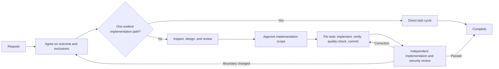

# Flujos de desarrollo para Claude Code

[](https://claude.ai/code)
[](https://github.com/shinpr/claude-code-workflows)
[](https://opensource.org/licenses/MIT)
[](https://github.com/shinpr/claude-code-workflows/pulls)

[English](README.md) | [简体中文](README.zh-CN.md) | [日本語](README.ja.md) | **Español** | [한국어](README.ko.md) | [Português (Brasil)](README.pt-BR.md)

Claude Code puede explorar una base de código a fondo. En trabajos complejos, el verdadero reto no es explorar, sino llegar a una conclusión. Mientras diseña un flujo de recuperación de cuentas, Claude podría detectar una inconsistencia real en el manejo de tokens y dedicarle casi todo el diseño, dejando impreciso el comportamiento de recuperación que se había solicitado.

claude-code-workflows mantiene esa exploración enfocada en un resultado acordado. Antes de diseñar, define el objetivo y lo que queda fuera de alcance; contrasta los diseños con el repositorio; verifica cada tarea antes de hacer commit y, en cambios grandes, comprueba de forma independiente que la implementación terminada entregue el resultado acordado, no incluya cambios innecesarios y no tenga problemas graves de funcionamiento, fiabilidad o seguridad. Dentro de esos límites, Claude decide los detalles de implementación a partir de la base de código.

Usa Claude Code directamente cuando el resultado y los límites seguros de implementación ya estén claros. Usa estos flujos cuando un cambio requiera acordar el alcance, conservar decisiones de diseño, transferir el trabajo entre contextos de forma confiable o contar con una verificación independiente.

---

## ¿Cuándo conviene usar estos flujos?

El flujo añade llamadas a agentes y genera documentos, así que debe justificar ese costo. Resulta útil cuando un hallazgo secundario real puede desviar un cambio grande de su objetivo, cuando un diseño coherente podría no cubrir el comportamiento solicitado o cuando una prueba que pasa no observa en realidad aquello que afirma verificar.

Una vez aprobado el alcance de implementación, Claude lleva las tareas por la verificación específica, los controles de calidad del repositorio, los commits y la revisión final, sin consultar decisiones rutinarias. Solo pide una decisión al usuario cuando debe cambiar el resultado de producto acordado o lo que quedó fuera de alcance; Claude se ocupa de las decisiones de diseño técnico e implementación. Al distribuirse como un plugin de Claude Code, un equipo puede aplicar los mismos controles en distintos repositorios sin imponerle a Claude una secuencia fija de pasos.

---

## Inicio rápido

Requiere una versión de Claude Code compatible con el marketplace de plugins.

### Elige un recorrido

| ¿Qué necesitas? | Empieza con | Plugin |
|---|---|---|
| Entregar de principio a fin un cambio de backend, API, CLI o propósito general | `/recipe-implement` | `dev-workflows` |
| Diseñar un cambio de backend o propósito general antes de implementarlo | `/recipe-design` | `dev-workflows` |
| Diseñar e implementar un frontend en React / TypeScript | `/recipe-front-design` → `/recipe-front-plan` → `/recipe-front-build` | `dev-workflows-frontend` |
| Entregar juntos un backend y un frontend React | `/recipe-fullstack-implement` | `dev-workflows-fullstack` |
| Revisar una implementación terminada frente al resultado acordado | `/recipe-review` o `/recipe-front-review` | `dev-workflows` o `dev-workflows-frontend` |
| Definir criterios de revisión propios del repositorio | `/recipe-quality-profile` | Cualquier plugin de flujos |
| Investigar un problema antes de elegir una solución | `/recipe-diagnose` | Cualquier plugin de flujos |
| Documentar un sistema existente a partir del código | `/recipe-reverse-engineer` | `dev-workflows` o `dev-workflows-fullstack` |
| Hacer un experimento descartable o un prototipo | Usa Claude Code directamente | Ninguno |

### Configuración común

```bash
# 1. Inicia Claude Code
claude

# 2. Añade el marketplace
/plugin marketplace add shinpr/claude-code-workflows
```

### Instala un solo plugin de flujos

Instala el plugin adecuado para tu proyecto. Si la instalación te pide ejecutar `/reload-plugins`, hazlo antes de invocar una recipe.

```bash
# Backend o propósito general
/plugin install dev-workflows@claude-code-workflows
/recipe-implement "Add rate limiting to the public API"

# Frontend
/plugin install dev-workflows-frontend@claude-code-workflows
/recipe-front-design "Add account recovery screens"

# Full stack
/plugin install dev-workflows-fullstack@claude-code-workflows
/recipe-fullstack-implement "Add user authentication with JWT + login form"
```

Instala solo uno de los plugins de flujos. `dev-workflows-fullstack` ya incluye los flujos de backend y frontend. Si antes utilizabas las recipes full stack de `dev-workflows`, migra a `dev-workflows-fullstack`.

`/recipe-front-design` se detiene después de que la UI Spec y el Design Doc aplicables hayan sido revisados y aprobados. Ejecuta `/recipe-front-plan` y `/recipe-front-build` cuando quieras continuar. Para backend o cambios generales, `/recipe-design`, `/recipe-plan` y `/recipe-build` ofrecen las mismas etapas.

### Configuración para equipos

Claude Code admite marketplaces y plugins con alcance de proyecto. Incluye el archivo `.claude/settings.json` resultante en el repositorio para que los colaboradores usen el mismo plugin.

```bash
claude plugin marketplace add shinpr/claude-code-workflows --scope project
claude plugin install dev-workflows-fullstack@claude-code-workflows --scope project
```

Sustituye `dev-workflows-fullstack` por el plugin correspondiente a tu repositorio. Consulta la [documentación de plugins de Claude Code](https://code.claude.com/docs/en/discover-plugins#configure-team-marketplaces) para conocer las opciones de instalación con alcance de proyecto y de instalación administrada.

---

## Cómo funciona



El recorrido depende de la cantidad de decisiones de producto y diseño, no del número de archivos ni del volumen de implementación.

| Escala | Qué necesita el cambio | Qué ocurre |
|---|---|---|
| Small | Un resultado que sigue un patrón existente dentro de una sola responsabilidad | Ciclo directo de tareas → controles específicos y del repositorio → revisión de seguridad |
| Medium | Un resultado que cruza responsabilidades o requiere una decisión de diseño duradera | Design Doc revisado, más UI Spec / ADR cuando corresponda → verificación de integración/E2E seleccionada → Work Plan revisado → ciclos de tareas → revisión final |
| Large | Varios resultados de producto independientes que requieren decisiones de diseño separadas | PRD y Design Docs revisados, más UI Spec / ADR cuando corresponda → verificación de integración/E2E seleccionada → Work Plan revisado → ciclos de tareas → revisión final |

Las UI Specs, los ADR y los esqueletos de pruebas de integración o E2E solo aparecen cuando hacen falta sus decisiones o sus límites de verificación.

Generar un documento no hace avanzar el flujo por sí solo. Las premisas que podrían cambiar el diseño elegido deben resolverse con evidencia comprobable antes de aprobarlo; solo se recurre a una prueba acotada cuando sea la forma más sencilla y suficiente de obtenerla.

El Work Plan se revisa para comprobar cobertura, orden de dependencias y verificaciones ejecutables antes de autorizar la implementación. Cada tarea se incorpora a un commit solo después de pasar sus controles específicos y los controles aplicables del repositorio. Al terminar la implementación por etapas, revisiones separadas comprueban el cambio completo frente al resultado acordado, buscan cambios innecesarios y problemas graves de funcionamiento o fiabilidad, confirman la cobertura observable y evalúan la seguridad.

La sesión principal decide qué hallazgos pertenecen al resultado actual, resuelve preguntas de implementación a partir del repositorio y mantiene en marcha el trabajo no afectado. Las sugerencias de una revisión no se convierten automáticamente en tareas. Las correcciones aceptadas vuelven a implementación y atraviesan de nuevo los controles correspondientes.

### Cómo sobreviven las decisiones a nuevos contextos

Usar un contexto nuevo para cada fase evita que el razonamiento de una fase se convierta silenciosamente en la autoridad de la siguiente. La [plantilla de Work Plan](skills/documentation-criteria/references/plan-template.md) incluida exige que cada requisito técnico aprobado en un Design Doc tenga una tarea que lo cubra o una brecha explícita. No convierte cada sección del documento ni cada sugerencia de revisión en una tarea. Una brecha significa que un requisito aprobado todavía no tiene una tarea de implementación o verificación.

```markdown
| Design Doc | DD Section | DD Item | Category | Covered By Task(s) | Gap Status | Notes |
|---|---|---|---|---|---|---|
| docs/design/example.md | API contract | Preserve the error response shape | contract-change | Phase 2 Task 1 | covered | |
| docs/design/example.md | Verification | Exercise cache invalidation | verification | | gap | Add a covering task before approval |
```

La [plantilla de Task](skills/documentation-criteria/references/task-template.md) lleva a implementación las decisiones obligatorias y los valores observables de los contratos, cada uno con una comprobación de cumplimiento que se responde con sí o no. Después de ejecutar la tarea, los controles aplicables del repositorio se ejecutan sobre el cambio completo antes del commit. Los revisores finales leen las mismas fuentes aprobadas y el código terminado, en lugar de depender de la conversación de implementación. `/recipe-quality-profile` permite registrar criterios de revisión propios del repositorio y sus fuentes en `docs/project-context/quality.yaml`; los revisores finales usan el perfil confirmado junto con las fuentes aprobadas.

### Una ejecución real

La [sincronización incremental de mcp-local-rag](https://github.com/shinpr/mcp-local-rag/pull/171) fue un cambio de 42 archivos que abarcó el escaneo del sistema de archivos, el almacenamiento, la CLI y las interfaces MCP. Una revisión de seguridad independiente devolvió la implementación dos veces. Detectó lecturas de archivos antes de la validación y una forma de escapar de los límites de ruta mediante un directorio padre enlazado simbólicamente.

La ejecución comenzó con un Work Plan existente que hacía referencia a un ADR y un Design Doc ausentes, por lo que no estaba clara la fuente aprobada para las decisiones técnicas. El usuario eligió tratar el Work Plan como fuente de autoridad y el flujo lo dividió en 13 tareas. La implementación final incluyó los cambios necesarios para verificar el comportamiento aprobado, mientras que el PR dejó constancia de por qué el modo watch y los trabajos persistentes quedaron fuera de alcance.

### Qué revisar después de la primera ejecución

- ¿El enfoque acordado amplía lo que ya existe y aporta evidencia para cada añadido?
- ¿Puedes seguir cada requisito hasta una tarea y un método de verificación observable?
- ¿Cada tarea terminada pasó los controles específicos y del repositorio antes del commit?
- ¿La revisión final confirmó que el cambio completo entrega el resultado acordado sin cambios innecesarios ni problemas graves de funcionamiento, fiabilidad o seguridad?
- Cuando un revisor propuso más trabajo, ¿el informe explica por qué se aplicó o se descartó?

---

## Flujos habituales

### Desarrollo completo de backend o propósito general

```bash
/recipe-implement "Add rate limiting to the public API"
```

El flujo delimita el cambio, inspecciona la implementación actual, crea únicamente los documentos necesarios para las decisiones y se detiene cuando hace falta una aprobación. Después continúa con la implementación planificada y la revisión final.

### Diseñar primero e implementar más tarde

```bash
# Backend o propósito general
/recipe-design "Design rate limiting for the public API"
/recipe-plan
/recipe-build

# Frontend React
/recipe-front-design "Build a user profile dashboard"
/recipe-front-plan
/recipe-front-build
```

Los flujos de diseño inspeccionan la implementación existente, confirman el alcance, crean los documentos necesarios, realizan una revisión de coherencia independiente y se detienen para solicitar aprobación. La planificación y la implementación pueden continuar más adelante, en un contexto nuevo o a cargo de otra persona, a partir de esos documentos aprobados.

El recorrido de frontend añade análisis de UI y una UI Spec cuando todavía hay que diseñar la estructura o el comportamiento de la interfaz, además de arquitectura de componentes, React Testing Library y controles de TypeScript.

Por ejemplo, dos componentes de un panel pueden manejar correctamente sus estados de carga por separado, pero la pantalla combinada quizá no defina qué ocurre si uno sigue cargando y el otro falla. La UI Spec registra esa combinación de estados y la vincula con el trabajo de diseño y pruebas antes de integrar los componentes.

### Desarrollo full stack

```bash
/recipe-fullstack-implement "Add user authentication with JWT + React login form"
```

Cuando el cambio contiene varios resultados de producto independientes, un único PRD cubre toda la funcionalidad. Los diseños de backend y frontend permanecen separados, `design-sync` comprueba el límite entre ambos y el Work Plan utiliza cortes verticales para probar la integración desde el principio.

Usa `/recipe-fullstack-build` para continuar desde un Work Plan full stack existente. El plugin full stack también incluye los flujos de backend y frontend aplicables.

<details>
<summary>Más ejemplos de flujos</summary>

#### Revisar una implementación terminada

```bash
/recipe-review
```

El flujo de revisión contrasta la implementación terminada con el resultado acordado y los criterios del repositorio, y después ejecuta una revisión de seguridad independiente. Las correcciones aceptadas vuelven al responsable de la implementación o del documento correspondiente y se revisan de nuevo.

#### Investigar antes de elegir una solución

```bash
/recipe-diagnose "API returns 500 on user login"
```

El flujo de diagnóstico traza las rutas de ejecución, verifica posibles puntos de fallo y presenta las ventajas y desventajas de cada solución. No modifica el código.

#### Documentar un sistema existente desde el código

```bash
/recipe-reverse-engineer "src/auth module"
```

Este flujo deriva PRD y Design Docs del código y los verifica contra la implementación. Usa la opción full stack cuando la funcionalidad abarque backend y frontend.

Consulta [How I Made Legacy Code AI-Friendly with Auto-Generated Docs](https://dev.to/shinpr/how-i-made-legacy-code-ai-friendly-with-auto-generated-docs-4353) para ver un ejemplo completo.

#### Ajustar una UI implementada según una fuente de diseño

```bash
/recipe-front-adjust "Align the card spacing and actions with the design source"
```

El plugin de frontend registra cómo llegar a la fuente de diseño externa, confirma el conjunto de archivos a modificar y repite la verificación visual hasta que el ajuste pasa los controles.

</details>

---

## Referencia de recipes

Todos los puntos de entrada usan el prefijo `recipe-`. Escribe `/recipe-` y usa Tab para ver las opciones instaladas.

<details>
<summary>Ver todas las recipes de backend y propósito general</summary>

| Recipe | Finalidad | Cuándo usarla |
|---|---|---|
| `/recipe-implement` | Implementar una funcionalidad de principio a fin | Funcionalidades nuevas y flujos completos |
| `/recipe-design` | Crear documentación de diseño | Planificación de arquitectura |
| `/recipe-plan` | Generar un Work Plan a partir del diseño | Fase de planificación |
| `/recipe-build` | Ejecutar un Work Plan existente | Retomar una implementación |
| `/recipe-review` | Revisar una implementación terminada frente al resultado acordado | Comprobación posterior a la implementación |
| `/recipe-quality-profile` | Definir criterios de revisión propios del repositorio | Criterios del repositorio |
| `/recipe-diagnose` | Investigar un problema y comparar soluciones | Análisis de causa raíz |
| `/recipe-reverse-engineer` | Derivar PRD y Design Docs del código | Documentación de sistemas existentes |
| `/recipe-add-integration-tests` | Añadir pruebas de integración o E2E | Cobertura de código existente |
| `/recipe-update-doc` | Actualizar y revisar documentos existentes | Cambios de requisitos o diseño |
| `/recipe-task` | Ejecutar directamente una tarea guiada por reglas | Trabajo que no requiere traspasos entre etapas |

</details>

<details>
<summary>Ver todas las recipes de frontend</summary>

El plugin de frontend añade análisis específico de React, arquitectura de componentes, React Testing Library, controles de TypeScript y la generación de una UI Spec a partir de código de prototipo cuando corresponda.

| Recipe | Finalidad | Cuándo usarla |
|---|---|---|
| `/recipe-front-design` | Crear la UI Spec y el Design Doc de frontend aplicables | Arquitectura de componentes React |
| `/recipe-front-plan` | Generar un Work Plan de frontend | Planificación de componentes |
| `/recipe-front-build` | Ejecutar el Work Plan de frontend | Retomar una implementación React |
| `/recipe-front-adjust` | Ajustar una UI implementada con verificación externa | Mejoras visuales |
| `/recipe-front-review` | Revisar un frontend terminado frente al resultado acordado | Comprobación posterior a la implementación |
| `/recipe-quality-profile` | Definir criterios de revisión propios del repositorio | Criterios del repositorio |
| `/recipe-diagnose` | Investigar un problema y comparar soluciones | Análisis de causa raíz |
| `/recipe-update-doc` | Actualizar y revisar documentos existentes | Cambios de requisitos o diseño |
| `/recipe-task` | Ejecutar directamente una tarea guiada por reglas | Trabajo que no requiere traspasos entre etapas |

</details>

---

## Qué incluyen los plugins

Los agentes especializados mantienen separados el análisis y el diseño de la ejecución y la revisión final. Cada plugin incluye solo los roles que usan sus flujos; el plugin full stack combina los roles de backend y frontend. La lista completa está disponible a continuación.

<details>
<summary>Ver todos los roles de agentes especializados</summary>

### Agentes compartidos

Estos agentes se comparten entre los plugins de backend, frontend y full stack:

| Agente | Función |
|---|---|
| **requirement-analyzer** | Reúne evidencia concisa sobre alcance y costo para las decisiones de requisitos y flujo del orquestador |
| **prd-creator** | Define requisitos de producto para funcionalidades grandes |
| **codebase-analyzer** | Inspecciona el código y las dependencias existentes antes del diseño |
| **code-verifier** | Compara los documentos con la implementación |
| **work-planner** | Convierte las decisiones de diseño en un Work Plan ejecutable |
| **task-decomposer** | Divide un Work Plan en tareas listas para commit |
| **acceptance-test-generator** | Crea esqueletos de pruebas de integración y E2E a partir de requisitos |
| **integration-test-reviewer** | Revisa las pruebas de integración y E2E contra la cobertura prevista |
| **code-reviewer** | Comprueba que la implementación terminada corresponda al resultado acordado y cumpla los criterios del repositorio |
| **document-reviewer** | Comprueba la integridad del documento y el cumplimiento de las reglas |
| **design-sync** | Detecta conflictos entre varios Design Docs |
| **investigator** | Traza rutas de ejecución e identifica posibles puntos de fallo |
| **verifier** | Cuestiona los puntos de fallo sospechosos y comprueba la cobertura de rutas |
| **solver** | Compara soluciones y sus trade-offs |
| **security-reviewer** | Revisa la implementación terminada en busca de problemas de seguridad |
| **rule-advisor** | Selecciona las reglas de desarrollo pertinentes para la tarea |

### Agentes específicos de backend

| Agente | Función |
|---|---|
| **technical-designer** | Diseña el enfoque técnico y la arquitectura |
| **scope-discoverer** | Encuentra límites funcionales en la implementación existente |
| **task-executor** | Implementa tareas de backend con verificación orientada por pruebas |
| **quality-fixer** | Ejecuta pruebas, controles de tipos, lint y otros controles de calidad |

### Agentes específicos de frontend

| Agente | Función |
|---|---|
| **ui-spec-designer** | Crea una UI Spec a partir de requisitos y un prototipo opcional |
| **ui-analyzer** | Obtiene fuentes y sistemas de diseño, consulta las guías e inspecciona la UI existente |
| **technical-designer-frontend** | Diseña la arquitectura de componentes React y la gestión de estado |
| **task-executor-frontend** | Implementa componentes React con cobertura basada en React Testing Library |
| **quality-fixer-frontend** | Ejecuta pruebas de frontend, controles de TypeScript, lint y builds |

</details>

<details>
<summary>Ver las guías de desarrollo incluidas</summary>

- **Coding Principles.** Estándares de calidad del código.
- **Testing Principles.** TDD, cobertura y patrones de pruebas.
- **Implementation Approach.** Decisiones de implementación y sus trade-offs.
- **Documentation Standards.** Documentación clara y mantenible.
- **External Resource Context.** Registra cómo llegar a fuentes y sistemas de diseño, esquemas de API, definiciones de infraestructura y otros recursos externos.
- **LLM-Friendly Context.** Prompts, entregas, documentos e instrucciones claras para que los agentes posteriores puedan trabajar sin adivinar.

Los agentes cargan estas skills cuando el trabajo las requiere. El plugin de frontend también incluye reglas específicas de React y TypeScript.

</details>

<details>
<summary>Usar las guías sin el flujo (dev-skills)</summary>

Si ya tienes orquestación mediante prompts propios o CI y solo necesitas guías de buenas prácticas, usa `dev-skills`. Si quieres que Claude planifique, ejecute y verifique el cambio de principio a fin, instala el plugin de flujos adecuado.

- Uso mínimo de contexto, sin agentes
- Guías de desarrollo, pruebas, diseño y documentación sin imponer un proceso
- Carga automática de las skills pertinentes para cada tarea

> **No instales `dev-skills` junto con un plugin de flujos.** Comparten las mismas skills y las descripciones duplicadas pueden hacer que Claude Code las ignore después de alcanzar su límite de contexto.

```bash
/plugin install dev-skills@claude-code-workflows
```

Para cambiar de tipo de plugin:

```bash
# dev-skills -> dev-workflows
/plugin uninstall dev-skills@claude-code-workflows
/plugin install dev-workflows@claude-code-workflows

# dev-workflows -> dev-skills
/plugin uninstall dev-workflows@claude-code-workflows
/plugin install dev-skills@claude-code-workflows
```

</details>

<details>
<summary>Ver complementos opcionales</summary>

Estos plugins cubren funciones relacionadas sin cambiar el flujo principal:

- [claude-code-discover](https://github.com/shinpr/claude-code-discover): convierte ideas de funcionalidades en PRD respaldados por evidencia.
- [metronome](https://github.com/shinpr/metronome): detecta atajos y pide a Claude que siga el procedimiento definido.
- [linear-prism](https://github.com/shinpr/linear-prism): valida requisitos y los convierte en tareas estructuradas de Linear.
- [pr-review](https://github.com/shinpr/pr-review-skill): revisa PR de GitHub con criterios propios del repositorio y publica únicamente los hallazgos aprobados.

```bash
/plugin install discover@claude-code-workflows
/plugin install metronome@claude-code-workflows
/plugin install linear-prism@claude-code-workflows
/plugin install pr-review@claude-code-workflows
```

</details>

---

## Preguntas frecuentes

**P: ¿Qué ocurre si hay errores?**

R: Los agentes quality-fixer resuelven fallos de pruebas, tipos, lint y build dentro del resultado aprobado, incluidos los cambios adyacentes necesarios para la misma responsabilidad o contrato.

El flujo solo consulta al usuario cuando ya no es posible conservar a la vez el resultado solicitado y lo que quedó fuera de alcance, o cuando una acción externa irreversible necesita autorización. Mientras no cambie lo que entrega el producto, resuelve por su cuenta los cambios de diseño técnico, contratos, interfaz, arquitectura, persistencia e implementación.

**P: ¿Existe una versión para OpenAI Codex CLI?**

R: Sí. **[codex-workflows](https://github.com/shinpr/codex-workflows)** ofrece el mismo modelo de flujo, adaptado al entorno de Codex CLI.

**P: ¿Debo incluir en los commits el Work Plan y los archivos de tareas de `docs/plans/`?**

R: No. Los flujos tratan `docs/plans/` como estado de trabajo temporal. Los archivos de tareas consumidos y los archivos de correcciones intermedias se eliminan al terminar correctamente. El Work Plan puede permanecer para una revisión o una ejecución posterior y se puede borrar cuando deje de ser necesario. Añade esta línea al `.gitignore` de tu proyecto para que ese estado no quede bajo control de versiones:

```
docs/plans/
```

Los PRD, ADR, UI Specs y Design Docs se guardan en `docs/prd/`, `docs/adr/`, `docs/ui-spec/` y `docs/design/`, respectivamente, y sí están destinados a formar parte del repositorio.

---

## Contribuir plugins externos

Este marketplace cubre el ciclo completo de creación de productos con IA: calidad del producto, descubrimiento, control de la implementación y verificación. Si tu plugin ayuda a los agentes de programación a crear mejores productos, nos interesa conocerlo.

Consulta [CONTRIBUTING.md](CONTRIBUTING.md) para ver las instrucciones y los criterios de aceptación.

<details>
<summary>Ver la estructura del repositorio</summary>

```
claude-code-workflows/
├── .claude-plugin/
│   └── marketplace.json        # Plugin definitions and per-plugin contents
├── agents/                     # Specialized analysis, design, execution, and review roles
├── skills/
│   ├── recipe-*/               # Workflow entry points
│   ├── documentation-criteria/ # Document rules and templates
│   ├── coding-principles/
│   ├── testing-principles/
│   ├── external-resource-context/
│   ├── llm-friendly-context/
│   └── ...
├── LICENSE
└── README.md
```

</details>

---

## Fundamentos del diseño

<details>
<summary>Lecturas relacionadas</summary>

- [Why LLMs Are Bad at 'First Try' and Great at Verification](https://www.norsica.jp/blog/llm-verification-over-generation): por qué la retroalimentación externa y los contextos nuevos son más confiables que pedirle a una misma sesión que genere y evalúe su propio trabajo.
- [When Better Models Make Old Agent Workflows Worse](https://www.norsica.jp/blog/when-better-models-make-old-agent-workflows-worse): por qué el flujo es estricto con los límites y la evidencia sin imponer una ruta concreta.
- [Reasoning Effort Is Not a Quality Setting](https://www.norsica.jp/blog/reasoning-effort-is-not-a-quality-setting): por qué una exploración más amplia todavía debe converger en el trabajo que justifica el resultado actual.
- [Stop Putting Everything in AGENTS.md](https://www.norsica.jp/blog/stop-putting-everything-in-agents-md): por qué las instrucciones permanentes deben ser breves y las skills, decisiones de diseño y guías de tareas deben cargarse cuando hacen falta.

</details>

---

## Licencia

Licencia MIT. Puedes usar, modificar y distribuir este software libremente.

Consulta [LICENSE](LICENSE) para obtener más información.

---

Desarrollado y mantenido por [@shinpr](https://github.com/shinpr).
