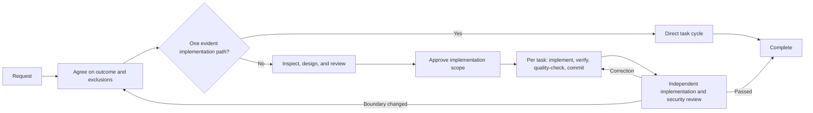

# Claude Code 開発ワークフロー

[](https://claude.ai/code)
[](https://github.com/shinpr/claude-code-workflows)
[](https://opensource.org/licenses/MIT)
[](https://github.com/shinpr/claude-code-workflows/pulls)

[English](README.md) | [简体中文](README.zh-CN.md) | **日本語** | [Español](README.es.md) | [한국어](README.ko.md) | [Português (Brasil)](README.pt-BR.md)

Claude Codeはコードベースを深く探索できます。しかし、複雑な作業でより難しいのは、探索そのものではなく結論へ収束させることです。たとえばアカウント復旧フローを設計している途中で、トークン処理の不整合を見つけ、その調査に大半を費やした結果、本来求められていた復旧時の動作が曖昧なまま残ることがあります。

claude-code-workflowsは、探索を合意済みの成果へ向け続けるための仕組みです。設計前に成果と対象外を合意し、設計内容をリポジトリと照合し、コミット前に各タスクを検証します。規模の大きな変更では、完成した実装が意図した動作とセキュリティ要件を満たすかを独立してレビューします。その範囲内で、実装の詳細はClaudeがコードベースから判断します。

成果と安全な実装範囲がすでに明確なら、Claude Codeをそのまま使うのが適しています。スコープの合意、後から参照できる設計判断、コンテキスト間の確実な引き継ぎ、独立した検証が必要な変更では、このワークフローを使ってください。

---

## どんなときに役立つか

このワークフローはエージェント呼び出しと成果物を増やすため、そのコストに見合う場面で使うものです。関連する問題の発見によって変更の目的がずれそうな場合、筋の通った設計でも要求された動作を外す可能性がある場合、あるいはテストが通っていても確認したい動作を実際には観測できていない場合に効果を発揮します。

実装範囲の承認後は、Claudeが各タスクに絞った検証、リポジトリの品質チェック、コミット、最終レビューまで進めます。通常の実装判断で逐一確認を求めることはありません。プロダクト変更や重要な設計変更はユーザーに戻し、元に戻せる実装上の選択はClaudeが判断します。Claude Codeプラグインとして提供されるため、Claudeの手順を固定せずに、複数のリポジトリへ同じ統制を適用できます。

---

## クイックスタート

プラグインマーケットプレイスに対応したバージョンのClaude Codeが必要です。

### 目的に合うルートを選ぶ

| やりたいこと | 最初に実行するもの | プラグイン |
|---|---|---|
| バックエンド、API、CLI、一般的な変更を一通り完了させる | `/recipe-implement` | `dev-workflows` |
| 実装前にバックエンドまたは一般的な変更を設計する | `/recipe-design` | `dev-workflows` |
| React / TypeScriptフロントエンドを設計・実装する | `/recipe-front-design` → `/recipe-front-plan` → `/recipe-front-build` | `dev-workflows-frontend` |
| バックエンドとReactフロントエンドをまとめて実装する | `/recipe-fullstack-implement` | `dev-workflows-fullstack` |
| 設計に照らして実装をレビューする | `/recipe-review` または `/recipe-front-review` | `dev-workflows` または `dev-workflows-frontend` |
| 修正を決める前に問題を調査する | `/recipe-diagnose` | 任意のワークフロープラグイン |
| コードから既存システムを文書化する | `/recipe-reverse-engineer` | `dev-workflows` または `dev-workflows-fullstack` |
| 使い捨ての実験やプロトタイプを作る | Claude Codeを直接使う | なし |

### 共通セットアップ

```bash
# 1. Claude Codeを起動
claude

# 2. マーケットプレイスを追加
/plugin marketplace add shinpr/claude-code-workflows
```

### ワークフロープラグインを1つインストールする

プロジェクトに合うプラグインを選びます。インストール後に`/reload-plugins`の実行を求められた場合は、レシピを呼び出す前に実行してください。

```bash
# バックエンドまたは一般的な変更
/plugin install dev-workflows@claude-code-workflows
/recipe-implement "Add rate limiting to the public API"

# フロントエンド
/plugin install dev-workflows-frontend@claude-code-workflows
/recipe-front-design "Add account recovery screens"

# フルスタック
/plugin install dev-workflows-fullstack@claude-code-workflows
/recipe-fullstack-implement "Add user authentication with JWT + login form"
```

インストールするワークフロープラグインは1つだけにしてください。`dev-workflows-fullstack`にはバックエンドとフロントエンドの両方が含まれています。以前`dev-workflows`のフルスタックレシピを使っていた場合は、`dev-workflows-fullstack`へ移行してください。

`/recipe-front-design`は、該当するUI仕様と設計ドキュメントがレビュー・承認された時点で終了します。続けて実装する場合は`/recipe-front-plan`と`/recipe-front-build`を実行します。バックエンドや一般的な変更にも、同じ段階構成の`/recipe-design`、`/recipe-plan`、`/recipe-build`があります。

### チームでのセットアップ

Claude Codeはプロジェクト単位のマーケットプレイスとプラグインに対応しています。生成された`.claude/settings.json`をコミットすると、コントリビューターにも同じワークフロープラグインの利用を案内できます。

```bash
claude plugin marketplace add shinpr/claude-code-workflows --scope project
claude plugin install dev-workflows-fullstack@claude-code-workflows --scope project
```

`dev-workflows-fullstack`は、リポジトリに合うプラグインへ置き換えてください。プロジェクト単位および管理対象のインストール方法については、[Claude Codeのプラグインドキュメント](https://code.claude.com/docs/en/discover-plugins#configure-team-marketplaces)を参照してください。

---

## 仕組み



ルートを決めるのはファイル数や実装量ではなく、必要なプロダクト判断と設計判断の数です。

| 規模 | 変更に必要なもの | 実行内容 |
|---|---|---|
| Small | 1つの責務の中で既存パターンに沿って達成できる1つの成果 | タスクを直接実行 → タスクごとのチェックとリポジトリチェック → セキュリティレビュー |
| Medium | 複数の責務にまたがる、または後続の実装にも影響する設計判断が必要な1つの成果 | レビュー済み設計ドキュメントと、必要に応じたUI仕様 / ADR → 選定した結合・E2E検証 → レビュー済み作業計画 → タスクサイクル → 最終レビュー |
| Large | 個別の設計判断を必要とする複数の独立したプロダクト成果 | レビュー済みPRDと設計ドキュメント、および必要に応じたUI仕様 / ADR → 選定した結合・E2E検証 → レビュー済み作業計画 → タスクサイクル → 最終レビュー |

UI仕様、ADR、結合テストやE2Eテストのスケルトンは、それぞれの判断または検証境界が必要な場合にだけ作成されます。

成果物を生成しただけでは、ワークフローは次へ進みません。設計上の主張は承認前にリポジトリと照合されます。作業計画は、実装を許可する前に、範囲、依存順序、実行可能な検証方法についてレビューされます。各タスクはそのタスクに絞ったチェックと該当するリポジトリチェックを通過してからコミットされます。段階的な実装が完了すると、設計との整合性、観測可能な動作のカバレッジ、セキュリティを別々にレビューします。

メインセッションは、どの発見が現在の成果に含まれるかを判断し、リポジトリを根拠に実装上の疑問を解決し、影響を受けない作業を止めずに進めます。レビューの提案が自動的に作業項目になることはありません。受け入れた修正は実装へ戻され、影響する検証ゲートを再度通過します。

### 新しいコンテキストへ判断を引き継ぐ仕組み

フェーズごとに新しいコンテキストを使うことで、前のフェーズの推論が、次のフェーズで暗黙の権限になることを防ぎます。同梱の[作業計画テンプレート](skills/documentation-criteria/references/plan-template.md)では、設計ドキュメントで承認されたすべての技術要件について、対応するタスクまたは明示的なギャップが必要です。ドキュメントの全セクションやレビュー提案を、無条件にタスクへ変換するものではありません。ギャップとは、承認済み要件に実装タスクまたは検証タスクがまだない状態を指します。

```markdown
| Design Doc | DD Section | DD Item | Category | Covered By Task(s) | Gap Status | Notes |
|---|---|---|---|---|---|---|
| docs/design/example.md | API contract | Preserve the error response shape | contract-change | Phase 2 Task 1 | covered | |
| docs/design/example.md | Verification | Exercise cache invalidation | verification | | gap | Add a covering task before approval |
```

[タスクテンプレート](skills/documentation-criteria/references/task-template.md)は、実装を拘束する判断と外部から確認できる契約上の値を引き継ぎ、それぞれにYes/Noで判定できる準拠チェックを持たせます。実行後、コミット前にタスク全体の変更へ該当するリポジトリチェックを行います。最終レビュアーは実装時の会話ではなく、同じ承認済みソースと完成したコードを読みます。

### 実際のワークフロー実行例

[mcp-local-ragの増分同期機能](https://github.com/shinpr/mcp-local-rag/pull/171)は、ファイルシステムのスキャン、ストレージ、CLI、MCPの各インターフェースにまたがる42ファイルの変更でした。独立したセキュリティレビューによって実装は2回差し戻され、検証前のファイル読み取りと、シンボリックリンクされた親ディレクトリを経由してパス制限を回避できる問題が見つかりました。

この実行は、参照先のADRと設計ドキュメントが存在しない作業計画から始まり、技術判断の根拠が不明確な状態でした。ユーザーは作業計画を正本として扱うことを選び、レシピはそれを13個のタスクに分割しました。最終実装には承認された動作を検証するために必要な変更が含まれ、監視モードと永続ジョブを対象外にした理由はPRに記録されています。

### 初回実行後に確認すること

- 合意したアプローチは既存の仕組みを拡張しているか。各追加には根拠があるか。
- 各要件からタスクと観測可能な検証方法まで追跡できるか。
- 完了したすべてのタスクが、コミット前にそのタスクに絞ったチェックとリポジトリの品質チェックを通過したか。
- 最終レビューは実装全体を意図した動作とセキュリティ要件に照らしたか。
- レビュアーが追加作業を提案した場合、適用または却下した理由が報告されているか。

---

## 代表的なワークフロー

### バックエンドまたは一般的な変更を最初から最後まで実装する

```bash
/recipe-implement "Add rate limiting to the public API"
```

レシピは変更範囲を定め、現在の実装を調べ、判断に必要なドキュメントだけを作成します。判断が必要な箇所では承認を求め、作業計画に沿った実装と最終レビューまで進めます。

### 先に設計し、実装は後で行う

```bash
# バックエンドまたは一般
/recipe-design "Design rate limiting for the public API"
/recipe-plan
/recipe-build

# Reactフロントエンド
/recipe-front-design "Build a user profile dashboard"
/recipe-front-plan
/recipe-front-build
```

設計レシピは既存実装を確認し、範囲を確定し、必要なドキュメントを作成して、独立した整合性レビューを行った後に承認を待ちます。承認済みの成果物があれば、別のコンテキストや別の担当者が後から計画と実装を再開できます。

フロントエンドでは、UIの構造や動作に設計の余地がある場合にUI分析とUI仕様を追加し、さらにコンポーネント設計、React Testing Library、TypeScriptのチェックを行います。

たとえば2つのダッシュボードコンポーネントが個別にはローディングを正しく処理していても、一方がローディング中で他方が失敗したときの画面全体の動作が未定義な場合があります。UI仕様はその状態の組み合わせを記録し、結合前に設計とテスト作業へ対応付けます。

### フルスタック開発

```bash
/recipe-fullstack-implement "Add user authentication with JWT + React login form"
```

変更に複数の独立したプロダクト成果がある場合は、1つのPRDで機能全体を扱います。バックエンドとフロントエンドの設計は分離したまま、`design-sync`が境界の整合性を確認し、作業計画は垂直スライスを使って早い段階から結合を検証します。

既存のフルスタック作業計画から再開するには`/recipe-fullstack-build`を使います。フルスタックプラグインには、対応するバックエンドとフロントエンドのレシピも含まれます。

<details>
<summary>その他のワークフロー例</summary>

#### 設計に照らして実装をレビューする

```bash
/recipe-review
```

レビューワークフローは実装を設計ドキュメントと比較し、独立したセキュリティレビューを行います。承認済みの判断を変える修正は、契約を暗黙に変更せず、関連するドキュメントへ戻されます。

#### 修正を決める前に問題を調査する

```bash
/recipe-diagnose "API returns 500 on user login"
```

診断ワークフローは実行経路をマッピングし、疑わしい障害点を検証して、解決策のトレードオフを提示します。コードは変更しません。

#### コードから既存システムを文書化する

```bash
/recipe-reverse-engineer "src/auth module"
```

コードからPRDと設計ドキュメントを作成し、実装と照合して内容を検証します。機能がバックエンドとフロントエンドにまたがる場合は、フルスタック版を使ってください。

詳しい実行例は[How I Made Legacy Code AI-Friendly with Auto-Generated Docs](https://dev.to/shinpr/how-i-made-legacy-code-ai-friendly-with-auto-generated-docs-4353)を参照してください。

#### 実装済みUIをデザインソースに合わせて調整する

```bash
/recipe-front-adjust "Align the card spacing and actions with the design source"
```

フロントエンドプラグインは外部デザインソースの参照方法を記録し、変更対象を確定し、調整がチェックに合格するまで視覚検証を繰り返します。

</details>

---

## ワークフローレシピ一覧

すべてのワークフローは`recipe-`で始まります。`/recipe-`まで入力してTabキーを押すと、インストール済みの候補を補完できます。

<details>
<summary>バックエンドおよび一般向けレシピをすべて表示</summary>

| レシピ | 目的 | 使用場面 |
|---|---|---|
| `/recipe-implement` | 機能を最初から最後まで実装 | 新機能や一連のワークフロー |
| `/recipe-design` | 設計ドキュメントを作成 | アーキテクチャ設計 |
| `/recipe-plan` | 設計から作業計画を作成 | 計画フェーズ |
| `/recipe-build` | 既存の作業計画を実行 | 実装の再開 |
| `/recipe-review` | 設計ドキュメントに照らして実装を検証 | 実装後の確認 |
| `/recipe-diagnose` | 問題を調査し、解決策を比較 | 根本原因の分析 |
| `/recipe-reverse-engineer` | コードからPRDと設計ドキュメントを作成 | 既存システムの文書化 |
| `/recipe-add-integration-tests` | 結合テストまたはE2Eテストを追加 | 既存コードのカバレッジ |
| `/recipe-update-doc` | 既存ドキュメントを更新・レビュー | 要件または設計の変更 |
| `/recipe-task` | ルールに従うタスクを直接実行 | 段階的な引き継ぎが不要な作業 |

</details>

<details>
<summary>フロントエンド向けレシピをすべて表示</summary>

フロントエンドプラグインはReact固有の分析、コンポーネント設計、React Testing Library、TypeScriptチェック、必要に応じたプロトタイプコードからのUI仕様作成を追加します。

| レシピ | 目的 | 使用場面 |
|---|---|---|
| `/recipe-front-design` | 該当するUI仕様とフロントエンド設計ドキュメントを作成 | Reactコンポーネント設計 |
| `/recipe-front-plan` | フロントエンド作業計画を作成 | コンポーネント計画 |
| `/recipe-front-build` | フロントエンド作業計画を実行 | React実装の再開 |
| `/recipe-front-adjust` | 外部検証を使って実装済みUIを調整 | 見た目の調整 |
| `/recipe-front-review` | フロントエンド設計ドキュメントに照らして実装を検証 | 実装後の確認 |
| `/recipe-diagnose` | 問題を調査し、解決策を比較 | 根本原因の分析 |
| `/recipe-update-doc` | 既存ドキュメントを更新・レビュー | 要件または設計の変更 |
| `/recipe-task` | ルールに従うタスクを直接実行 | 段階的な引き継ぎが不要な作業 |

</details>

---

## プラグインに含まれるもの

専門エージェントは分析と設計を実行・最終レビューから分離します。各プラグインには、そのワークフローが使う役割だけが含まれ、フルスタックプラグインはバックエンドとフロントエンドの役割を統合します。役割の全一覧は以下で確認できます。

<details>
<summary>専門エージェントの役割をすべて表示</summary>

### 共通エージェント

バックエンド、フロントエンド、フルスタックで共有されるエージェントです。

| エージェント | 役割 |
|---|---|
| **requirement-analyzer** | オーケストレーターが要件とワークフローを判断するための簡潔な範囲・コスト情報を収集 |
| **prd-creator** | 大規模な機能のプロダクト要件を定義 |
| **codebase-analyzer** | 設計前に既存コードと依存関係を調査 |
| **code-verifier** | ドキュメントを実装と比較 |
| **work-planner** | 設計判断を実行可能な作業計画へ変換 |
| **task-decomposer** | 作業計画をコミット単位のタスクに分割 |
| **acceptance-test-generator** | 要件から結合・E2Eテストのスケルトンを作成 |
| **integration-test-reviewer** | 結合・E2Eテストが意図した範囲を確認しているかレビュー |
| **code-reviewer** | 実装を設計ドキュメントと照合 |
| **document-reviewer** | ドキュメントの完全性とルール準拠を確認 |
| **design-sync** | 複数の設計ドキュメント間の矛盾を検出 |
| **investigator** | 実行経路をマッピングし、障害候補を特定 |
| **verifier** | 障害候補を検証し、経路の網羅性を確認 |
| **solver** | 解決策とトレードオフを比較 |
| **security-reviewer** | 完成した実装のセキュリティ問題をレビュー |
| **rule-advisor** | タスクに関連するコーディングルールを選定 |

### バックエンド固有のエージェント

| エージェント | 役割 |
|---|---|
| **technical-designer** | 技術アプローチとアーキテクチャを設計 |
| **scope-discoverer** | 既存実装から機能境界を特定 |
| **task-executor** | テストファーストの検証でバックエンドタスクを実装 |
| **quality-fixer** | テスト、型チェック、lintなどの品質ゲートを実行 |

### フロントエンド固有のエージェント

| エージェント | 役割 |
|---|---|
| **ui-spec-designer** | 要件と任意のプロトタイプからUI仕様を作成 |
| **ui-analyzer** | デザインソース、デザインシステム、ガイドラインを取得し、既存UIを調査 |
| **technical-designer-frontend** | Reactコンポーネント設計と状態管理を設計 |
| **task-executor-frontend** | React Testing Libraryのカバレッジを伴うReactコンポーネントを実装 |
| **quality-fixer-frontend** | フロントエンドテスト、TypeScriptチェック、lint、ビルドを実行 |

</details>

<details>
<summary>組み込みの開発ガイダンスを表示</summary>

- **Coding Principles：** コード品質の基準。
- **Testing Principles：** TDD、カバレッジ、テストパターン。
- **Implementation Approach：** 実装判断とトレードオフ。
- **Documentation Standards：** 明確で保守しやすいドキュメント。
- **External Resource Context：** デザインソース、デザインシステム、APIスキーマ、インフラ定義など、リポジトリ外の情報を参照する方法を記録。
- **LLM-Friendly Context：** 下流のエージェントが迷わず実行できるプロンプト、引き継ぎ、成果物、指示。

エージェントは作業に応じてこれらのスキルを読み込みます。フロントエンドプラグインにはReactとTypeScript固有のルールも含まれます。

</details>

<details>
<summary>ワークフローを使わずガイダンスだけを利用する（dev-skills）</summary>

独自のプロンプトやCIですでにオーケストレーションしていて、ベストプラクティスのガイドだけが必要な場合は`dev-skills`を使います。計画、実行、検証をClaudeに一通り任せたい場合は、用途に合うワークフロープラグインをインストールしてください。

- エージェントを含まない最小限のコンテキスト使用量
- 手順を固定せず、コーディング、テスト、設計、ドキュメントのガイダンスを提供
- 作業に応じて関連スキルを自動読み込み

> **`dev-skills`をワークフロープラグインと同時にインストールしないでください。** 同じスキル説明が重複し、コンテキスト上限に達した後にClaude Codeがスキルを無視することがあります。

```bash
/plugin install dev-skills@claude-code-workflows
```

プラグイン種別を切り替えるには、次のように操作します。

```bash
# dev-skillsからdev-workflowsへ
/plugin uninstall dev-skills@claude-code-workflows
/plugin install dev-workflows@claude-code-workflows

# dev-workflowsからdev-skillsへ
/plugin uninstall dev-workflows@claude-code-workflows
/plugin install dev-skills@claude-code-workflows
```

</details>

<details>
<summary>任意のアドオンを表示</summary>

これらのプラグインは、コアワークフローを変更せずに関連機能を追加します。

- [claude-code-discover](https://github.com/shinpr/claude-code-discover)：機能案を根拠のあるPRDへ変換。
- [metronome](https://github.com/shinpr/metronome)：近道をした兆候を検出し、定義された手順に従うようClaudeへ求める。
- [linear-prism](https://github.com/shinpr/linear-prism)：要件を検証し、構造化されたLinearタスクへ変換。
- [pr-review](https://github.com/shinpr/pr-review-skill)：GitHub PRをリポジトリ固有の基準でレビューし、承認された指摘だけを投稿。

```bash
/plugin install discover@claude-code-workflows
/plugin install metronome@claude-code-workflows
/plugin install linear-prism@claude-code-workflows
/plugin install pr-review@claude-code-workflows
```

</details>

---

## FAQ

**Q：エラーが発生した場合はどうなりますか？**

A：quality-fixerエージェントが、承認済みの成果の範囲内でテスト、型、lint、ビルドの失敗を修正します。同じ責務や契約に必要な周辺変更も対象です。

次の場合にのみワークフローが停止します。

- 修正によってプロダクト成果、承認済みの契約、重要な設計判断が変わる。
- ユーザーだけが持つ権限が必要になる。
- 既存の承認範囲に含まれない、元に戻せない外部操作を行う。

**Q：OpenAI Codex CLI向けのバージョンはありますか？**

A：はい。**[codex-workflows](https://github.com/shinpr/codex-workflows)**は同じワークフローモデルをCodex CLI向けに調整しています。

**Q：`docs/plans/`の作業計画とタスクファイルはコミットすべきですか？**

A：いいえ。レシピは`docs/plans/`を一時的な作業状態として扱います。処理済みのタスクファイルと中間修正ファイルは、正常終了後に削除されます。作業計画はレビューや後続のビルドのために残る場合がありますが、不要になれば削除できます。この作業状態がGit管理に入らないよう、プロジェクトの`.gitignore`へ次の行を追加してください。

```
docs/plans/
```

PRD、ADR、UI仕様、設計ドキュメントは、それぞれ`docs/prd/`、`docs/adr/`、`docs/ui-spec/`、`docs/design/`に配置され、コミット対象です。

---

## 外部プラグインのコントリビューション

このマーケットプレイスは、プロダクト品質、発見、実装統制、検証まで、AIを使ったプロダクト開発のライフサイクル全体を支援します。AIコーディングエージェントによる開発を改善するプラグインをお持ちなら、ぜひお知らせください。

提出方法と受け入れ基準は[CONTRIBUTING.md](CONTRIBUTING.md)を参照してください。

<details>
<summary>リポジトリ構成を表示</summary>

```
claude-code-workflows/
├── .claude-plugin/
│   └── marketplace.json        # Plugin definitions and per-plugin contents
├── agents/                     # Specialized analysis, design, execution, and review roles
├── skills/
│   ├── recipe-*/               # Workflow entry points
│   ├── documentation-criteria/ # Document rules and templates
│   ├── coding-principles/
│   ├── testing-principles/
│   ├── external-resource-context/
│   ├── llm-friendly-context/
│   └── ...
├── LICENSE
└── README.md
```

</details>

---

## 設計上の背景

<details>
<summary>設計の背景資料</summary>

- [Why LLMs Are Bad at 'First Try' and Great at Verification](https://www.norsica.jp/blog/llm-verification-over-generation)：同じセッションで生成と評価を行うより、外部フィードバックと新しいコンテキストを使う方が信頼できる理由。
- [When Better Models Make Old Agent Workflows Worse](https://www.norsica.jp/blog/when-better-models-make-old-agent-workflows-worse)：経路を固定せず、境界と根拠を厳格に扱う理由。
- [Reasoning Effort Is Not a Quality Setting](https://www.norsica.jp/blog/reasoning-effort-is-not-a-quality-setting)：探索を広げても、現在の成果に必要な作業へ収束させる必要がある理由。
- [Stop Putting Everything in AGENTS.md](https://www.norsica.jp/blog/stop-putting-everything-in-agents-md)：常時読み込む指示を小さく保ち、必要に応じてスキル、設計判断、タスクガイダンスを読み込む理由。

</details>

---

## ライセンス

MIT License。自由に利用、変更、配布できます。

詳細は[LICENSE](LICENSE)を参照してください。

---

[@shinpr](https://github.com/shinpr)が開発・メンテナンスしています。
