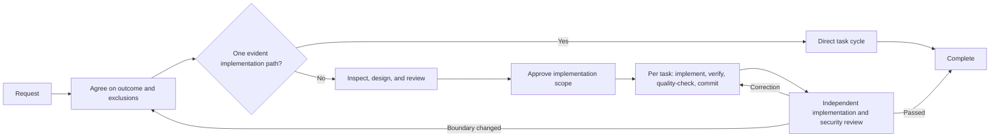

# Claude Code 開発ワークフロー

[](https://claude.ai/code)
[](https://github.com/shinpr/claude-code-workflows)
[](https://opensource.org/licenses/MIT)
[](https://github.com/shinpr/claude-code-workflows/pulls)

[English](README.md) | [简体中文](README.zh-CN.md) | **日本語** | [Español](README.es.md) | [한국어](README.ko.md) | [Português (Brasil)](README.pt-BR.md)

Claude Codeはコードベースを深く探索できます。しかし、複雑な作業でより難しいのは、探索そのものではなく結論へ収束させることです。たとえばアカウント復旧フローを設計している途中で、トークン処理の不整合を見つけ、その調査に大半を費やした結果、本来求められていた復旧時の動作が曖昧なまま残ることがあります。

claude-code-workflowsは、探索を合意済みの成果へ向け続けるための仕組みです。設計前に成果と対象外を合意し、設計内容をリポジトリと照合し、コミット前に各タスクを検証します。規模の大きな変更では、完成した実装が合意した成果を実現し、不要な機能や変更を含まず、動作・信頼性・セキュリティに重大な問題がないかを独立してレビューします。その範囲内で、実装の詳細はClaudeがコードベースから判断します。

成果と安全な実装範囲がすでに明確なら、Claude Codeをそのまま使うのが適しています。スコープの合意、後から参照できる設計判断、コンテキスト間の確実な引き継ぎ、独立した検証が必要な変更では、このワークフローを使ってください。

---

## どんなときに役立つか

このワークフローはエージェント呼び出しと成果物を増やすため、そのコストに見合う場面で使うものです。関連する問題の発見によって変更の目的がずれそうな場合、筋の通った設計でも要求された動作を外す可能性がある場合、あるいはテストが通っていても確認したい動作を実際には観測できていない場合に効果を発揮します。すべてのチェックまでは必要ない変更なら、[ライトモード](#ライトモード)で実行するチェックを減らせます。

実装範囲の承認後は、Claudeが各タスクに絞った検証、リポジトリの品質チェック、コミット、最終レビューまで進めます。通常の実装判断で逐一確認を求めることはありません。合意したプロダクト成果や対象外を変える必要がある場合と、元に戻せない外部操作に承認が必要な場合だけユーザーに判断を求め、技術設計や実装上の選択はClaudeが進めます。Claude Codeプラグインとして提供されるため、Claudeの手順を固定せずに、複数のリポジトリへ同じ統制を適用できます。

---

## クイックスタート

プラグインマーケットプレイスに対応したバージョンのClaude Codeが必要です。

### 目的に合うルートを選ぶ

| やりたいこと | 最初に実行するもの | プラグイン |
|---|---|---|
| バックエンド、API、CLI、一般的な変更を一通り完了させる | `/recipe-implement` | `dev-workflows` |
| 実装前にバックエンドまたは一般的な変更を設計する | `/recipe-design` | `dev-workflows` |
| React / TypeScriptフロントエンドを設計・実装する | `/recipe-front-design` → `/recipe-front-plan` → `/recipe-front-build` | `dev-workflows-frontend` |
| バックエンドとReactフロントエンドをまとめて実装する | `/recipe-fullstack-implement` | `dev-workflows-fullstack` |
| 完成した実装を合意した成果に照らしてレビューする | `/recipe-review` または `/recipe-front-review` | `dev-workflows` または `dev-workflows-frontend` |
| リポジトリ固有の品質ルールを定める | `/recipe-quality-profile` | 任意のワークフロープラグイン |
| 修正を決める前に問題を調査する | `/recipe-diagnose` | 任意のワークフロープラグイン |
| コードから既存システムを文書化する | `/recipe-reverse-engineer` | `dev-workflows` または `dev-workflows-fullstack` |
| 使い捨ての実験やプロトタイプを作る | Claude Codeを直接使う | なし |

### 共通セットアップ

```bash
# 1. Claude Codeを起動
claude

# 2. マーケットプレイスを追加
/plugin marketplace add shinpr/claude-code-workflows
```

### ワークフロープラグインを1つインストールする

プロジェクトに合うプラグインを選びます。インストール後に`/reload-plugins`の実行を求められた場合は、レシピを呼び出す前に実行してください。

```bash
# バックエンドまたは一般的な変更
/plugin install dev-workflows@claude-code-workflows
/recipe-implement "Add rate limiting to the public API"

# フロントエンド
/plugin install dev-workflows-frontend@claude-code-workflows
/recipe-front-design "Add account recovery screens"

# フルスタック
/plugin install dev-workflows-fullstack@claude-code-workflows
/recipe-fullstack-implement "Add user authentication with JWT + login form"
```

インストールするワークフロープラグインは1つだけにしてください。`dev-workflows-fullstack`にはバックエンドとフロントエンドの両方が含まれています。以前`dev-workflows`のフルスタックレシピを使っていた場合は、`dev-workflows-fullstack`へ移行してください。

`/recipe-front-design`は、該当するUI仕様と設計ドキュメントがレビュー・承認された時点で終了します。続けて実装する場合は`/recipe-front-plan`と`/recipe-front-build`を実行します。バックエンドや一般的な変更にも、同じ段階構成の`/recipe-design`、`/recipe-plan`、`/recipe-build`があります。

### チームでのセットアップ

Claude Codeはプロジェクト単位のマーケットプレイスとプラグインに対応しています。生成された`.claude/settings.json`をコミットすると、コントリビューターにも同じワークフロープラグインの利用を案内できます。

```bash
claude plugin marketplace add shinpr/claude-code-workflows --scope project
claude plugin install dev-workflows-fullstack@claude-code-workflows --scope project
```

`dev-workflows-fullstack`は、リポジトリに合うプラグインへ置き換えてください。プロジェクト単位および管理対象のインストール方法については、[Claude Codeのプラグインドキュメント](https://code.claude.com/docs/en/discover-plugins#configure-team-marketplaces)を参照してください。

---

## 仕組み


```mermaid
flowchart LR
    A[Request] --> B[Agree on outcome and exclusions]
    B --> C{One evident implementation path?}
    C -->|Yes| S[Direct task cycle]
    S --> J[Complete]
    C -->|No| D[Inspect, design, and review]
    D --> E[Approve implementation scope]
    E --> F[Per task: implement, verify, quality-check, commit]
    F --> I[Independent implementation and security review]
    I -->|Correction| F
    I -->|Boundary changed| B
    I -->|Passed| J[Complete]
```

ルートを決めるのはファイル数ではなく、必要なプロダクト判断と設計判断の数です。1つの責務の中で既存パターンに沿って達成できる1つの成果なら、そのままタスクサイクルへ進みます。複数の責務にまたがる変更や、長く残る設計判断が必要な変更では、先にレビュー済みの設計ドキュメントと作業計画を用意し、判断の内容に応じてPRD、UI仕様、ADRも作成します。

レビューの提案が自動的に作業項目になることはありません。メインセッションは、どの指摘が合意した成果に含まれるかを判断し、それ以外は理由を添えて却下します。

### ライトモード

```bash
/recipe-implement "Lite mode. Add rate limiting to the public API"
```

ライトモードは、どのレシピでも依頼文の中で指定できます。フェーズと承認ポイントは変わらず、実行するチェックだけが減ります。設計ドキュメントをリポジトリや他の設計ドキュメントと照合する作業と、独立したセキュリティレビューは行いません。リポジトリの品質チェックはコミットごとではなく最後のタスクの後に1回だけ実行し、最終コードレビューは通常どおり行います。ライトモードは、Claudeに解除を頼むまでそのセッションの間ずっと有効です。

### 実際のワークフロー実行例

[mcp-local-ragの増分同期機能](https://github.com/shinpr/mcp-local-rag/pull/171)は、ファイルシステムのスキャン、ストレージ、CLI、MCPの各インターフェースにまたがる42ファイルの変更でした。独立したセキュリティレビューによって実装は2回差し戻され、検証前のファイル読み取りと、シンボリックリンクされた親ディレクトリを経由してパス制限を回避できる問題が見つかりました。

この実行は、参照先のADRと設計ドキュメントが存在しない作業計画から始まり、技術判断の根拠が不明確な状態でした。ユーザーは作業計画を正本として扱うことを選び、レシピはそれを13個のタスクに分割しました。最終実装には承認された動作を検証するために必要な変更が含まれ、監視モードと永続ジョブを対象外にした理由はPRに記録されています。

---

## 代表的なワークフロー

### バックエンドまたは一般的な変更を最初から最後まで実装する

```bash
/recipe-implement "Add rate limiting to the public API"
```

レシピは変更範囲を定め、現在の実装を調べ、判断に必要なドキュメントだけを作成します。判断が必要な箇所では承認を求め、作業計画に沿った実装と最終レビューまで進めます。

### 先に設計し、実装は後で行う

```bash
# バックエンドまたは一般
/recipe-design "Design rate limiting for the public API"
/recipe-plan
/recipe-build

# Reactフロントエンド
/recipe-front-design "Build a user profile dashboard"
/recipe-front-plan
/recipe-front-build
```

設計レシピは既存実装を確認し、範囲を確定し、必要なドキュメントを作成して、独立した整合性レビューを行った後に承認を待ちます。承認済みの成果物があれば、別のコンテキストや別の担当者が後から計画と実装を再開できます。各タスクは[作業計画](skills/documentation-criteria/references/plan-template.md)の中で、満たすべき設計判断と受け入れ基準を参照します。最終レビュアーも以前の会話ではなく、同じ設計判断と受け入れ基準に照らして完成したコードを確認します。

フロントエンドでは、UIの構造や動作に設計の余地がある場合にUI分析とUI仕様を追加し、さらにコンポーネント設計、React Testing Library、TypeScriptのチェックを行います。

たとえば2つのダッシュボードコンポーネントが個別にはローディングを正しく処理していても、一方がローディング中で他方が失敗したときの画面全体の動作が未定義な場合があります。UI仕様はその状態の組み合わせを記録し、結合前に設計とテスト作業へ対応付けます。

### フルスタック開発

```bash
/recipe-fullstack-implement "Add user authentication with JWT + React login form"
```

変更に複数の独立したプロダクト成果がある場合は、1つのPRDで機能全体を扱います。バックエンドとフロントエンドの設計は分離したまま両者の境界の整合性を確認し、作業計画は垂直スライスを使って早い段階から結合を検証します。

既存のフルスタック作業計画から再開するには`/recipe-fullstack-build`を使います。フルスタックプラグインには、対応するバックエンドとフロントエンドのレシピも含まれます。

<details>
<summary>その他のワークフロー例</summary>

#### 完成した実装をレビューする

```bash
/recipe-review
```

レビューワークフローは完成した実装を合意した成果とリポジトリの基準に照らし、独立したセキュリティレビューを行います。受け入れた修正は、実装またはドキュメントの担当へ戻され、もう一度レビューされます。

#### 修正を決める前に問題を調査する

```bash
/recipe-diagnose "API returns 500 on user login"
```

診断ワークフローは実行経路をマッピングし、疑わしい障害点を検証して、解決策のトレードオフを提示します。コードは変更しません。

#### コードから既存システムを文書化する

```bash
/recipe-reverse-engineer "src/auth module"
```

コードからPRDと設計ドキュメントを作成し、実装と照合して内容を検証します。機能がバックエンドとフロントエンドにまたがる場合は、フルスタック版を使ってください。

詳しい実行例は[How I Made Legacy Code AI-Friendly with Auto-Generated Docs](https://dev.to/shinpr/how-i-made-legacy-code-ai-friendly-with-auto-generated-docs-4353)を参照してください。

#### 実装済みUIをデザインソースに合わせて調整する

```bash
/recipe-front-adjust "Align the card spacing and actions with the design source"
```

フロントエンドプラグインは外部デザインソースの参照方法を記録し、変更対象を確定し、調整がチェックに合格するまで視覚検証を繰り返します。

</details>

---

## ワークフローレシピ一覧

すべてのワークフローは`recipe-`で始まります。`/recipe-`まで入力してTabキーを押すと、インストール済みの候補を補完できます。

<details>
<summary>バックエンドおよび一般向けレシピをすべて表示</summary>

| レシピ | 目的 | 使用場面 |
|---|---|---|
| `/recipe-implement` | 機能を最初から最後まで実装 | 新機能や一連のワークフロー |
| `/recipe-design` | 設計ドキュメントを作成 | アーキテクチャ設計 |
| `/recipe-plan` | 設計から作業計画を作成 | 計画フェーズ |
| `/recipe-build` | 既存の作業計画を実行 | 実装の再開 |
| `/recipe-review` | 完成した実装を合意した成果に照らしてレビュー | 実装後の確認 |
| `/recipe-quality-profile` | リポジトリ固有の品質ルールを設定 | 品質ルールの設定 |
| `/recipe-diagnose` | 問題を調査し、解決策を比較 | 根本原因の分析 |
| `/recipe-reverse-engineer` | コードからPRDと設計ドキュメントを作成 | 既存システムの文書化 |
| `/recipe-add-integration-tests` | 結合テストまたはE2Eテストを追加 | 既存コードのカバレッジ |
| `/recipe-update-doc` | 既存ドキュメントを更新・レビュー | 要件または設計の変更 |

</details>

<details>
<summary>フロントエンド向けレシピをすべて表示</summary>

フロントエンドプラグインはReact固有の分析、コンポーネント設計、React Testing Library、TypeScriptチェック、必要に応じたプロトタイプコードからのUI仕様作成を追加します。

| レシピ | 目的 | 使用場面 |
|---|---|---|
| `/recipe-front-design` | 該当するUI仕様とフロントエンド設計ドキュメントを作成 | Reactコンポーネント設計 |
| `/recipe-front-plan` | フロントエンド作業計画を作成 | コンポーネント計画 |
| `/recipe-front-build` | フロントエンド作業計画を実行 | React実装の再開 |
| `/recipe-front-adjust` | 外部検証を使って実装済みUIを調整 | 見た目の調整 |
| `/recipe-front-review` | 完成したフロントエンドを合意した成果に照らしてレビュー | 実装後の確認 |
| `/recipe-quality-profile` | リポジトリ固有の品質ルールを設定 | 品質ルールの設定 |
| `/recipe-diagnose` | 問題を調査し、解決策を比較 | 根本原因の分析 |
| `/recipe-update-doc` | 既存ドキュメントを更新・レビュー | 要件または設計の変更 |

</details>

---

## ワークフローを使わずガイダンスだけを利用する

独自のプロンプトやCIですでにオーケストレーションしていて、ベストプラクティスのガイドだけが必要な場合は`dev-skills`を使います。計画、実行、検証をClaudeに一通り任せたい場合は、用途に合うワークフロープラグインをインストールしてください。

- エージェントやレシピスキルを含まない最小限のコンテキスト使用量
- 手順を固定せず、コーディング、テスト、設計、ドキュメントのガイダンスを提供
- 作業に応じて関連スキルを自動読み込み

> **`dev-skills`をワークフロープラグインと同時にインストールしないでください。** 同じスキル説明が重複し、コンテキスト上限に達した後にClaude Codeがスキルを無視することがあります。

```bash
/plugin install dev-skills@claude-code-workflows
```

プラグイン種別を切り替えるには、次のように操作します。

```bash
# dev-skillsからdev-workflowsへ
/plugin uninstall dev-skills@claude-code-workflows
/plugin install dev-workflows@claude-code-workflows

# dev-workflowsからdev-skillsへ
/plugin uninstall dev-workflows@claude-code-workflows
/plugin install dev-skills@claude-code-workflows
```

---

## FAQ

**Q：エラーが発生した場合はどうなりますか？**

A：ワークフローが、承認済みの成果の範囲内でテスト、型、lint、ビルドの失敗を修正します。同じ責務や契約に必要な周辺変更も対象です。

**Q：OpenAI Codex CLI向けのバージョンはありますか？**

A：はい。**[codex-workflows](https://github.com/shinpr/codex-workflows)**は同じワークフローモデルをCodex CLI向けに調整しています。

**Q：`docs/plans/`の作業計画とタスクファイルはコミットすべきですか？**

A：いいえ。レシピは`docs/plans/`を一時的な作業状態として扱います。処理済みのタスクファイルと中間修正ファイルは、正常終了後に削除されます。作業計画はレビューや後続のビルドのために残る場合がありますが、不要になれば削除できます。この作業状態がGit管理に入らないよう、プロジェクトの`.gitignore`へ次の行を追加してください。

```
docs/plans/
```

PRD、ADR、UI仕様、設計ドキュメントは、それぞれ`docs/prd/`、`docs/adr/`、`docs/ui-spec/`、`docs/design/`に配置され、コミット対象です。

---

## 設計上の背景

<details>
<summary>設計の背景資料</summary>

- [Why LLMs Are Bad at 'First Try' and Great at Verification](https://www.norsica.jp/blog/llm-verification-over-generation)：同じセッションで生成と評価を行うより、外部フィードバックと新しいコンテキストを使う方が信頼できる理由。
- [When Better Models Make Old Agent Workflows Worse](https://www.norsica.jp/blog/when-better-models-make-old-agent-workflows-worse)：経路を固定せず、境界と根拠を厳格に扱う理由。
- [Reasoning Effort Is Not a Quality Setting](https://www.norsica.jp/blog/reasoning-effort-is-not-a-quality-setting)：探索を広げても、現在の成果に必要な作業へ収束させる必要がある理由。
- [Stop Putting Everything in AGENTS.md](https://www.norsica.jp/blog/stop-putting-everything-in-agents-md)：常時読み込む指示を小さく保ち、必要に応じてスキル、設計判断、タスクガイダンスを読み込む理由。

</details>

---

## ライセンス

MIT License。自由に利用、変更、配布できます。

詳細は[LICENSE](LICENSE)を参照してください。

---

[@shinpr](https://github.com/shinpr)が開発・メンテナンスしています。
