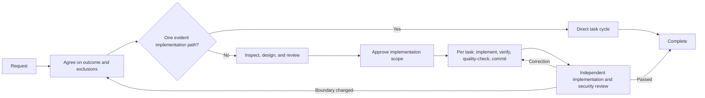

# Claude Code 개발 워크플로

[](https://claude.ai/code)
[](https://github.com/shinpr/claude-code-workflows)
[](https://opensource.org/licenses/MIT)
[](https://github.com/shinpr/claude-code-workflows/pulls)

[English](README.md) | [简体中文](README.zh-CN.md) | [日本語](README.ja.md) | [Español](README.es.md) | **한국어** | [Português (Brasil)](README.pt-BR.md)

Claude Code는 코드베이스를 깊이 탐색할 수 있습니다. 하지만 복잡한 작업에서 더 어려운 문제는 탐색이 아니라 결론을 내는 일입니다. 예를 들어 계정 복구 흐름을 설계하다가 토큰 처리의 실제 불일치를 발견하면, Claude가 설계 대부분을 그 문제에 할애한 나머지 정작 요청받은 복구 동작을 모호하게 남길 수 있습니다.

claude-code-workflows는 탐색이 합의된 결과를 향하도록 유지합니다. 설계 전에 목표와 제외 범위를 합의하고, 설계를 저장소와 대조하며, 커밋 전에 각 작업을 검증합니다. 규모가 큰 변경에서는 완성된 구현이 의도한 동작과 보안 요구 사항을 충족하는지도 독립적으로 검토합니다. 이 범위 안에서 Claude는 코드베이스를 바탕으로 구현 세부 사항을 결정합니다.

목표와 안전한 구현 범위가 이미 명확하다면 Claude Code를 직접 사용하세요. 범위 합의, 오래 유지해야 하는 설계 결정, 컨텍스트 사이의 안정적인 인계 또는 독립적인 검증이 필요한 변경에는 이 워크플로를 사용하세요.

---

## 언제 유용한가요?

이 워크플로는 Agent 호출과 산출물을 추가하므로 그만한 가치가 있을 때 사용해야 합니다. 관련 문제를 발견한 탓에 큰 변경이 원래 목표에서 벗어날 수 있거나, 설계 자체는 일관되지만 요청한 동작을 놓칠 수 있거나, 통과한 테스트가 검증한다고 주장한 내용을 실제로 관찰하지 못할 수 있을 때 유용합니다.

구현 범위가 승인되면 Claude는 일상적인 구현 결정을 되묻지 않고 작업별 검증, 저장소 품질 검사, 커밋, 최종 검토까지 진행합니다. 제품 변경과 주요 설계 변경은 사용자에게 결정을 요청하고, 되돌릴 수 있는 구현 선택은 Claude가 처리합니다. Claude Code 플러그인으로 제공되므로 Claude의 구체적인 작업 순서를 고정하지 않고도 팀의 여러 저장소에 같은 통제 방식을 적용할 수 있습니다.

---

## 빠른 시작

플러그인 마켓플레이스를 지원하는 버전의 Claude Code가 필요합니다.

### 목적에 맞는 경로 선택

| 필요한 작업 | 시작 명령 | 플러그인 |
|---|---|---|
| 백엔드, API, CLI 또는 일반 변경을 처음부터 끝까지 구현 | `/recipe-implement` | `dev-workflows` |
| 구현 전에 백엔드 또는 일반 변경을 설계 | `/recipe-design` | `dev-workflows` |
| React / TypeScript 프런트엔드를 설계하고 구현 | `/recipe-front-design` → `/recipe-front-plan` → `/recipe-front-build` | `dev-workflows-frontend` |
| 백엔드와 React 프런트엔드를 함께 구현 | `/recipe-fullstack-implement` | `dev-workflows-fullstack` |
| 설계를 기준으로 구현을 검토 | `/recipe-review` 또는 `/recipe-front-review` | `dev-workflows` 또는 `dev-workflows-frontend` |
| 수정 방법을 정하기 전에 문제를 조사 | `/recipe-diagnose` | 모든 워크플로 플러그인 |
| 코드에서 기존 시스템 문서를 생성 | `/recipe-reverse-engineer` | `dev-workflows` 또는 `dev-workflows-fullstack` |
| 일회성 실험이나 프로토타입 | Claude Code를 직접 사용 | 없음 |

### 공통 설정

```bash
# 1. Claude Code 실행
claude

# 2. 마켓플레이스 추가
/plugin marketplace add shinpr/claude-code-workflows
```

### 워크플로 플러그인 하나 설치

프로젝트에 맞는 플러그인을 설치하세요. 설치 후 `/reload-plugins` 실행 안내가 나오면 recipe를 호출하기 전에 실행하세요.

```bash
# 백엔드 또는 일반 변경
/plugin install dev-workflows@claude-code-workflows
/recipe-implement "Add rate limiting to the public API"

# 프런트엔드
/plugin install dev-workflows-frontend@claude-code-workflows
/recipe-front-design "Add account recovery screens"

# 풀스택
/plugin install dev-workflows-fullstack@claude-code-workflows
/recipe-fullstack-implement "Add user authentication with JWT + login form"
```

워크플로 플러그인은 하나만 설치하세요. `dev-workflows-fullstack`에는 백엔드와 프런트엔드 워크플로가 모두 포함되어 있습니다. 이전에 `dev-workflows`의 풀스택 recipe를 사용했다면 `dev-workflows-fullstack`으로 이전하세요.

`/recipe-front-design`은 해당하는 UI Spec과 Design Doc이 검토 및 승인되면 종료됩니다. 계속 진행하려면 `/recipe-front-plan`과 `/recipe-front-build`를 실행하세요. 백엔드나 일반 변경에는 같은 단계로 구성된 `/recipe-design`, `/recipe-plan`, `/recipe-build`가 있습니다.

### 팀 설정

Claude Code는 프로젝트 범위의 마켓플레이스와 플러그인을 지원합니다. 생성된 `.claude/settings.json`을 커밋하면 기여자도 같은 워크플로 플러그인을 사용하도록 안내할 수 있습니다.

```bash
claude plugin marketplace add shinpr/claude-code-workflows --scope project
claude plugin install dev-workflows-fullstack@claude-code-workflows --scope project
```

`dev-workflows-fullstack`은 저장소에 맞는 플러그인으로 바꾸세요. 프로젝트 범위 및 관리형 설치 방법은 [Claude Code 플러그인 문서](https://code.claude.com/docs/en/discover-plugins#configure-team-marketplaces)를 참고하세요.

---

## 동작 방식



경로는 파일 수나 구현 작업량이 아니라 필요한 제품 결정과 설계 결정의 수에 따라 달라집니다.

| 규모 | 변경에 필요한 조건 | 진행 방식 |
|---|---|---|
| Small | 하나의 책임 안에서 기존 패턴을 따르는 단일 결과 | 작업을 직접 실행 → 작업별 검사 및 저장소 검사 → 보안 검토 |
| Medium | 여러 책임에 걸치거나 장기적으로 유지할 설계 결정이 필요한 단일 결과 | 검토된 Design Doc과 필요시 UI Spec / ADR → 선택된 통합/E2E 검증 → 검토된 Work Plan → 작업 주기 → 최종 검토 |
| Large | 각각 별도의 설계 결정이 필요한 여러 독립적인 제품 결과 | 검토된 PRD 및 Design Doc과 필요시 UI Spec / ADR → 선택된 통합/E2E 검증 → 검토된 Work Plan → 작업 주기 → 최종 검토 |

UI Spec, ADR, 통합 또는 E2E 테스트 스켈레톤은 해당 결정이나 검증 경계가 필요할 때만 만들어집니다.

산출물을 만들었다고 워크플로가 자동으로 다음 단계로 넘어가지는 않습니다. 채택할 설계를 바꿀 수 있는 전제는 승인 전에 실제로 확인할 수 있는 근거로 해소해야 합니다. 저장소 근거와 신뢰할 수 있는 자료만으로 판단할 수 없으면, 검증 단계에서 어떤 근거가 부족한지 먼저 확인합니다. 범위를 제한한 기능 검증만으로 그 근거를 충분히 얻을 수 있다면, 설계를 맡은 에이전트가 한 번만 실행하고 임시 산출물을 폐기합니다. Work Plan은 구현을 승인하기 전에 범위, 의존성 순서, 실행 가능한 검증 방법을 검토합니다. 각 작업은 작업별 검사와 해당 저장소 검사를 통과한 뒤에만 커밋합니다. 단계별 구현이 끝나면 별도의 검토에서 설계 일관성, 관찰 가능한 동작의 검증 범위, 보안을 확인합니다.

메인 세션은 어떤 발견이 현재 목표에 포함되는지 판단하고, 저장소를 근거로 구현 질문을 해결하며, 영향을 받지 않는 작업을 계속 진행합니다. 검토 제안이 자동으로 작업이 되지는 않습니다. 수락된 수정은 구현 단계로 돌아가 영향을 받는 검증 관문을 다시 거칩니다.

### 새로운 컨텍스트에도 결정을 유지하는 방법

단계마다 새로운 컨텍스트를 사용하면 한 단계의 추론이 다음 단계에서 암묵적인 권한으로 바뀌는 일을 막을 수 있습니다. 포함된 [Work Plan 템플릿](skills/documentation-criteria/references/plan-template.md)은 Design Doc에서 승인된 모든 기술 요구 사항에 대응 작업이나 명시적인 누락 표시가 있도록 요구합니다. 문서의 모든 절이나 검토 제안을 작업으로 바꾸지는 않습니다. 누락은 승인된 요구 사항에 아직 구현 또는 검증 작업이 없다는 뜻입니다.

```markdown
| Design Doc | DD Section | DD Item | Category | Covered By Task(s) | Gap Status | Notes |
|---|---|---|---|---|---|---|
| docs/design/example.md | API contract | Preserve the error response shape | contract-change | Phase 2 Task 1 | covered | |
| docs/design/example.md | Verification | Exercise cache invalidation | verification | | gap | Add a covering task before approval |
```

[Task 템플릿](skills/documentation-criteria/references/task-template.md)은 구현을 구속하는 결정과 외부에서 확인할 수 있는 계약상의 값을 전달하며, 각 항목에 예/아니요로 답할 수 있는 준수 검사를 둡니다. 실행 후에는 커밋 전에 전체 작업 변경에 해당 저장소 검사를 적용합니다. 최종 검토자는 구현 대화에 의존하지 않고 같은 승인 자료와 완성된 코드를 읽습니다.

### 실제 워크플로 실행 사례

[mcp-local-rag의 증분 동기화 기능](https://github.com/shinpr/mcp-local-rag/pull/171)은 파일 시스템 스캔, 스토리지, CLI, MCP 인터페이스에 걸친 42개 파일 변경이었습니다. 독립적인 보안 검토가 구현을 두 번 돌려보냈습니다. 검증 전에 파일을 읽는 문제와 심볼릭 링크된 상위 디렉터리를 통해 경로 제한을 벗어나는 문제를 찾아냈습니다.

실행은 존재하지 않는 ADR과 Design Doc을 참조하는 Work Plan에서 시작되어 기술 결정의 승인 근거가 불분명했습니다. 사용자는 Work Plan을 기준 자료로 삼기로 했고, recipe는 이를 계획된 13개 작업으로 나눴습니다. 최종 구현에는 승인된 동작을 검증하는 데 필요한 변경이 포함되었고, watch 모드와 영구 작업을 제외한 이유는 PR에 기록했습니다.

### 첫 실행 후 확인할 사항

- 합의한 접근 방식이 기존 구현을 확장하며 각 추가 사항에 근거를 제시했나요?
- 각 요구 사항을 작업과 관찰 가능한 검증 방법까지 추적할 수 있나요?
- 완료된 모든 작업이 커밋 전에 작업별 검사와 저장소 품질 검사를 통과했나요?
- 최종 검토가 전체 변경을 의도한 동작 및 보안 요구 사항과 비교했나요?
- 검토자가 추가 작업을 제안했을 때 적용하거나 거절한 이유가 보고서에 있나요?

---

## 주요 워크플로

### 백엔드 또는 일반 개발을 처음부터 끝까지 진행

```bash
/recipe-implement "Add rate limiting to the public API"
```

recipe는 변경 범위를 정하고 현재 구현을 조사한 뒤, 결정에 필요한 문서만 만듭니다. 결정이 필요한 지점에서 승인을 요청하고, 이후 계획된 구현과 최종 검토까지 진행합니다.

### 먼저 설계하고 나중에 구현

```bash
# 백엔드 또는 일반 변경
/recipe-design "Design rate limiting for the public API"
/recipe-plan
/recipe-build

# React 프런트엔드
/recipe-front-design "Build a user profile dashboard"
/recipe-front-plan
/recipe-front-build
```

설계 recipe는 기존 구현을 조사하고 범위를 확인하며 필요한 문서를 만든 뒤, 독립적인 일관성 검토를 거쳐 승인을 기다립니다. 나중에 새 컨텍스트나 다른 담당자가 승인된 산출물을 바탕으로 계획과 구현을 이어갈 수 있습니다.

프런트엔드 경로는 UI 구조나 동작을 더 설계해야 할 때 UI 분석과 UI Spec을 추가하고, 컴포넌트 아키텍처, React Testing Library, TypeScript 검사도 수행합니다.

예를 들어 대시보드 컴포넌트 두 개가 각각 로딩 상태를 올바르게 처리해도, 하나는 로딩 중이고 다른 하나는 실패했을 때 전체 화면의 동작은 정의되지 않았을 수 있습니다. UI Spec은 이 상태 조합을 기록하고 통합 전에 설계 및 테스트 작업과 연결합니다.

### 풀스택 개발

```bash
/recipe-fullstack-implement "Add user authentication with JWT + React login form"
```

변경에 여러 독립적인 제품 결과가 있으면 하나의 PRD가 전체 기능을 다룹니다. 백엔드와 프런트엔드 설계는 분리하고, `design-sync`가 그 경계를 확인하며, Work Plan은 수직 슬라이스를 사용해 통합을 일찍 검증합니다.

기존 풀스택 Work Plan에서 계속하려면 `/recipe-fullstack-build`를 사용하세요. 풀스택 플러그인에는 필요한 백엔드와 프런트엔드 recipe도 포함되어 있습니다.

<details>
<summary>워크플로 예시 더 보기</summary>

#### 설계를 기준으로 구현 검토

```bash
/recipe-review
```

검토 워크플로는 구현을 Design Doc과 비교하고 독립적인 보안 검토를 실행합니다. 승인된 결정을 바꾸는 수정은 계약을 조용히 변경하지 않고 관련 문서 단계로 되돌려 다시 검토합니다.

#### 수정 방법을 정하기 전에 문제 조사

```bash
/recipe-diagnose "API returns 500 on user login"
```

진단 워크플로는 실행 경로를 정리하고 의심되는 실패 지점을 검증하며 해결책의 장단점을 제시합니다. 코드는 변경하지 않습니다.

#### 코드에서 기존 시스템 문서화

```bash
/recipe-reverse-engineer "src/auth module"
```

코드에서 PRD와 Design Doc을 만들고 구현과 대조해 검증합니다. 기능이 백엔드와 프런트엔드에 걸쳐 있다면 풀스택 옵션을 사용하세요.

전체 사례는 [How I Made Legacy Code AI-Friendly with Auto-Generated Docs](https://dev.to/shinpr/how-i-made-legacy-code-ai-friendly-with-auto-generated-docs-4353)를 참고하세요.

#### 디자인 자료에 맞춰 구현된 UI 조정

```bash
/recipe-front-adjust "Align the card spacing and actions with the design source"
```

프런트엔드 플러그인은 외부 디자인 자료에 접근하는 방법을 기록하고 변경 대상 파일을 확인한 뒤, 조정이 검사를 통과할 때까지 시각 검증을 반복합니다.

</details>

---

## Workflow Recipe 목록

모든 워크플로 진입점은 `recipe-` 접두사를 사용합니다. `/recipe-`를 입력하고 Tab 키를 누르면 설치된 항목을 확인할 수 있습니다.

<details>
<summary>백엔드 및 일반 recipe 모두 보기</summary>

| Recipe | 목적 | 사용 시점 |
|---|---|---|
| `/recipe-implement` | 기능을 처음부터 끝까지 구현 | 새 기능과 전체 워크플로 |
| `/recipe-design` | 설계 문서 작성 | 아키텍처 계획 |
| `/recipe-plan` | 설계에서 Work Plan 생성 | 계획 단계 |
| `/recipe-build` | 기존 Work Plan 실행 | 구현 재개 |
| `/recipe-review` | Design Doc을 기준으로 구현 검증 | 구현 후 확인 |
| `/recipe-diagnose` | 문제를 조사하고 해결책 비교 | 근본 원인 분석 |
| `/recipe-reverse-engineer` | 코드에서 PRD와 Design Doc 생성 | 기존 시스템 문서화 |
| `/recipe-add-integration-tests` | 통합 또는 E2E 테스트 추가 | 기존 코드의 커버리지 확보 |
| `/recipe-update-doc` | 기존 문서 업데이트 및 검토 | 요구 사항 또는 설계 변경 |
| `/recipe-task` | 규칙을 따르는 작업을 직접 실행 | 단계별 인계가 필요 없는 작업 |

</details>

<details>
<summary>프런트엔드 recipe 모두 보기</summary>

프런트엔드 플러그인은 React 전용 분석, 컴포넌트 아키텍처, React Testing Library, TypeScript 검사와 필요시 프로토타입 코드에서 UI Spec을 만드는 기능을 추가합니다.

| Recipe | 목적 | 사용 시점 |
|---|---|---|
| `/recipe-front-design` | 해당 UI Spec과 프런트엔드 Design Doc 작성 | React 컴포넌트 아키텍처 |
| `/recipe-front-plan` | 프런트엔드 Work Plan 생성 | 컴포넌트 계획 |
| `/recipe-front-build` | 프런트엔드 Work Plan 실행 | React 구현 재개 |
| `/recipe-front-adjust` | 외부 검증으로 구현된 UI 조정 | 시각적 개선 |
| `/recipe-front-review` | 프런트엔드 Design Doc을 기준으로 구현 검증 | 구현 후 확인 |
| `/recipe-diagnose` | 문제를 조사하고 해결책 비교 | 근본 원인 분석 |
| `/recipe-update-doc` | 기존 문서 업데이트 및 검토 | 요구 사항 또는 설계 변경 |
| `/recipe-task` | 규칙을 따르는 작업을 직접 실행 | 단계별 인계가 필요 없는 작업 |

</details>

---

## 플러그인 구성

전문 Agent는 분석과 설계를 실행 및 최종 검토와 분리합니다. 각 플러그인은 해당 워크플로에 필요한 역할만 포함하고, 풀스택 플러그인은 백엔드와 프런트엔드 역할을 결합합니다. 전체 역할 목록은 아래에서 확인할 수 있습니다.

<details>
<summary>전문 Agent 역할 모두 보기</summary>

### 공통 Agent

백엔드, 프런트엔드, 풀스택 플러그인이 공유하는 Agent입니다.

| Agent | 역할 |
|---|---|
| **requirement-analyzer** | 오케스트레이터가 요구 사항과 워크플로를 결정하는 데 필요한 간결한 범위 및 비용 근거 수집 |
| **prd-creator** | 큰 기능의 제품 요구 사항 정의 |
| **codebase-analyzer** | 설계 전에 기존 코드와 의존성 조사 |
| **code-verifier** | 문서를 구현과 비교 |
| **work-planner** | 설계 결정을 실행 가능한 Work Plan으로 변환 |
| **task-decomposer** | Work Plan을 커밋 가능한 작업으로 분할 |
| **acceptance-test-generator** | 요구 사항에서 통합 및 E2E 테스트 스켈레톤 생성 |
| **integration-test-reviewer** | 통합 및 E2E 테스트가 의도한 범위를 검증하는지 검토 |
| **code-reviewer** | 구현을 Design Doc과 대조 |
| **document-reviewer** | 문서 완전성과 규칙 준수 여부 검토 |
| **design-sync** | 여러 Design Doc 사이의 충돌 감지 |
| **investigator** | 실행 경로를 정리하고 잠재적인 실패 지점 식별 |
| **verifier** | 의심되는 실패 지점을 검증하고 경로 커버리지 확인 |
| **solver** | 해결책과 장단점 비교 |
| **security-reviewer** | 완성된 구현의 보안 문제 검토 |
| **rule-advisor** | 작업에 관련된 개발 규칙 선택 |

### 백엔드 전용 Agent

| Agent | 역할 |
|---|---|
| **technical-designer** | 기술 접근 방식과 아키텍처 설계 |
| **scope-discoverer** | 기존 구현에서 기능 경계 파악 |
| **task-executor** | 테스트 우선 검증으로 백엔드 작업 구현 |
| **quality-fixer** | 테스트, 타입 검사, lint 등 품질 관문 실행 |

### 프런트엔드 전용 Agent

| Agent | 역할 |
|---|---|
| **ui-spec-designer** | 요구 사항과 선택적 프로토타입에서 UI Spec 작성 |
| **ui-analyzer** | 디자인 자료, 디자인 시스템, 가이드라인을 가져오고 기존 UI 조사 |
| **technical-designer-frontend** | React 컴포넌트 아키텍처와 상태 관리 설계 |
| **task-executor-frontend** | React Testing Library 커버리지를 포함한 React 컴포넌트 구현 |
| **quality-fixer-frontend** | 프런트엔드 테스트, TypeScript 검사, lint, 빌드 실행 |

</details>

<details>
<summary>내장 개발 가이드 보기</summary>

- **Coding Principles.** 코드 품질 기준.
- **Testing Principles.** TDD, 커버리지, 테스트 패턴.
- **Implementation Approach.** 구현 결정과 장단점.
- **Documentation Standards.** 명확하고 유지보수하기 쉬운 문서.
- **External Resource Context.** 저장소 외부의 디자인 자료, 디자인 시스템, API 스키마, 인프라 정의 등에 접근하는 방법 기록.
- **LLM-Friendly Context.** 후속 Agent가 추측 없이 실행할 수 있도록 명확한 프롬프트, 인계, 산출물, 지시 제공.

Agent는 작업에 필요할 때 이 skill을 불러옵니다. 프런트엔드 플러그인에는 React와 TypeScript 전용 규칙도 포함됩니다.

</details>

<details>
<summary>워크플로 없이 가이드만 사용하기(dev-skills)</summary>

사용자 지정 프롬프트나 CI를 통해 이미 오케스트레이션하고 있고 모범 사례 가이드만 필요하다면 `dev-skills`를 사용하세요. Claude가 변경을 처음부터 끝까지 계획하고 실행하며 검증하게 하려면 용도에 맞는 워크플로 플러그인을 설치하세요.

- Agent 없이 최소한의 컨텍스트만 사용
- 정해진 절차를 강제하지 않고 개발, 테스트, 설계, 문서 가이드 제공
- 작업에 맞는 skill 자동 로드

> **`dev-skills`와 워크플로 플러그인을 함께 설치하지 마세요.** 두 플러그인은 같은 skill을 공유하므로 중복된 설명 때문에 컨텍스트 한도에 도달한 뒤 Claude Code가 skill을 무시할 수 있습니다.

```bash
/plugin install dev-skills@claude-code-workflows
```

플러그인 유형을 전환하려면 다음과 같이 실행하세요.

```bash
# dev-skills -> dev-workflows
/plugin uninstall dev-skills@claude-code-workflows
/plugin install dev-workflows@claude-code-workflows

# dev-workflows -> dev-skills
/plugin uninstall dev-workflows@claude-code-workflows
/plugin install dev-skills@claude-code-workflows
```

</details>

<details>
<summary>선택적 추가 플러그인 보기</summary>

다음 플러그인은 핵심 워크플로를 바꾸지 않고 관련 기능을 제공합니다.

- [claude-code-discover](https://github.com/shinpr/claude-code-discover): 기능 아이디어를 근거가 있는 PRD로 변환합니다.
- [metronome](https://github.com/shinpr/metronome): 지름길을 택한 징후를 감지하고 Claude가 정의된 절차를 따르도록 요청합니다.
- [linear-prism](https://github.com/shinpr/linear-prism): 요구 사항을 검증하고 구조화된 Linear 작업으로 변환합니다.
- [pr-review](https://github.com/shinpr/pr-review-skill): 저장소별 기준으로 GitHub PR을 검토하고 승인된 지적만 게시합니다.

```bash
/plugin install discover@claude-code-workflows
/plugin install metronome@claude-code-workflows
/plugin install linear-prism@claude-code-workflows
/plugin install pr-review@claude-code-workflows
```

</details>

---

## 자주 묻는 질문

**Q: 오류가 발생하면 어떻게 되나요?**

A: quality-fixer Agent가 승인된 목표 안에서 테스트, 타입, lint, 빌드 실패를 처리합니다. 같은 책임이나 계약에 필요한 인접 변경도 포함됩니다.

다음과 같은 경우에만 워크플로가 중단됩니다.

- 수정이 제품 목표, 승인된 계약 또는 주요 설계 결정을 변경하는 경우
- 사용자만 가진 권한이 필요한 경우
- 기존 승인 범위에 포함되지 않은 되돌릴 수 없는 외부 작업을 수행해야 하는 경우

**Q: OpenAI Codex CLI용 버전도 있나요?**

A: 네. **[codex-workflows](https://github.com/shinpr/codex-workflows)**는 같은 워크플로 모델을 Codex CLI 환경에 맞게 조정한 버전입니다.

**Q: `docs/plans/`의 Work Plan과 작업 파일을 커밋해야 하나요?**

A: 아니요. recipe는 `docs/plans/`를 임시 작업 상태로 취급합니다. 사용이 끝난 작업 파일과 중간 수정 파일은 정상 완료 후 삭제됩니다. Work Plan은 검토나 나중 작업을 위해 남을 수 있으며 더 이상 필요하지 않을 때 삭제하면 됩니다. 이 작업 상태가 Git에 포함되지 않도록 프로젝트의 `.gitignore`에 다음 줄을 추가하세요.

```
docs/plans/
```

PRD, ADR, UI Spec, Design Doc은 각각 `docs/prd/`, `docs/adr/`, `docs/ui-spec/`, `docs/design/`에 있으며 커밋 대상입니다.

---

## 외부 플러그인 기여

이 마켓플레이스는 제품 품질, 요구 사항 발견, 구현 통제, 검증까지 AI 제품 개발의 전체 수명 주기를 지원합니다. AI 코딩 Agent가 더 나은 제품을 만드는 데 도움이 되는 플러그인이 있다면 알려 주세요.

제출 방법과 승인 기준은 [CONTRIBUTING.md](CONTRIBUTING.md)를 참고하세요.

<details>
<summary>저장소 구조 보기</summary>

```
claude-code-workflows/
├── .claude-plugin/
│   └── marketplace.json        # Plugin definitions and per-plugin contents
├── agents/                     # Specialized analysis, design, execution, and review roles
├── skills/
│   ├── recipe-*/               # Workflow entry points
│   ├── documentation-criteria/ # Document rules and templates
│   ├── coding-principles/
│   ├── testing-principles/
│   ├── external-resource-context/
│   ├── llm-friendly-context/
│   └── ...
├── LICENSE
└── README.md
```

</details>

---

## 설계 배경

<details>
<summary>관련 자료</summary>

- [Why LLMs Are Bad at 'First Try' and Great at Verification](https://www.norsica.jp/blog/llm-verification-over-generation): 한 세션이 생성과 평가를 모두 맡는 것보다 외부 피드백과 새 컨텍스트가 더 신뢰할 수 있는 이유.
- [When Better Models Make Old Agent Workflows Worse](https://www.norsica.jp/blog/when-better-models-make-old-agent-workflows-worse): 구체적인 경로를 강제하지 않으면서 경계와 근거를 엄격하게 다루는 이유.
- [Reasoning Effort Is Not a Quality Setting](https://www.norsica.jp/blog/reasoning-effort-is-not-a-quality-setting): 탐색 범위가 넓더라도 현재 목표에 필요한 작업으로 수렴해야 하는 이유.
- [Stop Putting Everything in AGENTS.md](https://www.norsica.jp/blog/stop-putting-everything-in-agents-md): 항상 읽는 지시는 짧게 유지하고 skill, 설계 결정, 작업 가이드는 필요할 때 불러와야 하는 이유.

</details>

---

## 라이선스

MIT License. 자유롭게 사용, 수정, 배포할 수 있습니다.

자세한 내용은 [LICENSE](LICENSE)를 참고하세요.

---

[@shinpr](https://github.com/shinpr)이 개발하고 유지보수합니다.
