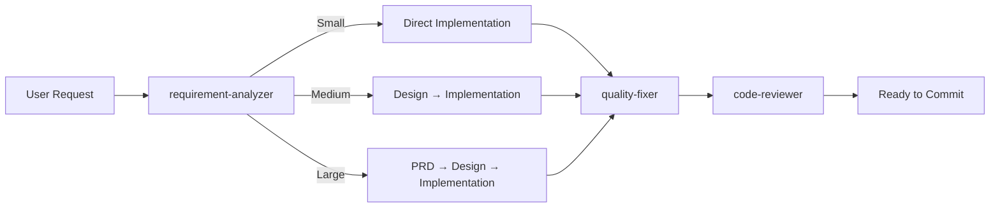

# Claude Code Workflows Plugin 🚀

[](https://claude.ai/code)
[](https://opensource.org/licenses/MIT)
[](https://github.com/shinpr/claude-code-workflows/pulls)

**Professional development workflows for Claude Code** - Language-agnostic best practices, specialized agents, and quality assurance patterns for building production-ready software.

---

## ⚡ Quick Start

```bash
# 1. Start Claude Code session
claude

# 2. Inside Claude Code, install the plugin
/plugin marketplace add shinpr/claude-code-workflows
/plugin install claude-code-workflows@shinpr

# 3. Start building with full workflow support
/implement <your feature>
```

**Note:** If you encounter SSH authentication errors, set up SSH keys for GitHub:

```bash
# 1. Check if SSH key already exists
ls ~/.ssh/id_ed25519.pub

# 2. Generate new SSH key (if needed)
ssh-keygen -t ed25519 -C "your_email@example.com"
# → Press Enter to save to default location
# → Enter a strong passphrase when prompted (recommended for security)

# 3. Add SSH key to ssh-agent
eval "$(ssh-agent -s)"
ssh-add ~/.ssh/id_ed25519

# 4. Copy public key to clipboard
cat ~/.ssh/id_ed25519.pub
# → Copy the output

# 5. Add to GitHub
# Go to https://github.com/settings/keys
# Click "New SSH key"
# Paste your public key and save

# 6. Test connection
ssh -T git@github.com
# → Should see: "Hi username! You've successfully authenticated..."
```

---

## 🎯 What's Included

### 📦 Specialized Agents

11 production-ready agents for every phase of development:

| Agent | Purpose | Activation |
|-------|---------|------------|
| **requirement-analyzer** | Assess task scope and complexity | Start of `/implement` |
| **prd-creator** | Create product requirements documents | Large-scale features |
| **technical-designer** | Design architecture and technical approach | Medium/large features |
| **work-planner** | Break down work into executable tasks | After design |
| **task-decomposer** | Decompose plans into commit-sized tasks | Task breakdown |
| **task-executor** | Execute individual tasks with TDD | Implementation |
| **quality-fixer** | Fix all quality issues automatically | After code changes |
| **code-reviewer** | Verify compliance with design docs | Post-implementation |
| **acceptance-test-generator** | Generate E2E and integration tests | Testing phase |
| **rule-advisor** | Select optimal rules for current task | Task initiation |
| **document-reviewer** | Review documentation consistency | Documentation phase |

### ⚡ Workflow Commands

Streamline your development with purpose-built commands:

| Command | Purpose | When to Use |
|---------|---------|-------------|
| `/implement` | End-to-end feature development | New features, complete workflows |
| `/task` | Execute single task with precision | Bug fixes, small changes |
| `/design` | Create design documentation | Architecture planning |
| `/plan` | Generate work plan from design | Planning phase |
| `/build` | Execute from existing task plan | Resume implementation |
| `/review` | Verify code against design docs | Post-implementation check |

### 📚 Language-Agnostic Rules

Battle-tested best practices that work across all languages:

- **[Coding Principles](agents/rules/coding-principles.md)** - Universal code quality standards
- **[Testing Principles](agents/rules/testing-principles.md)** - TDD, coverage, test patterns
- **[Architecture Patterns](agents/rules/architecture/)** - Design decisions and trade-offs
- **[Documentation Standards](agents/rules/documentation-criteria.md)** - Clear, maintainable docs

---

## 🚀 Why Use This Plugin?

### Problem: AI Coding Challenges

- ❌ Context exhaustion in long sessions
- ❌ Declining code quality over time
- ❌ Inconsistent patterns across team
- ❌ Manual quality checks and fixes

### Solution: Specialized Workflows

- ✅ Fresh context per specialized agent
- ✅ Consistent quality through enforced rules
- ✅ Automated quality assurance
- ✅ Complete development lifecycle support

---

## 📖 Documentation

### Core Concepts
- **Sub Agents** - [Anthropic Documentation](https://docs.anthropic.com/en/docs/claude-code/sub-agents)
- **Design Philosophy** - [770K tokens without exhaustion](https://dev.to/shinpr/zero-context-exhaustion-building-production-ready-ai-coding-teams-with-claude-code-sub-agents-31b)

---

## 🔧 How It Works

### Intelligent Workflow Orchestration



### Execution Flow

1. **Analysis**: Assess task complexity and requirements
2. **Planning**: Generate appropriate documentation (PRD, Design Doc, Work Plan)
3. **Execution**: Specialized agents handle each phase autonomously
4. **Quality**: Automated testing, type checking, and error fixing
5. **Review**: Verify compliance and completeness
6. **Commit**: Clean, production-ready code

---

## 💡 Real-World Results

### Success Stories

#### [Sub-Agents MCP Server](https://github.com/shinpr/sub-agents-mcp)
- **Time**: 2 days → 30 TypeScript files with full coverage
- **Result**: Production-deployed MCP server

#### [MCP Image Generator](https://github.com/shinpr/mcp-image)
- **Time**: 1.5 days → Complete creative tool
- **Result**: Multi-image blending, character consistency

> **Key Insight**: Proper workflows + specialized agents = production-quality code at AI speed

---

## 🎯 Typical Workflow

### Feature Development
```bash
/implement "Add user authentication with JWT"
# → Automatically:
#   1. Analyzes requirements
#   2. Creates design documents
#   3. Breaks down into tasks
#   4. Implements with TDD
#   5. Fixes all quality issues
#   6. Reviews against design
```

### Bug Fix or Small Change
```bash
/task "Fix validation error message"
# → Direct implementation with quality checks
```

### Code Review
```bash
/review
# → Verifies implementation matches design docs
```

---

## 📂 Repository Structure

```
claude-code-workflows/
├── .claude-plugin/           # Plugin metadata
│   └── plugin.json          # Plugin configuration
├── agents/                  # Specialized agent definitions
│   ├── requirement-analyzer.md
│   ├── technical-designer.md
│   ├── quality-fixer.md
│   ├── rules/              # Development rules
│   │   ├── coding-principles.md
│   │   ├── testing-principles.md
│   │   ├── documentation-criteria.md
│   │   └── architecture/
│   ├── guides/             # User documentation
│   └── templates/          # Document templates
├── commands/                # Workflow commands
│   ├── implement.md
│   ├── task.md
│   ├── design.md
│   ├── plan.md
│   ├── build.md
│   └── review.md
├── LICENSE
└── README.md
```

---

## 🤔 FAQ

**Q: Do I need to learn special commands?**
A: Just use `/implement` to start. The plugin handles the complexity automatically.

**Q: What if there are errors?**
A: The `quality-fixer` agent automatically fixes most issues. If it can't, it provides clear guidance.

**Q: Can I customize the workflows?**
A: Absolutely! After installation, edit rules in `~/.claude/agents/rules/` and agents in `~/.claude/agents/` to fit your team's needs.

---

## 📄 License

MIT License - Free to use, modify, and distribute.

See [LICENSE](LICENSE) for full details.

---

## 🙏 Acknowledgments

- Built on [Claude Code](https://claude.ai/code) by Anthropic
- Community feedback and real-world testing

---

**Happy Coding with Claude Code Workflows!** 🚀✨
