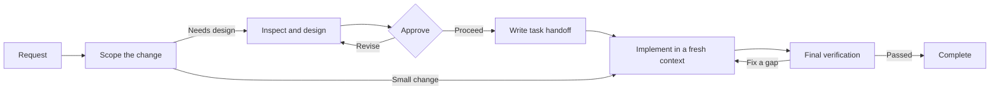

# Claude Code Development Workflows

[](https://claude.ai/code)
[](https://github.com/shinpr/claude-code-workflows)
[](https://opensource.org/licenses/MIT)
[](https://github.com/shinpr/claude-code-workflows/pulls)

Repeatable software development workflows for Claude Code that keep design decisions traceable through implementation, tests, and review.

Each phase runs in a fresh agent context and hands off through explicit artifacts. The workflow inspects the existing codebase, designs the smallest sufficient change, pauses for approval, implements one task at a time, and checks whether the finished work still matches the agreed scope and requirements.

Use the end-to-end recipes for production changes that span files, layers, or contributors, where a long AI coding session can quietly grow in scope or lose an important decision between design and implementation. Focused recipes let you stop after design, continue from approved artifacts, review an implementation, or investigate a problem without changing the code.

---

## Why use a development workflow?

Claude Code can complete an individual coding task well. The harder problem is keeping a larger change coherent after the first answer.

Suppose analysis finds that an existing authentication path should be extended. Halfway through implementation, a new abstraction looks convenient, the response contract changes with it, and the frontend adapts to the new shape. Every local edit may look reasonable and every test may pass, while the result no longer matches the design that the team agreed on.

In that example, extending the existing authentication path remains the default. A second mechanism needs evidence during design, and the agreed response contract is carried into the work plan, implementation tasks, tests, and final review. If implementation discovers that the contract really must change, the workflow stops and returns to design instead of letting the frontend quietly adapt to a decision nobody reviewed.

Because the process is packaged as a Claude Code plugin, a team can apply it consistently across repositories.

---

## Quick Start

Requires a Claude Code release with plugin marketplace support.

### Choose a path

| What do you need? | Start with | Plugin |
|---|---|---|
| Deliver a backend, API, CLI, or general change end to end | `/recipe-implement` | `dev-workflows` |
| Design a backend or general change before implementation | `/recipe-design` | `dev-workflows` |
| Design and build a React / TypeScript frontend | `/recipe-front-design` → `/recipe-front-plan` → `/recipe-front-build` | `dev-workflows-frontend` |
| Deliver a backend and React frontend change together | `/recipe-fullstack-implement` | `dev-workflows-fullstack` |
| Review an implementation against its design | `/recipe-review` or `/recipe-front-review` | `dev-workflows` or `dev-workflows-frontend` |
| Investigate a problem before choosing a fix | `/recipe-diagnose` | Any workflow plugin |
| Document an existing system from its code | `/recipe-reverse-engineer` | `dev-workflows` or `dev-workflows-fullstack` |
| A throwaway experiment or prototype | Use Claude Code directly | None |

### Common setup

```bash
# 1. Start Claude Code
claude

# 2. Add the marketplace
/plugin marketplace add shinpr/claude-code-workflows
```

### Install one workflow plugin

```bash
# Backend or general
/plugin install dev-workflows@claude-code-workflows
/reload-plugins
/recipe-implement "Add rate limiting to the public API"

# Frontend
/plugin install dev-workflows-frontend@claude-code-workflows
/reload-plugins
/recipe-front-design "Add account recovery screens"

# Full-stack
/plugin install dev-workflows-fullstack@claude-code-workflows
/reload-plugins
/recipe-fullstack-implement "Add user authentication with JWT + login form"
```

Install only one workflow plugin. `dev-workflows-fullstack` already contains the backend and frontend workflows. If you previously used full-stack recipes from `dev-workflows`, migrate to `dev-workflows-fullstack`.

`/recipe-front-design` stops after the UI Spec and Design Doc are reviewed and approved. Run `/recipe-front-plan` and `/recipe-front-build` when you are ready to continue. For a backend or general change, `/recipe-design`, `/recipe-plan`, and `/recipe-build` provide the same staged path.

### Team setup

Claude Code supports project-scoped marketplaces and plugins. Commit the resulting `.claude/settings.json` so contributors are prompted to use the same workflow plugin.

```bash
claude plugin marketplace add shinpr/claude-code-workflows --scope project
claude plugin install dev-workflows-fullstack@claude-code-workflows --scope project
```

Replace `dev-workflows-fullstack` with the plugin that matches the repository. See the [Claude Code plugin documentation](https://code.claude.com/docs/en/discover-plugins#configure-team-marketplaces) for project and managed installation options.

---

## How It Works


```mermaid
flowchart LR
    A[Request] --> B[Scope the change]
    B -->|Needs design| C[Inspect and design]
    C --> D{Approve}
    D -->|Revise| C
    D -->|Proceed| H[Write task handoff]
    H --> E[Implement in a fresh context]
    B -->|Small change| E
    E --> F[Final verification]
    F -->|Fix a gap| E
    F -->|Passed| G[Complete]
```

Small changes skip documents they do not need. Larger changes add codebase analysis, a Design Doc, and—when the scope calls for them—a PRD, UI Spec, ADR, acceptance tests, and work plan. The requirement and affected layers decide the route; the workflow does not create a full document set by default.

Implementation proceeds through task files with explicit targets and checks. When all tasks are done, a separate review checks the result for design consistency and security issues. If the requirement changes along the way, the workflow identifies which decisions are no longer valid and returns there before continuing.

### A handoff you can inspect

Fresh contexts only help if the handoff between them is concrete. The included [Work Plan template](skills/documentation-criteria/references/plan-template.md) requires every technical requirement from a Design Doc to have a covering task or an explicit gap:

```markdown
| Design Doc | DD Section | DD Item | Category | Covered By Task(s) | Gap Status | Notes |
|---|---|---|---|---|---|---|
| docs/design/example.md | API contract | Preserve the error response shape | contract-change | Phase 2 Task 1 | covered | |
| docs/design/example.md | Verification | Exercise cache invalidation | verification | | gap | Add a covering task before approval |
```

The [Task template](skills/documentation-criteria/references/task-template.md) then carries binding decisions and observable contract values into implementation, each with a yes-or-no compliance check. The final review reads the same source documents instead of relying on the implementation conversation.

### A real workflow run

[The incremental sync feature in mcp-local-rag](https://github.com/shinpr/mcp-local-rag/pull/171) was a 42-file change across filesystem scanning, storage, and both the CLI and MCP surfaces. An independent security review sent the implementation back twice. It caught file reads happening before validation and a path-containment escape through a symlinked parent.

The run began with an existing Work Plan. When `/recipe-build` found that its planned ADR and Design Doc were missing, it stopped at the intended approval boundary. The user approved using the Work Plan as the technical source of truth, and the recipe divided it into 13 planned tasks. Adding test files outside the planned file set required a second user decision. The PR also records why watch mode and persistent jobs were left out.

### What to inspect after the first run

After the first run, inspect the artifacts:

- Does the agreed approach extend what already exists and give evidence for each addition?
- Can you follow each requirement into a task and a verification method, and did implementation stay within the assigned files and contracts?
- Does the final report compare the finished code with the intended behavior and security requirements?

---

## Typical Workflows

### End-to-end backend or general development

```bash
/recipe-implement "Add rate limiting to the public API"
```

The recipe scopes the change, inspects the current implementation, creates only the documents required for its size, pauses when a decision is needed, and carries the plan through implementation and final review.

### Design first, implement later

```bash
# Backend or general
/recipe-design "Design rate limiting for the public API"
/recipe-plan
/recipe-build

# React frontend
/recipe-front-design "Build a user profile dashboard"
/recipe-front-plan
/recipe-front-build
```

The design recipes inspect the existing code, confirm the scope, create the required documents, run an independent consistency review, and stop for approval. Planning and implementation can continue later, in a new context or by another contributor, from those approved artifacts.

The frontend path adds UI analysis, component architecture, React Testing Library, and TypeScript checks. Its UI Spec records states that a visual prototype usually leaves open.

For example, two dashboard components may each handle loading correctly while the combined screen has no defined behavior when one is loading and the other has failed. The UI Spec records that state combination and traces it into design and test work before integration.

### Full-stack development

```bash
/recipe-fullstack-implement "Add user authentication with JWT + React login form"
```

When the scale calls for a PRD, one document covers the whole feature. Backend and frontend design stay separate, `design-sync` checks the boundary between them, and the work plan uses vertical slices so integration is exercised before the end.

Use `/recipe-fullstack-build` to continue from an existing full-stack work plan. The full-stack plugin also includes the applicable backend and frontend recipes.

<details>
<summary>More workflow examples</summary>

#### Review an implementation against its design

```bash
/recipe-review
```

The review workflow compares the implementation with its Design Docs and runs an independent security review. A fix that changes an approved decision returns to the relevant document instead of silently changing the contract.

#### Diagnose before choosing a fix

```bash
/recipe-diagnose "API returns 500 on user login"
```

The diagnosis workflow maps execution paths, verifies suspected failure points, and presents solution trade-offs. It does not change the code.

#### Document an existing system

```bash
/recipe-reverse-engineer "src/auth module"
```

This derives PRDs and Design Docs from the code and verifies the documents against the implementation. Use the full-stack option when the feature crosses backend and frontend.

For a walkthrough, see [How I Made Legacy Code AI-Friendly with Auto-Generated Docs](https://dev.to/shinpr/how-i-made-legacy-code-ai-friendly-with-auto-generated-docs-4353).

#### Adjust an implemented UI against a design source

```bash
/recipe-front-adjust "Align the card spacing and actions with the design source"
```

The frontend plugin records how to reach the external design source, confirms the write set, and repeats visual verification until the adjustment passes its checks.

</details>

---

## Workflow Recipe Reference

All workflow entry points use the `recipe-` prefix. Type `/recipe-` and use tab completion to see what the installed plugin provides.

<details>
<summary>View all backend and general recipes</summary>

| Recipe | Purpose | When to Use |
|--------|---------|-------------|
| `/recipe-implement` | End-to-end feature development | New features, complete workflows |
| `/recipe-design` | Create design documentation | Architecture planning |
| `/recipe-plan` | Generate a work plan from design | Planning phase |
| `/recipe-build` | Execute an existing work plan | Resume implementation |
| `/recipe-review` | Verify code against Design Docs | Post-implementation check |
| `/recipe-diagnose` | Investigate a problem and compare solutions | Root cause analysis |
| `/recipe-reverse-engineer` | Derive PRDs and Design Docs from code | Existing-system documentation |
| `/recipe-add-integration-tests` | Add integration or E2E tests | Coverage for existing code |
| `/recipe-update-doc` | Update and review existing documents | Requirement or design changes |
| `/recipe-task` | Run a rule-guided task directly | Work that does not need staged workflow handoffs |

</details>

<details>
<summary>View all frontend recipes</summary>

The frontend plugin adds React-specific analysis, component architecture, React Testing Library, TypeScript checks, and UI Spec generation from optional prototype code.

| Recipe | Purpose | When to Use |
|--------|---------|-------------|
| `/recipe-front-design` | Create a UI Spec and frontend Design Doc | React component architecture |
| `/recipe-front-plan` | Generate a frontend work plan | Component planning |
| `/recipe-front-build` | Execute a frontend work plan | Resume React implementation |
| `/recipe-front-adjust` | Adjust an implemented UI with external verification | Visual refinements |
| `/recipe-front-review` | Verify code against frontend Design Docs | Post-implementation check |
| `/recipe-diagnose` | Investigate a problem and compare solutions | Root cause analysis |
| `/recipe-update-doc` | Update and review existing documents | Requirement or design changes |
| `/recipe-task` | Run a rule-guided task directly | Work that does not need staged workflow handoffs |

</details>

---

## What the Plugins Include

Specialized agents keep analysis and design separate from execution and final review. Each plugin includes only the roles its workflows use; the full-stack plugin combines the backend and frontend roles. The complete role list is folded below.

<details>
<summary>View all specialized agent roles</summary>

### Shared agents

These agents are shared by the backend, frontend, and full-stack workflow plugins:

| Agent | What It Does |
|-------|--------------|
| **requirement-analyzer** | Determines change size, affected layers, and the required workflow |
| **prd-creator** | Defines product requirements for larger features |
| **codebase-analyzer** | Inspects existing code and dependencies before design |
| **code-verifier** | Compares documents with the implementation |
| **work-planner** | Turns design decisions into an executable work plan |
| **task-decomposer** | Splits a work plan into commit-ready tasks |
| **acceptance-test-generator** | Creates integration and E2E test skeletons from requirements |
| **integration-test-reviewer** | Reviews integration and E2E tests against their intended coverage |
| **code-reviewer** | Checks implementation against the Design Docs |
| **document-reviewer** | Checks a document for completeness and rule compliance |
| **design-sync** | Detects conflicts across multiple Design Docs |
| **investigator** | Maps execution paths and identifies possible failure points |
| **verifier** | Challenges suspected failure points and checks path coverage |
| **solver** | Compares solutions and their trade-offs |
| **security-reviewer** | Reviews the completed implementation for security issues |
| **rule-advisor** | Selects the coding rules relevant to the task |

### Backend-specific agents

| Agent | What It Does |
|-------|--------------|
| **technical-designer** | Designs the technical approach and architecture |
| **scope-discoverer** | Finds functional boundaries in an existing codebase |
| **task-executor** | Implements backend tasks with test-first verification |
| **quality-fixer** | Runs tests, type checks, linting, and other project quality gates |

### Frontend-specific agents

| Agent | What It Does |
|-------|--------------|
| **ui-spec-designer** | Creates a UI Spec from requirements and optional prototype code |
| **ui-analyzer** | Fetches design sources, design systems, and guidelines, then inspects the existing UI |
| **technical-designer-frontend** | Designs React component architecture and state management |
| **task-executor-frontend** | Implements React components with React Testing Library coverage |
| **quality-fixer-frontend** | Runs frontend tests, TypeScript checks, linting, and builds |

</details>

<details>
<summary>View built-in development guidance</summary>

- **Coding Principles.** Code quality standards.
- **Testing Principles.** TDD, coverage, test patterns.
- **Implementation Approach.** Design decisions and trade-offs.
- **Documentation Standards.** Clear, maintainable docs.
- **External Resource Context.** Records how to reach design sources, design systems, API schemas, infrastructure definitions, and other resources outside the repository.
- **LLM-Friendly Context.** Clear prompts, handoffs, generated artifacts, and instructions for downstream agents.

Agents load these skills when the work calls for them. The frontend plugin also includes React and TypeScript-specific rules.

</details>

<details>
<summary>Use the guidance without the workflow (dev-skills)</summary>

If you already have orchestration through custom prompts or CI and want only the best-practice guides, use `dev-skills`. If you want Claude to plan, execute, and verify a change end to end, install one of the workflow plugins instead.

- Minimal context footprint with no agents or recipe skills
- Coding, testing, design, and documentation guidance without a prescribed workflow
- Automatic skill loading when a task is relevant

> **Do not install `dev-skills` alongside a workflow plugin.** They share the same skills, and duplicate descriptions can cause Claude Code to ignore skills after reaching its context limit.

```bash
/plugin install dev-skills@claude-code-workflows
```

To switch between plugin types:

```bash
# dev-skills -> dev-workflows
/plugin uninstall dev-skills@claude-code-workflows
/plugin install dev-workflows@claude-code-workflows

# dev-workflows -> dev-skills
/plugin uninstall dev-workflows@claude-code-workflows
/plugin install dev-skills@claude-code-workflows
```

</details>

<details>
<summary>View optional add-ons</summary>

These plugins cover adjacent work without changing the core development workflow:

- [claude-code-discover](https://github.com/shinpr/claude-code-discover): turns feature ideas into evidence-backed PRDs.
- [metronome](https://github.com/shinpr/metronome): detects shortcut-taking behavior and asks Claude to follow the defined procedure.
- [linear-prism](https://github.com/shinpr/linear-prism): validates requirements and turns them into structured Linear tasks.
- [pr-review](https://github.com/shinpr/pr-review-skill): reviews GitHub PRs against repository-specific criteria before posting approved findings.

```bash
/plugin install discover@claude-code-workflows
/plugin install metronome@claude-code-workflows
/plugin install linear-prism@claude-code-workflows
/plugin install pr-review@claude-code-workflows
```

</details>

---

## FAQ

**Q: What if there are errors?**

A: The quality-fixer agents handle test, type, lint, and build failures within the assigned task scope. If a fix would change a contract, exceed that scope, or needs a decision that the existing documents do not answer, the workflow stops and reports what needs attention.

**Q: Is there a version for OpenAI Codex CLI?**

A: Yes. **[codex-workflows](https://github.com/shinpr/codex-workflows)** provides the same workflow model, adapted to the Codex CLI environment.

**Q: Should I commit the work plan and task files in `docs/plans/`?**

A: No. Recipes treat `docs/plans/` as ephemeral working state. Consumed task files and intermediate fix files are cleaned up after successful execution. The work plan may remain for review or a later build and can be deleted when it is no longer needed. Add the following line to your project's `.gitignore` so this working state stays out of git:

```
docs/plans/
```

PRDs, ADRs, UI Specs, and Design Docs live in their own directories (`docs/prd/`, `docs/adr/`, `docs/ui-spec/`, `docs/design/`) and are intended to be committed.

---

## Contributing External Plugins

This marketplace supports the full lifecycle of building products with AI: product quality, discovery, implementation control, and verification. If your plugin helps developers build better products with AI coding agents, we'd like to hear from you.

See [CONTRIBUTING.md](CONTRIBUTING.md) for submission guidelines and acceptance criteria.

<details>
<summary>View repository layout</summary>

```
claude-code-workflows/
├── .claude-plugin/
│   └── marketplace.json        # Plugin definitions and per-plugin contents
├── agents/                     # Specialized analysis, design, execution, and review roles
├── skills/
│   ├── recipe-*/               # Workflow entry points
│   ├── documentation-criteria/ # Document rules and templates
│   ├── coding-principles/
│   ├── testing-principles/
│   ├── external-resource-context/
│   ├── llm-friendly-context/
│   └── ...
├── LICENSE
└── README.md
```

</details>

---

## License

MIT License. Free to use, modify, and distribute.

See [LICENSE](LICENSE) for full details.

---

Built and maintained by [@shinpr](https://github.com/shinpr).
