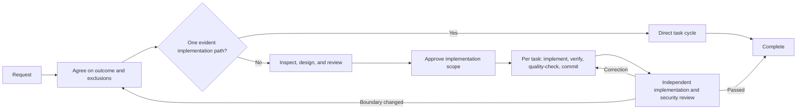

# Claude Code Development Workflows

[](https://claude.ai/code)
[](https://github.com/shinpr/claude-code-workflows)
[](https://opensource.org/licenses/MIT)
[](https://github.com/shinpr/claude-code-workflows/pulls)

**English** | [简体中文](README.zh-CN.md) | [日本語](README.ja.md) | [Español](README.es.md) | [한국어](README.ko.md) | [Português (Brasil)](README.pt-BR.md)

Claude Code can explore a codebase deeply. On non-trivial work, the harder problem is convergence. While designing an account-recovery flow, Claude may find a real inconsistency in token handling and spend most of the design on it, leaving the requested recovery behavior vague.

claude-code-workflows keeps that exploration pointed at an agreed result. It agrees on the outcome and exclusions before design, checks designs against the repository, verifies each task before commit, and, on larger changes, independently reviews the finished implementation to make sure it delivers the agreed result, does not include unnecessary changes, and has no serious functional, reliability, or security problems. Within that scope, Claude chooses the implementation details from the codebase.

Use Claude Code directly when the outcome and safe implementation boundary are already clear. Use these workflows when a change needs scope agreement, durable design decisions, a reliable handoff between contexts, or independent verification.

---

## When is the workflow useful?

The workflow adds agent calls and artifacts, so it should earn that cost. Use it when a real side finding could pull a larger change away from its intended result, a design could be internally consistent but miss the requested behavior, or a passing test could fail to observe what it claims to prove. When a change does not need every check, [lite mode](#lite-mode) runs fewer of them.

Once the implementation scope is approved, Claude carries the tasks through focused verification, repository quality checks, commits, and final review without asking for routine implementation decisions. It asks the user only when the agreed product outcome or exclusions must change, or when an irreversible external action needs approval; Claude handles technical design and implementation choices. Because the process is packaged as a Claude Code plugin, a team can apply the same controls across repositories without prescribing Claude's steps.

---

## Quick Start

Requires a Claude Code release with plugin marketplace support.

### Choose a path

| What do you need? | Start with | Plugin |
|---|---|---|
| Deliver a backend, API, CLI, or general change end to end | `/recipe-implement` | `dev-workflows` |
| Design a backend or general change before implementation | `/recipe-design` | `dev-workflows` |
| Design and build a React / TypeScript frontend | `/recipe-front-design` → `/recipe-front-plan` → `/recipe-front-build` | `dev-workflows-frontend` |
| Deliver a backend and React frontend change together | `/recipe-fullstack-implement` | `dev-workflows-fullstack` |
| Review a completed implementation against the agreed outcome | `/recipe-review` or `/recipe-front-review` | `dev-workflows` or `dev-workflows-frontend` |
| Set repository-specific quality rules | `/recipe-quality-profile` | Any workflow plugin |
| Investigate a problem before choosing a fix | `/recipe-diagnose` | Any workflow plugin |
| Document an existing system from its code | `/recipe-reverse-engineer` | `dev-workflows` or `dev-workflows-fullstack` |
| A throwaway experiment or prototype | Use Claude Code directly | None |

### Common setup

```bash
# 1. Start Claude Code
claude

# 2. Add the marketplace
/plugin marketplace add shinpr/claude-code-workflows
```

### Install one workflow plugin

Install the plugin that matches your project. If the install tells you to run `/reload-plugins`, do that before invoking the recipe.

```bash
# Backend or general
/plugin install dev-workflows@claude-code-workflows
/recipe-implement "Add rate limiting to the public API"

# Frontend
/plugin install dev-workflows-frontend@claude-code-workflows
/recipe-front-design "Add account recovery screens"

# Full-stack
/plugin install dev-workflows-fullstack@claude-code-workflows
/recipe-fullstack-implement "Add user authentication with JWT + login form"
```

Install only one workflow plugin. `dev-workflows-fullstack` already contains the backend and frontend workflows. If you previously used full-stack recipes from `dev-workflows`, migrate to `dev-workflows-fullstack`.

`/recipe-front-design` stops after the applicable UI Spec and Design Doc are reviewed and approved. Run `/recipe-front-plan` and `/recipe-front-build` when you are ready to continue. For a backend or general change, `/recipe-design`, `/recipe-plan`, and `/recipe-build` provide the same staged path.

### Team setup

Claude Code supports project-scoped marketplaces and plugins. Commit the resulting `.claude/settings.json` so contributors are prompted to use the same workflow plugin.

```bash
claude plugin marketplace add shinpr/claude-code-workflows --scope project
claude plugin install dev-workflows-fullstack@claude-code-workflows --scope project
```

Replace `dev-workflows-fullstack` with the plugin that matches the repository. See the [Claude Code plugin documentation](https://code.claude.com/docs/en/discover-plugins#configure-team-marketplaces) for project and managed installation options.

---

## How It Works


```mermaid
flowchart LR
    A[Request] --> B[Agree on outcome and exclusions]
    B --> C{One evident implementation path?}
    C -->|Yes| S[Direct task cycle]
    S --> J[Complete]
    C -->|No| D[Inspect, design, and review]
    D --> E[Approve implementation scope]
    E --> F[Per task: implement, verify, quality-check, commit]
    F --> I[Independent implementation and security review]
    I -->|Correction| F
    I -->|Boundary changed| B
    I -->|Passed| J[Complete]
```

The route depends on how many product and design decisions the change involves, not on file count. A change with one outcome that follows an existing pattern within one responsibility goes straight to a task cycle. A change that crosses responsibilities or needs a lasting design decision first gets a reviewed Design Doc and Work Plan, plus a PRD, UI Spec, or ADR when one of its decisions calls for it.

Review suggestions do not become work automatically. The main session decides which findings belong to the agreed outcome and declines the rest with a reason.

### Lite mode

```bash
/recipe-implement "Lite mode. Add rate limiting to the public API"
```

Ask for lite mode in the request to any recipe. It keeps the same phases and approval stops but runs fewer checks: Design Docs are not checked against the repository or against each other, and the separate security review is skipped. Repository quality checks run once after the last task instead of before every commit, and the final code review still runs. Lite mode stays on for the rest of the session until you ask Claude to drop it.

### A real workflow run

[The incremental sync feature in mcp-local-rag](https://github.com/shinpr/mcp-local-rag/pull/171) was a 42-file change across filesystem scanning, storage, and both the CLI and MCP surfaces. An independent security review sent the implementation back twice. It caught file reads happening before validation and a path-containment escape through a symlinked parent.

The run began with an existing Work Plan that referred to an ADR and Design Doc that were not present, leaving the approved source for its technical decisions unclear. The user chose to treat the Work Plan as the source of truth, and the recipe divided it into 13 planned tasks. The final implementation included the changes needed to verify the approved behavior, while the PR records why watch mode and persistent jobs were left out.

---

## Typical Workflows

### End-to-end backend or general development

```bash
/recipe-implement "Add rate limiting to the public API"
```

The recipe scopes the change, inspects the current implementation, creates only the documents required by its decisions, pauses when a decision is needed, and carries the plan through implementation and final review.

### Design first, implement later

```bash
# Backend or general
/recipe-design "Design rate limiting for the public API"
/recipe-plan
/recipe-build

# React frontend
/recipe-front-design "Build a user profile dashboard"
/recipe-front-plan
/recipe-front-build
```

The design recipes inspect the existing code, confirm the scope, create the required documents, run an independent consistency review, and stop for approval. Planning and implementation can continue later, in a new context or by another contributor, from those approved artifacts. Each task in the [Work Plan](skills/documentation-criteria/references/plan-template.md) cites the design decisions and acceptance criteria it must satisfy, and the final reviewers check the completed code against those same sources instead of the earlier conversation.

The frontend path adds UI analysis and a UI Spec when UI structure or behavior remains to be designed, plus component architecture, React Testing Library, and TypeScript checks.

For example, two dashboard components may each handle loading correctly while the combined screen has no defined behavior when one is loading and the other has failed. The UI Spec records that state combination and traces it into design and test work before integration.

### Full-stack development

```bash
/recipe-fullstack-implement "Add user authentication with JWT + React login form"
```

When the change has multiple independent product outcomes, one PRD covers the whole feature. Backend and frontend design stay separate, a consistency check covers the boundary between them, and the work plan uses vertical slices so integration is exercised before the end.

Use `/recipe-fullstack-build` to continue from an existing full-stack work plan. The full-stack plugin also includes the applicable backend and frontend recipes.

<details>
<summary>More workflow examples</summary>

#### Review a completed implementation

```bash
/recipe-review
```

The review workflow checks the completed implementation against the agreed outcome and repository standards, then runs an independent security review. Accepted corrections return to the appropriate implementation or document owner and are reviewed again.

#### Diagnose before choosing a fix

```bash
/recipe-diagnose "API returns 500 on user login"
```

The diagnosis workflow maps execution paths, verifies suspected failure points, and presents solution trade-offs. It does not change the code.

#### Document an existing system

```bash
/recipe-reverse-engineer "src/auth module"
```

This derives PRDs and Design Docs from the code and verifies the documents against the implementation. Use the full-stack option when the feature crosses backend and frontend.

For a walkthrough, see [How I Made Legacy Code AI-Friendly with Auto-Generated Docs](https://dev.to/shinpr/how-i-made-legacy-code-ai-friendly-with-auto-generated-docs-4353).

#### Adjust an implemented UI against a design source

```bash
/recipe-front-adjust "Align the card spacing and actions with the design source"
```

The frontend plugin records how to reach the external design source, confirms the write set, and repeats visual verification until the adjustment passes its checks.

</details>

---

## Workflow Recipe Reference

All workflow entry points use the `recipe-` prefix. Type `/recipe-` and use tab completion to see what the installed plugin provides.

<details>
<summary>View all backend and general recipes</summary>

| Recipe | Purpose | When to Use |
|--------|---------|-------------|
| `/recipe-implement` | End-to-end feature development | New features, complete workflows |
| `/recipe-design` | Create design documentation | Architecture planning |
| `/recipe-plan` | Generate a work plan from design | Planning phase |
| `/recipe-build` | Execute an existing work plan | Resume implementation |
| `/recipe-review` | Review a completed implementation against the agreed outcome | Post-implementation check |
| `/recipe-quality-profile` | Set repository-specific quality rules | Repository quality rules |
| `/recipe-diagnose` | Investigate a problem and compare solutions | Root cause analysis |
| `/recipe-reverse-engineer` | Derive PRDs and Design Docs from code | Existing-system documentation |
| `/recipe-add-integration-tests` | Add integration or E2E tests | Coverage for existing code |
| `/recipe-update-doc` | Update and review existing documents | Requirement or design changes |

</details>

<details>
<summary>View all frontend recipes</summary>

The frontend plugin adds React-specific analysis, component architecture, React Testing Library, TypeScript checks, and applicable UI Spec generation from optional prototype code.

| Recipe | Purpose | When to Use |
|--------|---------|-------------|
| `/recipe-front-design` | Create an applicable UI Spec and frontend Design Doc | React component architecture |
| `/recipe-front-plan` | Generate a frontend work plan | Component planning |
| `/recipe-front-build` | Execute a frontend work plan | Resume React implementation |
| `/recipe-front-adjust` | Adjust an implemented UI with external verification | Visual refinements |
| `/recipe-front-review` | Review a completed frontend against the agreed outcome | Post-implementation check |
| `/recipe-quality-profile` | Set repository-specific quality rules | Repository quality rules |
| `/recipe-diagnose` | Investigate a problem and compare solutions | Root cause analysis |
| `/recipe-update-doc` | Update and review existing documents | Requirement or design changes |

</details>

---

## Guidance Without the Workflow

If you already have orchestration through custom prompts or CI and want only the best-practice guides, use `dev-skills`. If you want Claude to plan, execute, and verify a change end to end, install one of the workflow plugins instead.

- Minimal context footprint with no agents or recipe skills
- Coding, testing, design, and documentation guidance without a prescribed workflow
- Automatic skill loading when a task is relevant

> **Do not install `dev-skills` alongside a workflow plugin.** They share the same skills, and duplicate descriptions can cause Claude Code to ignore skills after reaching its context limit.

```bash
/plugin install dev-skills@claude-code-workflows
```

To switch between plugin types:

```bash
# dev-skills -> dev-workflows
/plugin uninstall dev-skills@claude-code-workflows
/plugin install dev-workflows@claude-code-workflows

# dev-workflows -> dev-skills
/plugin uninstall dev-workflows@claude-code-workflows
/plugin install dev-skills@claude-code-workflows
```

---

## FAQ

**Q: What if there are errors?**

A: The workflow fixes test, type, lint, and build failures within the approved outcome, including adjacent changes required by the same responsibility or contract.

**Q: Is there a version for OpenAI Codex CLI?**

A: Yes. **[codex-workflows](https://github.com/shinpr/codex-workflows)** provides the same workflow model, adapted to the Codex CLI environment.

**Q: Should I commit the work plan and task files in `docs/plans/`?**

A: No. Recipes treat `docs/plans/` as ephemeral working state. Consumed task files and intermediate fix files are cleaned up after successful execution. The work plan may remain for review or a later build and can be deleted when it is no longer needed. Add the following line to your project's `.gitignore` so this working state stays out of git:

```
docs/plans/
```

PRDs, ADRs, UI Specs, and Design Docs live in their own directories (`docs/prd/`, `docs/adr/`, `docs/ui-spec/`, `docs/design/`) and are intended to be committed.

---

## Design Rationale

<details>
<summary>Background reading behind the workflow design</summary>

- [Why LLMs Are Bad at 'First Try' and Great at Verification](https://www.norsica.jp/blog/llm-verification-over-generation): why external feedback and fresh contexts are more reliable than asking one session to generate and judge its own work
- [When Better Models Make Old Agent Workflows Worse](https://www.norsica.jp/blog/when-better-models-make-old-agent-workflows-worse): why the workflow is strict about boundaries and evidence without prescribing the route between them
- [Reasoning Effort Is Not a Quality Setting](https://www.norsica.jp/blog/reasoning-effort-is-not-a-quality-setting): why broader exploration must still converge on the work the current outcome justifies
- [Stop Putting Everything in AGENTS.md](https://www.norsica.jp/blog/stop-putting-everything-in-agents-md): why always-on instructions stay small while skills, design decisions, and task guidance are loaded where they apply

</details>

---

## License

MIT License. Free to use, modify, and distribute.

See [LICENSE](LICENSE) for full details.

---

Built and maintained by [@shinpr](https://github.com/shinpr).
