# Claude Code Workflows 🚀

[](https://claude.ai/code)
[](https://github.com/shinpr/claude-code-workflows)
[](https://opensource.org/licenses/MIT)
[](https://github.com/shinpr/claude-code-workflows/pulls)

**Build production-ready software with Claude Code** - Plugins and tools that bring best practices, specialized agents, automated quality checks, and safety guardrails to your development process.

---

## ⚡ Quick Start

This marketplace includes the following plugins:

**Core plugins:**
- **dev-workflows** - Backend and general-purpose development
- **dev-workflows-frontend** - React/TypeScript specialized workflows

**Optional add-ons** (enhance core plugins):
- **[metronome](https://github.com/shinpr/metronome)** - Detects shortcut-taking behavior and nudges Claude to proceed step by step
- **[dev-workflows-governance](https://github.com/francismiles1/dev-workflows-governance)** - Enforces TIDY stage and human signoff checkpoint before deployment

**Skills only** (for users with existing workflows):
- **dev-skills** - Coding best practices, testing principles, and design guidelines — no workflow commands

The core value is the end-to-end workflow. Choose what fits your project:

### Backend or General Development

```bash
# 1. Start Claude Code
claude

# 2. Install the marketplace
/plugin marketplace add shinpr/claude-code-workflows

# 3. Install backend plugin
/plugin install dev-workflows@claude-code-workflows

# 4. Restart session (required)
# Exit and restart Claude Code

# 5. Start building
/implement <your feature>
```

### Frontend Development (React/TypeScript)

```bash
# 1-2. Same as above (start Claude Code and add marketplace)

# 3. Install frontend plugin
/plugin install dev-workflows-frontend@claude-code-workflows

# 4-5. Same as above (restart and start building)

# Use frontend-specific commands
/front-design <your feature>
```

### Full-Stack Development

Install both plugins to get the complete toolkit for backend and frontend work.

```bash
# Use fullstack commands for cross-layer features
/fullstack-implement "Add user authentication with JWT + login form"

# Or execute from existing fullstack work plan
/fullstack-build
```

The fullstack commands create separate Design Docs per layer (backend + frontend), verify cross-layer consistency via design-sync, and route tasks to the appropriate executor based on filename patterns. See [Fullstack Workflow](#fullstack-workflow) for details.

### External Plugins
```bash
# Install metronome (prevents shortcut-taking behavior)
/plugin install metronome@claude-code-workflows

# Install dev-workflows-governance (TIDY stage + signoff checkpoint)
/plugin install dev-workflows-governance@claude-code-workflows
```

### Skills Only (For Users with Existing Workflows)

If you already have your own orchestration (custom prompts, scripts, CI-driven loops) and just want the best-practice guides, use `dev-skills`. If you want Claude to plan, execute, and verify end-to-end, install `dev-workflows` instead.

- Minimal context footprint — no agents or commands loaded
- Drop-in best practices without changing your workflow
- Works as a ruleset layer for your own orchestrator

> **Do not install alongside dev-workflows or dev-workflows-frontend** — duplicate skills will be silently ignored. See [details below](#warning-duplicate-skills).

```bash
# Install skills-only plugin
/plugin install dev-skills@claude-code-workflows
```

Skills auto-load when relevant — `coding-principles` activates during implementation, `testing-principles` during test writing, etc.

**Switching between plugins:**

```bash
# dev-skills → dev-workflows
/plugin uninstall dev-skills@claude-code-workflows
/plugin install dev-workflows@claude-code-workflows

# dev-workflows → dev-skills
/plugin uninstall dev-workflows@claude-code-workflows
/plugin install dev-skills@claude-code-workflows
```

<a id="warning-duplicate-skills"></a>

> **Warning:** dev-skills and dev-workflows / dev-workflows-frontend share the same skills. Installing both causes skill descriptions to appear twice in the system context. Claude Code limits skill descriptions to ~2% of the context window — exceeding this limit causes skills to be silently ignored.

---

## 🔧 How It Works

### The Workflow

```mermaid
graph TB
    A[👤 User Request] --> B[🔍 requirement-analyzer]

    B --> |"📦 Large (6+ files)"| C[📄 prd-creator]
    B --> |"📦 Medium (3-5 files)"| D[📐 technical-designer]
    B --> |"📦 Small (1-2 files)"| E[⚡ Direct Implementation]

    C --> D
    D --> DR[📋 document-reviewer]
    DR --> DS[🔄 design-sync]
    DS --> F[🧪 acceptance-test-generator]
    F --> G[📋 work-planner]
    G --> H[✂️ task-decomposer]

    H --> I[🔨 task-executor]
    E --> I

    I --> J[✅ quality-fixer]
    J --> K[🎉 Ready to Commit]
```



### The Diagnosis Workflow

```mermaid
graph LR
    P[🐛 Problem] --> INV[🔍 investigator]
    INV --> |Evidence Matrix| ASS{Complex?}
    ASS --> |Yes| VER[⚖️ verifier]
    ASS --> |No| SOL[💡 solver]
    VER --> |Validated Conclusion| SOL
    SOL --> |Solutions + Steps| R[📋 Report]
```



### The Reverse Engineering Workflow

```mermaid
graph TB
    subgraph Phase1[Phase 1: PRD Generation]
        CMD[📜 /reverse-engineer] --> SD[🔍 scope-discoverer unified]
        SD --> PRD[📄 prd-creator]
        PRD --> CV1[✅ code-verifier]
        CV1 --> DR1[📋 document-reviewer]
    end

    subgraph Phase2[Phase 2: Design Doc Generation]
        TD[📐 technical-designer] --> CV2[✅ code-verifier]
        CV2 --> DR2[📋 document-reviewer]
        DR2 --> DONE[📚 Complete]
    end

    DR1 --> |"All PRDs Approved (reuse scope)"| TD
```



### What Happens Behind the Scenes

1. **Analysis** - Figures out how complex your task is
2. **Planning** - Creates the right docs (PRD, design doc, work plan) based on complexity
3. **Execution** - Specialized agents handle implementation autonomously
4. **Quality** - Runs tests, checks types, fixes errors automatically
5. **Review** - Makes sure everything matches the design
6. **Done** - Clean, production-ready code

---

## ⚡ Workflow Commands

### Backend & General Development (dev-workflows)

| Command | Purpose | When to Use |
|---------|---------|-------------|
| `/implement` | End-to-end feature development | New features, complete workflows |
| `/fullstack-implement` | End-to-end fullstack development | Cross-layer features (requires both plugins) |
| `/task` | Execute single task with precision | Bug fixes, small changes |
| `/design` | Create design documentation | Architecture planning |
| `/plan` | Generate work plan from design | Planning phase |
| `/build` | Execute from existing task plan | Resume implementation |
| `/fullstack-build` | Execute fullstack task plan | Resume cross-layer implementation (requires both plugins) |
| `/review` | Verify code against design docs | Post-implementation check |
| `/diagnose` | Investigate problems and derive solutions | Bug investigation, root cause analysis |
| `/reverse-engineer` | Generate PRD/Design Docs from existing code | Legacy system documentation, codebase understanding |
| `/add-integration-tests` | Add integration/E2E tests to existing code | Test coverage for existing implementations |
| `/update-doc` | Update existing design documents with review | Spec changes, review feedback, document maintenance |

### Frontend Development (dev-workflows-frontend)

| Command | Purpose | When to Use |
|---------|---------|-------------|
| `/front-design` | Create frontend design docs | React component architecture |
| `/front-plan` | Generate frontend work plan | Component breakdown planning |
| `/front-build` | Execute frontend task plan | Resume React implementation |
| `/front-review` | Verify code against design docs | Post-implementation check |
| `/task` | Execute single task with precision | Component fixes, small updates |
| `/diagnose` | Investigate problems and derive solutions | Bug investigation, root cause analysis |
| `/update-doc` | Update existing design documents with review | Spec changes, review feedback, document maintenance |

> **Tip**: Both plugins share `/task`, `/diagnose`, and `/update-doc` commands with the same functionality. For reverse engineering, use `/reverse-engineer` with the fullstack option to generate both backend and frontend Design Docs in a single workflow.

---

## 📦 Specialized Agents

### Shared Agents (Available in Both Plugins)

These agents work the same way whether you're building a REST API or a React app:

| Agent | What It Does |
|-------|--------------|
| **requirement-analyzer** | Figures out how complex your task is and picks the right workflow |
| **work-planner** | Breaks down design docs into actionable tasks |
| **task-decomposer** | Splits work into small, commit-ready chunks |
| **code-reviewer** | Checks your code against design docs to make sure nothing's missing |
| **document-reviewer** | Reviews single document quality, completeness, and rule compliance |
| **design-sync** | Verifies consistency across multiple Design Docs and detects conflicts |
| **investigator** | Collects evidence, enumerates hypotheses, builds evidence matrix for problem diagnosis |
| **verifier** | Validates investigation results using ACH and Devil's Advocate methods |
| **solver** | Generates solutions with tradeoff analysis and implementation steps |
| **scope-discoverer** | Discovers functional scope from codebase for reverse engineering |
| **code-verifier** | Validates consistency between documentation and code implementation |

### Backend-Specific Agents (dev-workflows)

| Agent | What It Does |
|-------|--------------|
| **prd-creator** | Writes product requirement docs for complex features |
| **technical-designer** | Plans architecture and tech stack decisions |
| **acceptance-test-generator** | Creates E2E and integration test scaffolds from requirements |
| **integration-test-reviewer** | Reviews integration/E2E tests for skeleton compliance and quality |
| **task-executor** | Implements backend features with TDD |
| **quality-fixer** | Runs tests, fixes type errors, handles linting - everything quality-related |
| **rule-advisor** | Picks the best coding rules for your current task |

### Frontend-Specific Agents (dev-workflows-frontend)

| Agent | What It Does |
|-------|--------------|
| **prd-creator** | Writes product requirement docs for complex features |
| **technical-designer-frontend** | Plans React component architecture and state management |
| **task-executor-frontend** | Implements React components with Testing Library |
| **quality-fixer-frontend** | Handles React-specific tests, TypeScript checks, and builds |
| **rule-advisor** | Picks the best coding rules for your current task |
| **design-sync** | Verifies consistency across multiple Design Docs and detects conflicts |

---

## 📚 Built-in Best Practices

The backend plugin includes proven best practices that work with any language:

- **Coding Principles** - Code quality standards
- **Testing Principles** - TDD, coverage, test patterns
- **Implementation Approach** - Design decisions and trade-offs
- **Documentation Standards** - Clear, maintainable docs

These are loaded as skills and automatically applied by agents when relevant.

The frontend plugin has React and TypeScript-specific rules built in.

---

## 🚀 Why Use These Plugins?

### The Problem

When building with AI coding assistants, you often run into:

- Context gets exhausted in long sessions
- Code quality drops over time
- Patterns become inconsistent
- You end up fixing test failures and type errors manually

### The Solution

These plugins fix that by:

- **Fresh context for each phase** - Specialized agents handle different parts without context exhaustion
- **Enforced best practices** - Language-agnostic rules (backend) and React patterns (frontend) keep quality consistent
- **Automated quality checks** - Tests, types, and linting run automatically and get fixed if they fail
- **Complete lifecycle** - From requirements to implementation to review

### Frontend-Specific Benefits

The frontend plugin is built specifically for React development:

- Component architecture planning with state management decisions
- React Testing Library integration from the start
- TypeScript-first approach with automatic type generation
- Handles build errors, test failures, and type issues automatically

---

## 🎯 Typical Workflows

### Backend Feature Development

```bash
/implement "Add user authentication with JWT"

# What happens:
# 1. Analyzes your requirements
# 2. Creates design documents
# 3. Breaks down into tasks
# 4. Implements with TDD
# 5. Runs tests and fixes issues
# 6. Reviews against design docs
```

### Frontend Feature Development

```bash
/front-design "Build a user profile dashboard"

# What happens:
# 1. Plans React component structure
# 2. Defines state management approach
# 3. Creates work plan
#
# Then run:
/front-build

# This:
# 1. Implements components with Testing Library
# 2. Writes tests for each component
# 3. Handles TypeScript types
# 4. Fixes lint and build errors
```

### Fullstack Workflow

```bash
/fullstack-implement "Add user authentication with JWT + React login form"

# What happens:
# 1. Analyzes requirements (same as /implement)
# 2. Creates PRD covering the entire feature
# 3. Creates separate Design Docs for backend AND frontend
# 4. Verifies cross-layer consistency via design-sync
# 5. Creates work plan with vertical feature slices
# 6. Decomposes into layer-aware tasks (backend/frontend/fullstack)
# 7. Routes each task to the appropriate executor
# 8. Runs layer-appropriate quality checks
# 9. Commits vertical slices for early integration
```

> **Requires both plugins installed.** The fullstack commands create separate Design Docs per layer and route tasks to backend or frontend executors based on filename patterns (`*-backend-task-*`, `*-frontend-task-*`). For reverse engineering existing fullstack codebases, use `/reverse-engineer` with the fullstack option.

### Quick Fixes (Both Plugins)

```bash
/task "Fix validation error message"

# Direct implementation with quality checks
# Works the same in both plugins
```

### Code Review

```bash
/review

# Checks your implementation against design docs
# Catches missing features or inconsistencies
```

### Problem Diagnosis (Both Plugins)

```bash
/diagnose "API returns 500 error on user login"

# What happens:
# 1. Investigator collects evidence from code, logs, git history
# 2. Builds evidence matrix with multiple hypotheses
# 3. Verifier validates findings with ACH and Devil's Advocate
# 4. Solver generates solutions with tradeoff analysis
# 5. Presents actionable implementation steps
```

### Reverse Engineering

```bash
/reverse-engineer "src/auth module"

# What happens:
# 1. Discovers functional scope (user-value + technical) in a single pass
# 2. Generates PRD for each feature unit
# 3. Verifies PRD against actual code
# 4. Reviews and revises until consistent
# 5. Generates Design Docs with code verification
# 6. Produces complete documentation from existing code
#
# Fullstack option: generates both backend and frontend Design Docs per feature unit
```

> If you're working with undocumented legacy code, these commands are designed to make it AI-friendly by generating PRD and design docs.
> For a quick walkthrough, see: [How I Made Legacy Code AI-Friendly with Auto-Generated Docs](https://dev.to/shinpr/how-i-made-legacy-code-ai-friendly-with-auto-generated-docs-4353)

---

## 📂 Repository Structure

```
claude-code-workflows/
├── .claude-plugin/
│   └── marketplace.json        # Manages both plugins
│
├── agents/                     # Shared agents (symlinked by both plugins)
│   ├── code-reviewer.md
│   ├── investigator.md         # Diagnosis workflow
│   ├── verifier.md             # Diagnosis workflow
│   ├── solver.md               # Diagnosis workflow
│   ├── scope-discoverer.md     # Reverse engineering workflow
│   ├── code-verifier.md        # Reverse engineering workflow
│   ├── task-executor.md
│   ├── technical-designer.md
│   └── ... (17 agents total)
│
├── commands/                   # Shared commands
│   ├── implement.md
│   ├── design.md
│   ├── diagnose.md             # Problem diagnosis
│   ├── reverse-engineer.md     # Reverse documentation
│   ├── plan.md
│   ├── build.md
│   └── ... (10 commands for backend, 8 for frontend)
│
├── skills/                     # Skills (auto-loaded by agents)
│   ├── ai-development-guide/
│   ├── coding-principles/
│   ├── testing-principles/
│   ├── implementation-approach/
│   ├── typescript-rules/       # Frontend-specific
│   └── ... (11 skills total)
│
├── backend/                    # dev-workflows plugin
│   ├── agents/                 # Symlinks to shared agents
│   ├── commands/               # Symlinks to shared commands
│   ├── skills/                 # Symlinks to shared skills
│   └── .claude-plugin/
│       └── plugin.json
│
├── frontend/                   # dev-workflows-frontend plugin
│   ├── agents/                 # Symlinks to shared agents
│   ├── commands/               # Symlinks to shared commands
│   ├── skills/                 # Symlinks to shared skills
│   └── .claude-plugin/
│       └── plugin.json
│
├── skills-only/                # dev-skills plugin (skills only, no commands/agents)
│   ├── skills/                 # Symlinks to shared skills (9 of 11 — workflow-specific skills excluded)
│   └── .claude-plugin/
│       └── plugin.json
│
├── LICENSE
└── README.md
```

---

## 🤔 FAQ

**Q: Which plugin should I install?**

A: Depends on what you're building:
- **Backend, APIs, CLI tools, or general programming** → Install `dev-workflows`
- **React apps** → Install `dev-workflows-frontend`
- **Full-stack projects** → Install both

Both plugins can run side-by-side without conflicts.

**Q: Can I use both plugins at the same time?**

A: Yes! They're designed to work together. Install both if you're building a full-stack app. Use `/fullstack-implement` for features that span both backend and frontend — it creates separate Design Docs per layer and routes tasks to the appropriate executor automatically.

**Q: Do I need to learn special commands?**

A: Not really. For backend, just use `/implement`. For frontend, use `/front-design`. The plugins handle everything else automatically.

**Q: What if there are errors?**

A: The quality-fixer agents (one in each plugin) automatically fix most issues like test failures, type errors, and lint problems. If something can't be auto-fixed, you'll get clear guidance on what needs attention.

**Q: What's the difference between dev-skills and dev-workflows?**

A: `dev-skills` provides only coding best practices as skills (`coding-principles`, `testing-principles`, etc.) — no workflow commands or agents. `dev-workflows` includes the same skills plus commands like `/implement` and 18 specialized agents for full orchestrated development. Use `dev-skills` if you already have your own orchestration and just want the knowledge guides. They should not be installed together. See [Skills Only](#skills-only-for-users-with-existing-workflows) for details and switching instructions.

---

## 🔌 Contributing External Plugins

This marketplace focuses on plugins that improve **control, reliability, and safety** in agentic coding. If your plugin helps developers trust and manage AI coding agents in production workflows, we'd like to hear from you.

See [CONTRIBUTING.md](CONTRIBUTING.md) for submission guidelines and acceptance criteria.

---

## 📄 License

MIT License - Free to use, modify, and distribute.

See [LICENSE](LICENSE) for full details.

---

**Happy Coding with Claude Code Workflows!** 🚀✨