# Claude Code Workflows 🚀

[](https://claude.ai/code)
[](https://opensource.org/licenses/MIT)
[](https://github.com/shinpr/claude-code-workflows/pulls)

**Build production-ready software with Claude Code** - Workflow plugins that bring best practices, specialized agents, and automated quality checks to your development process.

---

## ⚡ Quick Start

This marketplace includes two plugins:

- **dev-workflows** - Backend and general-purpose development
- **dev-workflows-frontend** - React/TypeScript specialized workflows

Choose what fits your project:

### Backend or General Development

```bash
# 1. Start Claude Code
claude

# 2. Install the marketplace
/plugin marketplace add shinpr/claude-code-workflows

# 3. Install backend plugin
/plugin install dev-workflows@claude-code-workflows

# 4. Restart session (required)
# Exit and restart Claude Code

# 5. Start building
/implement <your feature>
```

### Frontend Development (React/TypeScript)

```bash
# 1-2. Same as above (start Claude Code and add marketplace)

# 3. Install frontend plugin
/plugin install dev-workflows-frontend@claude-code-workflows

# 4-5. Same as above (restart and start building)

# Use frontend-specific commands
/front-design <your feature>
```

### Full-Stack Development

Install both plugins to get the complete toolkit for backend and frontend work.

> **Note**: If you encounter SSH errors during installation, see [SSH Setup FAQ](#ssh-authentication-error-during-plugin-installation) below.

---

## 🔧 How It Works

### The Workflow

```mermaid
graph TB
    A[👤 User Request] --> B[🔍 requirement-analyzer]

    B --> |"📦 Large (6+ files)"| C[📄 prd-creator]
    B --> |"📦 Medium (3-5 files)"| D[📐 technical-designer]
    B --> |"📦 Small (1-2 files)"| E[⚡ Direct Implementation]

    C --> D
    D --> DR[📋 document-reviewer]
    DR --> DS[🔄 design-sync]
    DS --> F[🧪 acceptance-test-generator]
    F --> G[📋 work-planner]
    G --> H[✂️ task-decomposer]

    H --> I[🔨 task-executor]
    E --> I

    I --> J[✅ quality-fixer]
    J --> K[🎉 Ready to Commit]
```



### What Happens Behind the Scenes

1. **Analysis** - Figures out how complex your task is
2. **Planning** - Creates the right docs (PRD, design doc, work plan) based on complexity
3. **Execution** - Specialized agents handle implementation autonomously
4. **Quality** - Runs tests, checks types, fixes errors automatically
5. **Review** - Makes sure everything matches the design
6. **Done** - Clean, production-ready code

---

## ⚡ Workflow Commands

### Backend & General Development (dev-workflows)

| Command | Purpose | When to Use |
|---------|---------|-------------|
| `/implement` | End-to-end feature development | New features, complete workflows |
| `/task` | Execute single task with precision | Bug fixes, small changes |
| `/design` | Create design documentation | Architecture planning |
| `/plan` | Generate work plan from design | Planning phase |
| `/build` | Execute from existing task plan | Resume implementation |
| `/review` | Verify code against design docs | Post-implementation check |

### Frontend Development (dev-workflows-frontend)

| Command | Purpose | When to Use |
|---------|---------|-------------|
| `/front-design` | Create frontend design docs | React component architecture |
| `/front-plan` | Generate frontend work plan | Component breakdown planning |
| `/front-build` | Execute frontend task plan | Resume React implementation |
| `/task` | Execute single task with precision | Component fixes, small updates |
| `/review` | Verify code against design docs | Post-implementation check |

> **Tip**: Both plugins share `/task` and `/review` commands with the same functionality.

---

## 📦 Specialized Agents

### Shared Agents (Available in Both Plugins)

These agents work the same way whether you're building a REST API or a React app:

| Agent | What It Does |
|-------|--------------|
| **requirement-analyzer** | Figures out how complex your task is and picks the right workflow |
| **work-planner** | Breaks down design docs into actionable tasks |
| **task-decomposer** | Splits work into small, commit-ready chunks |
| **code-reviewer** | Checks your code against design docs to make sure nothing's missing |
| **document-reviewer** | Reviews single document quality, completeness, and rule compliance |
| **design-sync** | Verifies consistency across multiple Design Docs and detects conflicts |

### Backend-Specific Agents (dev-workflows)

| Agent | What It Does |
|-------|--------------|
| **prd-creator** | Writes product requirement docs for complex features |
| **technical-designer** | Plans architecture and tech stack decisions |
| **acceptance-test-generator** | Creates E2E and integration test scaffolds from requirements |
| **integration-test-reviewer** | Reviews integration/E2E tests for skeleton compliance and quality |
| **task-executor** | Implements backend features with TDD |
| **quality-fixer** | Runs tests, fixes type errors, handles linting - everything quality-related |
| **rule-advisor** | Picks the best coding rules for your current task |

### Frontend-Specific Agents (dev-workflows-frontend)

| Agent | What It Does |
|-------|--------------|
| **technical-designer-frontend** | Plans React component architecture and state management |
| **task-executor-frontend** | Implements React components with Testing Library |
| **quality-fixer-frontend** | Handles React-specific tests, TypeScript checks, and builds |

---

## 📚 Built-in Best Practices

The backend plugin includes proven best practices that work with any language:

- **Coding Principles** - Code quality standards
- **Testing Principles** - TDD, coverage, test patterns
- **Implementation Approach** - Design decisions and trade-offs
- **Documentation Standards** - Clear, maintainable docs

These are loaded as skills and automatically applied by agents when relevant.

The frontend plugin has React and TypeScript-specific rules built in.

---

## 🚀 Why Use These Plugins?

### The Problem

When building with AI coding assistants, you often run into:

- Context gets exhausted in long sessions
- Code quality drops over time
- Patterns become inconsistent
- You end up fixing test failures and type errors manually

### The Solution

These plugins fix that by:

- **Fresh context for each phase** - Specialized agents handle different parts without context exhaustion
- **Enforced best practices** - Language-agnostic rules (backend) and React patterns (frontend) keep quality consistent
- **Automated quality checks** - Tests, types, and linting run automatically and get fixed if they fail
- **Complete lifecycle** - From requirements to implementation to review

### Frontend-Specific Benefits

The frontend plugin is built specifically for React development:

- Component architecture planning with state management decisions
- React Testing Library integration from the start
- TypeScript-first approach with automatic type generation
- Handles build errors, test failures, and type issues automatically

---

## 💡 Real-World Examples

### What People Have Built

#### [Sub-Agents MCP Server](https://github.com/shinpr/sub-agents-mcp)
Built in 2 days - 30 TypeScript files with full test coverage, now running in production.

#### [MCP Image Generator](https://github.com/shinpr/mcp-image)
Built in 1.5 days - Complete creative tool with multi-image blending and character consistency.

> The right workflow structure + specialized agents = production-quality code at AI speed.

---

## 🎯 Typical Workflows

### Backend Feature Development

```bash
/implement "Add user authentication with JWT"

# What happens:
# 1. Analyzes your requirements
# 2. Creates design documents
# 3. Breaks down into tasks
# 4. Implements with TDD
# 5. Runs tests and fixes issues
# 6. Reviews against design docs
```

### Frontend Feature Development

```bash
/front-design "Build a user profile dashboard"

# What happens:
# 1. Plans React component structure
# 2. Defines state management approach
# 3. Creates work plan
#
# Then run:
/front-build

# This:
# 1. Implements components with Testing Library
# 2. Writes tests for each component
# 3. Handles TypeScript types
# 4. Fixes lint and build errors
```

### Quick Fixes (Both Plugins)

```bash
/task "Fix validation error message"

# Direct implementation with quality checks
# Works the same in both plugins
```

### Code Review

```bash
/review

# Checks your implementation against design docs
# Catches missing features or inconsistencies
```

---

## 📂 Repository Structure

```
claude-code-workflows/
├── .claude-plugin/
│   └── marketplace.json        # Manages both plugins
│
├── agents/                     # Shared agents (symlinked by both plugins)
│   ├── acceptance-test-generator.md
│   ├── code-reviewer.md
│   ├── prd-creator.md
│   ├── quality-fixer.md
│   ├── task-executor.md
│   ├── technical-designer.md
│   └── ...
│
├── commands/                   # Shared commands
│   ├── implement.md
│   ├── design.md
│   ├── plan.md
│   ├── build.md
│   └── ...
│
├── skills/                     # Skills (auto-loaded by agents)
│   ├── coding-principles/
│   ├── testing-principles/
│   ├── documentation-criteria/
│   ├── implementation-approach/
│   ├── ai-development-guide/
│   ├── typescript-rules/       # Frontend-specific
│   ├── typescript-testing/     # Frontend-specific
│   └── ...
│
├── backend/                    # dev-workflows plugin
│   └── .claude-plugin/
│       └── plugin.json
│
├── frontend/                   # dev-workflows-frontend plugin
│   └── .claude-plugin/
│       └── plugin.json
│
├── LICENSE
└── README.md
```

---

## 🤔 FAQ

**Q: Which plugin should I install?**

A: Depends on what you're building:
- **Backend, APIs, CLI tools, or general programming** → Install `dev-workflows`
- **React apps** → Install `dev-workflows-frontend`
- **Full-stack projects** → Install both

Both plugins can run side-by-side without conflicts.

**Q: Can I use both plugins at the same time?**

A: Yes! They're designed to work together. Install both if you're building a full-stack app.

**Q: Do I need to learn special commands?**

A: Not really. For backend, just use `/implement`. For frontend, use `/front-design`. The plugins handle everything else automatically.

**Q: What if there are errors?**

A: The quality-fixer agents (one in each plugin) automatically fix most issues like test failures, type errors, and lint problems. If something can't be auto-fixed, you'll get clear guidance on what needs attention.

**Q: SSH authentication error during plugin installation?**
A: Set up SSH keys for GitHub:

```bash
# 1. Check if SSH key already exists
ls ~/.ssh/id_ed25519.pub

# 2. Generate new SSH key (if needed)
ssh-keygen -t ed25519 -C "your_email@example.com"
# → Press Enter to save to default location
# → Enter a strong passphrase when prompted (recommended for security)

# 3. Add SSH key to ssh-agent
eval "$(ssh-agent -s)"
ssh-add ~/.ssh/id_ed25519

# 4. Copy public key to clipboard
cat ~/.ssh/id_ed25519.pub
# → Copy the output

# 5. Add to GitHub
# Go to https://github.com/settings/keys
# Click "New SSH key"
# Paste your public key and save

# 6. Test connection
ssh -T git@github.com
# → Should see: "Hi username! You've successfully authenticated..."
```

---

## 📄 License

MIT License - Free to use, modify, and distribute.

See [LICENSE](LICENSE) for full details.

---

**Happy Coding with Claude Code Workflows!** 🚀✨