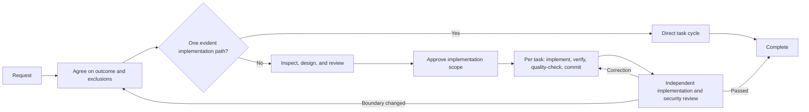

# Fluxos de desenvolvimento para Claude Code

[](https://claude.ai/code)
[](https://github.com/shinpr/claude-code-workflows)
[](https://opensource.org/licenses/MIT)
[](https://github.com/shinpr/claude-code-workflows/pulls)

[English](README.md) | [简体中文](README.zh-CN.md) | [日本語](README.ja.md) | [Español](README.es.md) | [한국어](README.ko.md) | **Português (Brasil)**

O Claude Code consegue explorar uma base de código em profundidade. Em trabalhos mais complexos, porém, o desafio maior não é explorar: é chegar a uma conclusão. Ao projetar um fluxo de recuperação de conta, por exemplo, o Claude pode encontrar uma inconsistência real no tratamento de tokens e dedicar quase todo o design a ela, deixando vago o comportamento de recuperação que havia sido solicitado.

O claude-code-workflows mantém essa exploração direcionada a um resultado combinado. Antes do design, ele define o objetivo e o que fica fora do escopo; confronta o design com o repositório; verifica cada tarefa antes do commit e, em mudanças maiores, verifica de forma independente se a implementação concluída entrega o resultado combinado, não inclui mudanças desnecessárias e não apresenta falhas graves de funcionamento, confiabilidade ou segurança. Dentro desses limites, o Claude decide os detalhes da implementação com base no código existente.

Use o Claude Code diretamente quando o resultado e os limites seguros da implementação já estiverem claros. Use estes fluxos quando uma mudança exigir acordo de escopo, decisões de design duradouras, uma passagem de contexto confiável ou verificação independente.

---

## Quando vale a pena usar o fluxo?

O fluxo adiciona chamadas de agentes e documentos, então precisa compensar esse custo. Ele é útil quando uma descoberta paralela real pode desviar uma mudança grande do objetivo, quando um design coerente pode deixar de fora o comportamento solicitado ou quando um teste que passa não observa de fato aquilo que diz verificar.

Depois que o escopo de implementação é aprovado, o Claude conduz as tarefas pelas verificações específicas, pelos controles de qualidade do repositório, pelos commits e pela revisão final, sem pedir confirmação para decisões rotineiras. Ele só volta ao usuário quando o resultado combinado ou o que ficou fora do escopo precisa mudar; as decisões de design técnico e implementação ficam com o Claude. Como o processo é distribuído na forma de plugin do Claude Code, a equipe pode aplicar os mesmos controles em vários repositórios sem prescrever os passos do Claude.

---

## Início rápido

Requer uma versão do Claude Code com suporte ao marketplace de plugins.

### Escolha um caminho

| O que você precisa? | Comece com | Plugin |
|---|---|---|
| Entregar de ponta a ponta uma mudança de backend, API, CLI ou de uso geral | `/recipe-implement` | `dev-workflows` |
| Projetar uma mudança de backend ou de uso geral antes da implementação | `/recipe-design` | `dev-workflows` |
| Projetar e implementar um frontend React / TypeScript | `/recipe-front-design` → `/recipe-front-plan` → `/recipe-front-build` | `dev-workflows-frontend` |
| Entregar backend e frontend React juntos | `/recipe-fullstack-implement` | `dev-workflows-fullstack` |
| Revisar uma implementação concluída em relação ao resultado combinado | `/recipe-review` ou `/recipe-front-review` | `dev-workflows` ou `dev-workflows-frontend` |
| Definir regras de qualidade específicas do repositório | `/recipe-quality-profile` | Qualquer plugin de fluxo |
| Investigar um problema antes de escolher a correção | `/recipe-diagnose` | Qualquer plugin de fluxo |
| Documentar um sistema existente a partir do código | `/recipe-reverse-engineer` | `dev-workflows` ou `dev-workflows-fullstack` |
| Fazer um experimento descartável ou protótipo | Use o Claude Code diretamente | Nenhum |

### Configuração comum

```bash
# 1. Inicie o Claude Code
claude

# 2. Adicione o marketplace
/plugin marketplace add shinpr/claude-code-workflows
```

### Instale um único plugin de fluxo

Instale o plugin adequado ao projeto. Se a instalação pedir para executar `/reload-plugins`, faça isso antes de chamar uma recipe.

```bash
# Backend ou uso geral
/plugin install dev-workflows@claude-code-workflows
/recipe-implement "Add rate limiting to the public API"

# Frontend
/plugin install dev-workflows-frontend@claude-code-workflows
/recipe-front-design "Add account recovery screens"

# Full stack
/plugin install dev-workflows-fullstack@claude-code-workflows
/recipe-fullstack-implement "Add user authentication with JWT + login form"
```

Instale apenas um plugin de fluxo. O `dev-workflows-fullstack` já inclui os fluxos de backend e frontend. Se você usava as recipes full stack do `dev-workflows`, migre para o `dev-workflows-fullstack`.

O `/recipe-front-design` termina depois que a UI Spec e o Design Doc aplicáveis forem revisados e aprovados. Execute `/recipe-front-plan` e `/recipe-front-build` quando quiser continuar. Para backend ou mudanças de uso geral, `/recipe-design`, `/recipe-plan` e `/recipe-build` oferecem as mesmas etapas.

### Configuração para equipes

O Claude Code aceita marketplaces e plugins com escopo de projeto. Inclua o arquivo `.claude/settings.json` gerado no repositório para que os colaboradores usem o mesmo plugin.

```bash
claude plugin marketplace add shinpr/claude-code-workflows --scope project
claude plugin install dev-workflows-fullstack@claude-code-workflows --scope project
```

Substitua `dev-workflows-fullstack` pelo plugin adequado ao repositório. Consulte a [documentação de plugins do Claude Code](https://code.claude.com/docs/en/discover-plugins#configure-team-marketplaces) para conhecer as opções de instalação com escopo de projeto e de instalação gerenciada.

---

## Como funciona



O caminho é determinado pelo número de decisões de produto e design, não pela quantidade de arquivos nem pelo volume da implementação.

| Escala | O que a mudança exige | O que acontece |
|---|---|---|
| Small | Um resultado que segue um padrão existente dentro de uma única responsabilidade | Ciclo direto de tarefas → verificações específicas e do repositório → revisão de segurança |
| Medium | Um resultado que atravessa responsabilidades ou requer uma decisão duradoura de design | Design Doc revisado, mais UI Spec / ADR quando necessário → prova de integração/E2E selecionada → Work Plan revisado → ciclos de tarefas → revisão final |
| Large | Vários resultados independentes de produto que exigem decisões separadas de design | PRD e Design Docs revisados, mais UI Spec / ADR quando necessário → prova de integração/E2E selecionada → Work Plan revisado → ciclos de tarefas → revisão final |

UI Specs, ADRs e esqueletos de testes de integração ou E2E só aparecem quando as respectivas decisões ou fronteiras de verificação se aplicam.

Gerar um documento, por si só, não faz o fluxo avançar. Premissas que podem alterar o design escolhido precisam ser resolvidas com evidências verificáveis antes da aprovação; um teste delimitado só é usado quando for a forma mais simples e suficiente de comprová-las.

O Work Plan é revisado quanto à cobertura, à ordem das dependências e à viabilidade das verificações antes de autorizar a implementação. Cada tarefa só entra em um commit depois de passar pelas verificações específicas e pelos controles aplicáveis do repositório. Ao fim da implementação em etapas, revisões separadas comparam a mudança completa com o resultado combinado, procuram mudanças desnecessárias e falhas graves de funcionamento ou confiabilidade, confirmam a cobertura observável e avaliam a segurança.

A sessão principal decide quais descobertas pertencem ao resultado atual, resolve dúvidas de implementação com base no repositório e mantém em andamento o trabalho que não foi afetado. Sugestões de revisão não viram tarefas automaticamente. Correções aceitas retornam à implementação e passam novamente pelos controles afetados.

### Como as decisões sobrevivem a novos contextos

Um novo contexto em cada fase evita que o raciocínio de uma fase vire, silenciosamente, a autoridade da seguinte. O [modelo de Work Plan](skills/documentation-criteria/references/plan-template.md) incluído exige que todo requisito técnico aprovado em um Design Doc tenha uma tarefa correspondente ou uma lacuna explícita. Ele não transforma cada seção do documento nem cada sugestão de revisão em tarefa. Uma lacuna significa que um requisito aprovado ainda não tem uma tarefa de implementação ou verificação.

```markdown
| Design Doc | DD Section | DD Item | Category | Covered By Task(s) | Gap Status | Notes |
|---|---|---|---|---|---|---|
| docs/design/example.md | API contract | Preserve the error response shape | contract-change | Phase 2 Task 1 | covered | |
| docs/design/example.md | Verification | Exercise cache invalidation | verification | | gap | Add a covering task before approval |
```

O [modelo de Task](skills/documentation-criteria/references/task-template.md) leva para a implementação as decisões obrigatórias e os valores observáveis dos contratos, cada um com uma verificação de conformidade que pode ser respondida com sim ou não. Depois da execução, os controles aplicáveis do repositório rodam sobre a mudança completa antes do commit. Os revisores finais leem as mesmas fontes aprovadas e o código concluído, em vez de depender da conversa de implementação. `/recipe-quality-profile` permite registrar regras de qualidade específicas do repositório e suas fontes em `docs/project-context/quality.yaml`; os executores de implementação e os revisores finais usam o perfil confirmado junto com as fontes aprovadas.

### Uma execução real

O [recurso de sincronização incremental do mcp-local-rag](https://github.com/shinpr/mcp-local-rag/pull/171) foi uma mudança de 42 arquivos que atravessou a leitura do sistema de arquivos, o armazenamento, a CLI e as interfaces MCP. Uma revisão independente de segurança devolveu a implementação duas vezes. Ela encontrou leituras de arquivos antes da validação e uma forma de contornar a restrição de caminhos por meio de um diretório pai com link simbólico.

A execução começou com um Work Plan que fazia referência a um ADR e a um Design Doc inexistentes, deixando incerta a fonte aprovada para as decisões técnicas. O usuário optou por tratar o Work Plan como referência principal, e a recipe o dividiu em 13 tarefas planejadas. A implementação final incluiu as mudanças necessárias para verificar o comportamento aprovado, enquanto o PR registrou por que o modo watch e os jobs persistentes ficaram fora do escopo.

### O que verificar após a primeira execução

- A abordagem combinada ampliou o que já existia e apresentou evidências para cada adição?
- É possível seguir cada requisito até uma tarefa e um método de verificação observável?
- Toda tarefa concluída passou pelas verificações específicas e do repositório antes do commit?
- A revisão final confirmou que toda a mudança entrega o resultado combinado sem mudanças desnecessárias nem falhas graves de funcionamento, confiabilidade ou segurança?
- Quando um revisor propôs mais trabalho, o relatório explicou por que a sugestão foi aplicada ou recusada?

---

## Fluxos mais comuns

### Desenvolvimento completo de backend ou uso geral

```bash
/recipe-implement "Add rate limiting to the public API"
```

A recipe delimita a mudança, examina a implementação atual, cria somente os documentos necessários para as decisões e pausa quando precisa de uma aprovação. Em seguida, conclui a implementação planejada e a revisão final.

### Projetar primeiro e implementar depois

```bash
# Backend ou uso geral
/recipe-design "Design rate limiting for the public API"
/recipe-plan
/recipe-build

# Frontend React
/recipe-front-design "Build a user profile dashboard"
/recipe-front-plan
/recipe-front-build
```

As recipes de design examinam a implementação existente, confirmam o escopo, criam os documentos necessários, executam uma revisão independente de consistência e param para aprovação. O planejamento e a implementação podem continuar mais tarde, em outro contexto ou por outra pessoa, a partir dos documentos aprovados.

O caminho de frontend acrescenta análise e uma UI Spec quando a estrutura ou o comportamento da interface ainda precisa ser definido, além de arquitetura de componentes, React Testing Library e verificações de TypeScript.

Por exemplo, dois componentes de um dashboard podem tratar corretamente seus estados de carregamento isoladamente, mas a tela combinada pode não definir o que acontece quando um ainda carrega e o outro falha. A UI Spec registra essa combinação de estados e a relaciona ao trabalho de design e teste antes da integração.

### Desenvolvimento full stack

```bash
/recipe-fullstack-implement "Add user authentication with JWT + React login form"
```

Quando a mudança contém vários resultados independentes de produto, um único PRD cobre toda a funcionalidade. Os designs de backend e frontend permanecem separados, o `design-sync` verifica a fronteira entre eles e o Work Plan usa slices verticais para testar a integração desde cedo.

Use `/recipe-fullstack-build` para continuar a partir de um Work Plan full stack existente. O plugin full stack também inclui as recipes de backend e frontend aplicáveis.

<details>
<summary>Mais exemplos de fluxo</summary>

#### Revisar uma implementação concluída

```bash
/recipe-review
```

O fluxo de revisão compara a implementação concluída com o resultado combinado e os critérios do repositório, depois executa uma revisão independente de segurança. As correções aceitas voltam ao responsável pela implementação ou pelo documento correspondente e passam por nova revisão.

#### Investigar antes de escolher uma correção

```bash
/recipe-diagnose "API returns 500 on user login"
```

O fluxo de diagnóstico mapeia os caminhos de execução, verifica possíveis pontos de falha e apresenta os prós e contras das soluções. Ele não altera o código.

#### Documentar um sistema existente a partir do código

```bash
/recipe-reverse-engineer "src/auth module"
```

Esse fluxo deriva PRDs e Design Docs do código e os verifica em relação à implementação. Use a opção full stack quando a funcionalidade atravessar backend e frontend.

Veja [How I Made Legacy Code AI-Friendly with Auto-Generated Docs](https://dev.to/shinpr/how-i-made-legacy-code-ai-friendly-with-auto-generated-docs-4353) para acompanhar um exemplo completo.

#### Ajustar uma UI implementada a partir de uma fonte de design

```bash
/recipe-front-adjust "Align the card spacing and actions with the design source"
```

O plugin de frontend registra como acessar a fonte externa de design, confirma o conjunto de arquivos a alterar e repete a verificação visual até o ajuste passar pelos controles.

</details>

---

## Referência das recipes

Todos os pontos de entrada usam o prefixo `recipe-`. Digite `/recipe-` e use Tab para ver as opções instaladas.

<details>
<summary>Ver todas as recipes de backend e uso geral</summary>

| Recipe | Objetivo | Quando usar |
|---|---|---|
| `/recipe-implement` | Implementar uma funcionalidade de ponta a ponta | Novas funcionalidades e fluxos completos |
| `/recipe-design` | Criar documentação de design | Planejamento de arquitetura |
| `/recipe-plan` | Gerar um Work Plan a partir do design | Etapa de planejamento |
| `/recipe-build` | Executar um Work Plan existente | Retomar uma implementação |
| `/recipe-review` | Revisar uma implementação concluída em relação ao resultado combinado | Verificação após a implementação |
| `/recipe-quality-profile` | Definir regras de qualidade específicas do repositório | Regras de qualidade |
| `/recipe-diagnose` | Investigar um problema e comparar soluções | Análise de causa raiz |
| `/recipe-reverse-engineer` | Derivar PRDs e Design Docs do código | Documentação de sistemas existentes |
| `/recipe-add-integration-tests` | Adicionar testes de integração ou E2E | Cobertura para código existente |
| `/recipe-update-doc` | Atualizar e revisar documentos existentes | Mudanças de requisitos ou design |
| `/recipe-task` | Executar diretamente uma tarefa guiada por regras | Trabalho que não precisa de passagem de contexto entre etapas |

</details>

<details>
<summary>Ver todas as recipes de frontend</summary>

O plugin de frontend acrescenta análise específica de React, arquitetura de componentes, React Testing Library, verificações de TypeScript e, quando necessário, a geração de uma UI Spec a partir de um protótipo.

| Recipe | Objetivo | Quando usar |
|---|---|---|
| `/recipe-front-design` | Criar a UI Spec e o Design Doc de frontend aplicáveis | Arquitetura de componentes React |
| `/recipe-front-plan` | Gerar um Work Plan de frontend | Planejamento de componentes |
| `/recipe-front-build` | Executar o Work Plan de frontend | Retomar a implementação React |
| `/recipe-front-adjust` | Ajustar uma UI implementada com verificação externa | Refinamentos visuais |
| `/recipe-front-review` | Revisar um frontend concluído em relação ao resultado combinado | Verificação após a implementação |
| `/recipe-quality-profile` | Definir regras de qualidade específicas do repositório | Regras de qualidade |
| `/recipe-diagnose` | Investigar um problema e comparar soluções | Análise de causa raiz |
| `/recipe-update-doc` | Atualizar e revisar documentos existentes | Mudanças de requisitos ou design |
| `/recipe-task` | Executar diretamente uma tarefa guiada por regras | Trabalho que não precisa de passagem de contexto entre etapas |

</details>

---

## O que os plugins incluem

Agentes especializados mantêm a análise e o design separados da execução e da revisão final. Cada plugin inclui somente os papéis usados por seus fluxos; o plugin full stack combina os papéis de backend e frontend. A lista completa está abaixo.

<details>
<summary>Ver todos os papéis de agentes especializados</summary>

### Agentes compartilhados

Estes agentes são compartilhados pelos plugins de backend, frontend e full stack:

| Agente | Função |
|---|---|
| **requirement-analyzer** | Reúne evidências objetivas de escopo e custo para as decisões de requisitos e fluxo do orquestrador |
| **prd-creator** | Define requisitos de produto para funcionalidades maiores |
| **codebase-analyzer** | Examina o código e as dependências existentes antes do design |
| **code-verifier** | Compara os documentos com a implementação |
| **work-planner** | Transforma decisões de design em um Work Plan executável |
| **task-decomposer** | Divide um Work Plan em tarefas prontas para commit |
| **acceptance-test-generator** | Cria esqueletos de testes de integração e E2E a partir dos requisitos |
| **integration-test-reviewer** | Revisa testes de integração e E2E em relação à cobertura pretendida |
| **code-reviewer** | Verifica se a implementação concluída atende ao resultado combinado e aos critérios do repositório |
| **document-reviewer** | Verifica a integridade do documento e a conformidade com as regras |
| **design-sync** | Detecta conflitos entre vários Design Docs |
| **investigator** | Mapeia caminhos de execução e identifica possíveis pontos de falha |
| **verifier** | Questiona possíveis pontos de falha e verifica a cobertura dos caminhos |
| **solver** | Compara soluções e seus trade-offs |
| **security-reviewer** | Revisa a implementação concluída em busca de problemas de segurança |
| **rule-advisor** | Seleciona as regras de desenvolvimento relevantes para a tarefa |

### Agentes específicos de backend

| Agente | Função |
|---|---|
| **technical-designer** | Projeta a abordagem técnica e a arquitetura |
| **scope-discoverer** | Encontra limites funcionais na implementação existente |
| **task-executor** | Implementa tarefas de backend com verificação orientada por testes |
| **quality-fixer** | Executa testes, verificações de tipos, lint e outros controles de qualidade |

### Agentes específicos de frontend

| Agente | Função |
|---|---|
| **ui-spec-designer** | Cria uma UI Spec a partir dos requisitos e de um protótipo opcional |
| **ui-analyzer** | Obtém fontes e sistemas de design, consulta diretrizes e examina a UI existente |
| **technical-designer-frontend** | Projeta a arquitetura de componentes React e o gerenciamento de estado |
| **task-executor-frontend** | Implementa componentes React com cobertura baseada em React Testing Library |
| **quality-fixer-frontend** | Executa testes de frontend, verificações de TypeScript, lint e builds |

</details>

<details>
<summary>Ver as orientações de desenvolvimento incluídas</summary>

- **Coding Principles.** Padrões de qualidade de código.
- **Testing Principles.** TDD, cobertura e padrões de teste.
- **Implementation Approach.** Decisões de implementação e seus trade-offs.
- **Documentation Standards.** Documentação clara e fácil de manter.
- **External Resource Context.** Registra como chegar a fontes e sistemas de design, esquemas de API, definições de infraestrutura e outros recursos externos.
- **LLM-Friendly Context.** Prompts, passagens de contexto, documentos e instruções claros para que os próximos agentes executem sem precisar adivinhar.

Os agentes carregam essas skills conforme a necessidade do trabalho. O plugin de frontend também inclui regras específicas de React e TypeScript.

</details>

<details>
<summary>Usar as orientações sem o fluxo (dev-skills)</summary>

Se você já tem orquestração por meio de prompts próprios ou CI e precisa apenas das orientações de boas práticas, use `dev-skills`. Se quiser que o Claude planeje, execute e verifique uma mudança de ponta a ponta, instale o plugin de fluxo adequado.

- Uso mínimo de contexto, sem agentes
- Orientações de desenvolvimento, testes, design e documentação sem impor um processo
- Carregamento automático das skills relevantes para cada tarefa

> **Não instale `dev-skills` junto com um plugin de fluxo.** Eles compartilham as mesmas skills, e descrições duplicadas podem fazer com que o Claude Code ignore skills depois de atingir o limite de contexto.

```bash
/plugin install dev-skills@claude-code-workflows
```

Para alternar entre os tipos de plugin:

```bash
# dev-skills -> dev-workflows
/plugin uninstall dev-skills@claude-code-workflows
/plugin install dev-workflows@claude-code-workflows

# dev-workflows -> dev-skills
/plugin uninstall dev-workflows@claude-code-workflows
/plugin install dev-skills@claude-code-workflows
```

</details>

<details>
<summary>Ver complementos opcionais</summary>

Estes plugins cobrem funções relacionadas sem alterar o fluxo principal:

- [claude-code-discover](https://github.com/shinpr/claude-code-discover): transforma ideias de funcionalidades em PRDs sustentados por evidências.
- [metronome](https://github.com/shinpr/metronome): detecta atalhos e pede que o Claude siga o procedimento definido.
- [linear-prism](https://github.com/shinpr/linear-prism): valida requisitos e os transforma em tarefas estruturadas do Linear.
- [pr-review](https://github.com/shinpr/pr-review-skill): revisa PRs do GitHub segundo os critérios do repositório e publica apenas os achados aprovados.

```bash
/plugin install discover@claude-code-workflows
/plugin install metronome@claude-code-workflows
/plugin install linear-prism@claude-code-workflows
/plugin install pr-review@claude-code-workflows
```

</details>

---

## Perguntas frequentes

**P: O que acontece se houver erros?**

R: Os agentes quality-fixer resolvem falhas de testes, tipos, lint e build dentro do resultado aprovado, inclusive mudanças adjacentes exigidas pela mesma responsabilidade ou contrato.

O fluxo só consulta o usuário quando já não é possível preservar ao mesmo tempo o resultado solicitado e o que ficou fora do escopo, ou quando uma ação externa irreversível precisa de autorização. Enquanto não mudar o que o produto entrega, o Claude resolve por conta própria as mudanças de design técnico, contratos, interface, arquitetura, persistência e implementação.

**P: Existe uma versão para o OpenAI Codex CLI?**

R: Sim. O **[codex-workflows](https://github.com/shinpr/codex-workflows)** usa o mesmo modelo de fluxo, adaptado ao ambiente do Codex CLI.

**P: Devo incluir no commit o Work Plan e os arquivos de tarefas em `docs/plans/`?**

R: Não. As recipes tratam `docs/plans/` como estado temporário de trabalho. Arquivos de tarefas já usados e arquivos intermediários de correção são removidos após a conclusão bem-sucedida. O Work Plan pode permanecer para revisão ou para uma execução futura e pode ser excluído quando não for mais necessário. Adicione a linha abaixo ao `.gitignore` do projeto para manter esse estado fora do controle de versão:

```
docs/plans/
```

PRDs, ADRs, UI Specs e Design Docs ficam em `docs/prd/`, `docs/adr/`, `docs/ui-spec/` e `docs/design/`, respectivamente, e devem ser incluídos no repositório.

---

## Contribuindo com plugins externos

Este marketplace cobre todo o ciclo de desenvolvimento de produtos com IA: qualidade do produto, descoberta, controle da implementação e verificação. Se o seu plugin ajuda agentes de programação a entregar produtos melhores, queremos conhecê-lo.

Consulte [CONTRIBUTING.md](CONTRIBUTING.md) para ver as instruções e os critérios de aceitação.

<details>
<summary>Ver a estrutura do repositório</summary>

```
claude-code-workflows/
├── .claude-plugin/
│   └── marketplace.json        # Plugin definitions and per-plugin contents
├── agents/                     # Specialized analysis, design, execution, and review roles
├── skills/
│   ├── recipe-*/               # Workflow entry points
│   ├── documentation-criteria/ # Document rules and templates
│   ├── coding-principles/
│   ├── testing-principles/
│   ├── external-resource-context/
│   ├── llm-friendly-context/
│   └── ...
├── LICENSE
└── README.md
```

</details>

---

## Fundamentos do design

<details>
<summary>Leituras relacionadas</summary>

- [Why LLMs Are Bad at 'First Try' and Great at Verification](https://www.norsica.jp/blog/llm-verification-over-generation): por que feedback externo e novos contextos são mais confiáveis do que pedir à mesma sessão para gerar e avaliar o próprio trabalho.
- [When Better Models Make Old Agent Workflows Worse](https://www.norsica.jp/blog/when-better-models-make-old-agent-workflows-worse): por que o fluxo é rigoroso com limites e evidências sem impor um caminho específico.
- [Reasoning Effort Is Not a Quality Setting](https://www.norsica.jp/blog/reasoning-effort-is-not-a-quality-setting): por que uma exploração mais ampla ainda precisa convergir para o trabalho que o resultado atual justifica.
- [Stop Putting Everything in AGENTS.md](https://www.norsica.jp/blog/stop-putting-everything-in-agents-md): por que instruções permanentes devem permanecer pequenas e skills, decisões de design e orientações de tarefas devem ser carregadas conforme a necessidade.

</details>

---

## Licença

Licença MIT. Você pode usar, modificar e distribuir livremente.

Consulte [LICENSE](LICENSE) para saber mais.

---

Desenvolvido e mantido por [@shinpr](https://github.com/shinpr).
