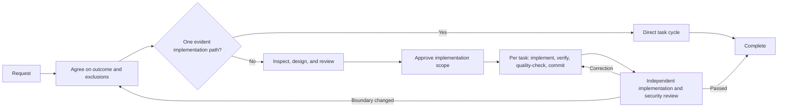

# Fluxos de desenvolvimento para Claude Code

[](https://claude.ai/code)
[](https://github.com/shinpr/claude-code-workflows)
[](https://opensource.org/licenses/MIT)
[](https://github.com/shinpr/claude-code-workflows/pulls)

[English](README.md) | [简体中文](README.zh-CN.md) | [日本語](README.ja.md) | [Español](README.es.md) | [한국어](README.ko.md) | **Português (Brasil)**

O Claude Code consegue explorar uma base de código em profundidade. Em trabalhos mais complexos, porém, o desafio maior não é explorar: é chegar a uma conclusão. Ao projetar um fluxo de recuperação de conta, por exemplo, o Claude pode encontrar uma inconsistência real no tratamento de tokens e dedicar quase todo o design a ela, deixando vago o comportamento de recuperação que havia sido solicitado.

O claude-code-workflows mantém essa exploração direcionada a um resultado combinado. Antes do design, ele combina com o usuário o resultado esperado e o que fica fora do escopo; confronta o design com o repositório; verifica cada tarefa antes do commit e, em mudanças maiores, verifica de forma independente se a implementação concluída entrega o resultado combinado, não inclui mudanças desnecessárias e não apresenta falhas graves de funcionamento, confiabilidade ou segurança. Dentro desses limites, o Claude decide os detalhes da implementação com base no código existente.

Use o Claude Code diretamente quando o resultado e os limites seguros da implementação já estiverem claros. Use estes fluxos quando uma mudança exigir acordo de escopo, decisões de design duradouras, uma passagem de contexto confiável ou verificação independente.

---

## Quando vale a pena usar o fluxo?

O fluxo adiciona chamadas de agentes e documentos, então precisa compensar esse custo. Ele é útil quando uma descoberta paralela real pode desviar uma mudança grande do objetivo, quando um design coerente pode deixar de fora o comportamento solicitado ou quando um teste que passa não observa de fato aquilo que diz verificar. Quando uma mudança não precisa de todas as verificações, o [modo lite](#modo-lite) executa menos delas.

Depois que o escopo de implementação é aprovado, o Claude conduz as tarefas pelas verificações específicas, pelos controles de qualidade do repositório, pelos commits e pela revisão final, sem pedir confirmação para decisões rotineiras. Ele só volta ao usuário quando o resultado combinado ou o que ficou fora do escopo precisa mudar, ou quando uma ação externa irreversível precisa de autorização; as decisões de design técnico e implementação ficam com o Claude. Como o processo é distribuído na forma de plugin do Claude Code, a equipe pode aplicar os mesmos controles em vários repositórios sem prescrever os passos do Claude.

---

## Início rápido

Requer uma versão do Claude Code com suporte ao marketplace de plugins.

### Escolha um caminho

| O que você precisa? | Comece com | Plugin |
|---|---|---|
| Entregar de ponta a ponta uma mudança de backend, API, CLI ou de uso geral | `/recipe-implement` | `dev-workflows` |
| Projetar uma mudança de backend ou de uso geral antes da implementação | `/recipe-design` | `dev-workflows` |
| Projetar e implementar um frontend React / TypeScript | `/recipe-front-design` → `/recipe-front-plan` → `/recipe-front-build` | `dev-workflows-frontend` |
| Entregar backend e frontend React juntos | `/recipe-fullstack-implement` | `dev-workflows-fullstack` |
| Revisar uma implementação concluída em relação ao resultado combinado | `/recipe-review` ou `/recipe-front-review` | `dev-workflows` ou `dev-workflows-frontend` |
| Definir regras de qualidade específicas do repositório | `/recipe-quality-profile` | Qualquer plugin de fluxo |
| Investigar um problema antes de escolher a correção | `/recipe-diagnose` | Qualquer plugin de fluxo |
| Documentar um sistema existente a partir do código | `/recipe-reverse-engineer` | `dev-workflows` ou `dev-workflows-fullstack` |
| Fazer um experimento descartável ou protótipo | Use o Claude Code diretamente | Nenhum |

### Configuração comum

```bash
# 1. Inicie o Claude Code
claude

# 2. Adicione o marketplace
/plugin marketplace add shinpr/claude-code-workflows
```

### Instale um único plugin de fluxo

Instale o plugin adequado ao projeto. Se a instalação pedir para executar `/reload-plugins`, faça isso antes de chamar uma recipe.

```bash
# Backend ou uso geral
/plugin install dev-workflows@claude-code-workflows
/recipe-implement "Add rate limiting to the public API"

# Frontend
/plugin install dev-workflows-frontend@claude-code-workflows
/recipe-front-design "Add account recovery screens"

# Full stack
/plugin install dev-workflows-fullstack@claude-code-workflows
/recipe-fullstack-implement "Add user authentication with JWT + login form"
```

Instale apenas um plugin de fluxo. O `dev-workflows-fullstack` já inclui os fluxos de backend e frontend. Se você usava as recipes full stack do `dev-workflows`, migre para o `dev-workflows-fullstack`.

O `/recipe-front-design` termina depois que a UI Spec e o Design Doc aplicáveis forem revisados e aprovados. Execute `/recipe-front-plan` e `/recipe-front-build` quando quiser continuar. Para backend ou mudanças de uso geral, `/recipe-design`, `/recipe-plan` e `/recipe-build` oferecem as mesmas etapas.

### Configuração para equipes

O Claude Code aceita marketplaces e plugins com escopo de projeto. Inclua o arquivo `.claude/settings.json` gerado no repositório para que os colaboradores usem o mesmo plugin.

```bash
claude plugin marketplace add shinpr/claude-code-workflows --scope project
claude plugin install dev-workflows-fullstack@claude-code-workflows --scope project
```

Substitua `dev-workflows-fullstack` pelo plugin adequado ao repositório. Consulte a [documentação de plugins do Claude Code](https://code.claude.com/docs/en/discover-plugins#configure-team-marketplaces) para conhecer as opções de instalação com escopo de projeto e de instalação gerenciada.

---

## Como funciona


```mermaid
flowchart LR
    A[Request] --> B[Agree on outcome and exclusions]
    B --> C{One evident implementation path?}
    C -->|Yes| S[Direct task cycle]
    S --> J[Complete]
    C -->|No| D[Inspect, design, and review]
    D --> E[Approve implementation scope]
    E --> F[Per task: implement, verify, quality-check, commit]
    F --> I[Independent implementation and security review]
    I -->|Correction| F
    I -->|Boundary changed| B
    I -->|Passed| J[Complete]
```

O caminho depende de quantas decisões de produto e design a mudança envolve, não da quantidade de arquivos. Uma mudança com um único resultado, que segue um padrão existente dentro de uma única responsabilidade, vai direto para o ciclo de tarefas. Uma mudança que atravessa responsabilidades ou exige uma decisão duradoura de design passa antes por um Design Doc e um Work Plan revisados, além de PRD, UI Spec ou ADR quando alguma de suas decisões pedir.

Sugestões de revisão não viram tarefas automaticamente. A sessão principal decide quais descobertas pertencem ao resultado combinado e recusa as demais com uma justificativa.

### Modo lite

```bash
/recipe-implement "Lite mode. Add rate limiting to the public API"
```

Peça o modo lite ao chamar qualquer recipe. As etapas e os pontos de aprovação continuam os mesmos, mas o fluxo faz menos verificações: os Design Docs não são confrontados com o repositório nem entre si, e a revisão independente de segurança não é executada. Os controles de qualidade do repositório rodam uma única vez, depois da última tarefa, em vez de antes de cada commit. A revisão final do código continua sendo feita. O modo lite vale até o fim da sessão, a menos que você peça ao Claude para desligá-lo.

### Uma execução real

O [recurso de sincronização incremental do mcp-local-rag](https://github.com/shinpr/mcp-local-rag/pull/171) foi uma mudança de 42 arquivos que atravessou a leitura do sistema de arquivos, o armazenamento, a CLI e as interfaces MCP. Uma revisão independente de segurança devolveu a implementação duas vezes. Ela encontrou leituras de arquivos antes da validação e uma forma de contornar a restrição de caminhos por meio de um diretório pai com link simbólico.

A execução começou com um Work Plan que fazia referência a um ADR e a um Design Doc inexistentes, deixando incerta a fonte aprovada para as decisões técnicas. O usuário optou por tratar o Work Plan como referência principal, e a recipe o dividiu em 13 tarefas planejadas. A implementação final incluiu as mudanças necessárias para verificar o comportamento aprovado, enquanto o PR registrou por que o modo watch e os jobs persistentes ficaram fora do escopo.

---

## Fluxos mais comuns

### Desenvolvimento completo de backend ou uso geral

```bash
/recipe-implement "Add rate limiting to the public API"
```

A recipe delimita a mudança, examina a implementação atual, cria somente os documentos necessários para as decisões e pausa quando precisa de uma aprovação. Em seguida, conclui a implementação planejada e a revisão final.

### Projetar primeiro e implementar depois

```bash
# Backend ou uso geral
/recipe-design "Design rate limiting for the public API"
/recipe-plan
/recipe-build

# Frontend React
/recipe-front-design "Build a user profile dashboard"
/recipe-front-plan
/recipe-front-build
```

As recipes de design examinam a implementação existente, confirmam o escopo, criam os documentos necessários, executam uma revisão independente de consistência e param para aprovação. O planejamento e a implementação podem continuar mais tarde, em outro contexto ou por outra pessoa, a partir dos documentos aprovados. Cada tarefa do [Work Plan](skills/documentation-criteria/references/plan-template.md) cita as decisões de design e os critérios de aceitação que precisa atender, e os revisores finais conferem o código concluído com essas mesmas fontes, em vez da conversa anterior.

O caminho de frontend acrescenta análise e uma UI Spec quando a estrutura ou o comportamento da interface ainda precisa ser definido, além de arquitetura de componentes, React Testing Library e verificações de TypeScript.

Por exemplo, dois componentes de um dashboard podem tratar corretamente seus estados de carregamento isoladamente, mas a tela combinada pode não definir o que acontece quando um ainda carrega e o outro falha. A UI Spec registra essa combinação de estados e a relaciona ao trabalho de design e teste antes da integração.

### Desenvolvimento full stack

```bash
/recipe-fullstack-implement "Add user authentication with JWT + React login form"
```

Quando a mudança contém vários resultados independentes de produto, um único PRD cobre toda a funcionalidade. Os designs de backend e frontend permanecem separados, uma verificação de consistência cobre a fronteira entre eles e o Work Plan usa slices verticais para testar a integração desde cedo.

Use `/recipe-fullstack-build` para continuar a partir de um Work Plan full stack existente. O plugin full stack também inclui as recipes de backend e frontend aplicáveis.

<details>
<summary>Mais exemplos de fluxo</summary>

#### Revisar uma implementação concluída

```bash
/recipe-review
```

O fluxo de revisão compara a implementação concluída com o resultado combinado e os critérios do repositório, depois executa uma revisão independente de segurança. As correções aceitas voltam ao responsável pela implementação ou pelo documento correspondente e passam por nova revisão.

#### Investigar antes de escolher uma correção

```bash
/recipe-diagnose "API returns 500 on user login"
```

O fluxo de diagnóstico mapeia os caminhos de execução, verifica possíveis pontos de falha e apresenta os prós e contras das soluções. Ele não altera o código.

#### Documentar um sistema existente a partir do código

```bash
/recipe-reverse-engineer "src/auth module"
```

Esse fluxo deriva PRDs e Design Docs do código e os verifica em relação à implementação. Use a opção full stack quando a funcionalidade atravessar backend e frontend.

Veja [How I Made Legacy Code AI-Friendly with Auto-Generated Docs](https://dev.to/shinpr/how-i-made-legacy-code-ai-friendly-with-auto-generated-docs-4353) para acompanhar um exemplo completo.

#### Ajustar uma UI implementada a partir de uma fonte de design

```bash
/recipe-front-adjust "Align the card spacing and actions with the design source"
```

O plugin de frontend registra como acessar a fonte externa de design, confirma o conjunto de arquivos a alterar e repete a verificação visual até o ajuste passar pelos controles.

</details>

---

## Referência das recipes

Todos os pontos de entrada usam o prefixo `recipe-`. Digite `/recipe-` e use Tab para ver as opções instaladas.

<details>
<summary>Ver todas as recipes de backend e uso geral</summary>

| Recipe | Objetivo | Quando usar |
|---|---|---|
| `/recipe-implement` | Implementar uma funcionalidade de ponta a ponta | Novas funcionalidades e fluxos completos |
| `/recipe-design` | Criar documentação de design | Planejamento de arquitetura |
| `/recipe-plan` | Gerar um Work Plan a partir do design | Etapa de planejamento |
| `/recipe-build` | Executar um Work Plan existente | Retomar uma implementação |
| `/recipe-review` | Revisar uma implementação concluída em relação ao resultado combinado | Verificação após a implementação |
| `/recipe-quality-profile` | Definir regras de qualidade específicas do repositório | Regras de qualidade |
| `/recipe-diagnose` | Investigar um problema e comparar soluções | Análise de causa raiz |
| `/recipe-reverse-engineer` | Derivar PRDs e Design Docs do código | Documentação de sistemas existentes |
| `/recipe-add-integration-tests` | Adicionar testes de integração ou E2E | Cobertura para código existente |
| `/recipe-update-doc` | Atualizar e revisar documentos existentes | Mudanças de requisitos ou design |

</details>

<details>
<summary>Ver todas as recipes de frontend</summary>

O plugin de frontend acrescenta análise específica de React, arquitetura de componentes, React Testing Library, verificações de TypeScript e, quando necessário, a geração de uma UI Spec a partir de um protótipo.

| Recipe | Objetivo | Quando usar |
|---|---|---|
| `/recipe-front-design` | Criar a UI Spec e o Design Doc de frontend aplicáveis | Arquitetura de componentes React |
| `/recipe-front-plan` | Gerar um Work Plan de frontend | Planejamento de componentes |
| `/recipe-front-build` | Executar o Work Plan de frontend | Retomar a implementação React |
| `/recipe-front-adjust` | Ajustar uma UI implementada com verificação externa | Refinamentos visuais |
| `/recipe-front-review` | Revisar um frontend concluído em relação ao resultado combinado | Verificação após a implementação |
| `/recipe-quality-profile` | Definir regras de qualidade específicas do repositório | Regras de qualidade |
| `/recipe-diagnose` | Investigar um problema e comparar soluções | Análise de causa raiz |
| `/recipe-update-doc` | Atualizar e revisar documentos existentes | Mudanças de requisitos ou design |

</details>

---

## Orientações sem o fluxo

Se você já tem orquestração por meio de prompts próprios ou CI e precisa apenas das orientações de boas práticas, use `dev-skills`. Se quiser que o Claude planeje, execute e verifique uma mudança de ponta a ponta, instale o plugin de fluxo adequado.

- Uso mínimo de contexto, sem agentes nem skills de recipe
- Orientações de desenvolvimento, testes, design e documentação sem impor um processo
- Carregamento automático das skills relevantes para cada tarefa

> **Não instale `dev-skills` junto com um plugin de fluxo.** Eles compartilham as mesmas skills, e descrições duplicadas podem fazer com que o Claude Code ignore skills depois de atingir o limite de contexto.

```bash
/plugin install dev-skills@claude-code-workflows
```

Para alternar entre os tipos de plugin:

```bash
# dev-skills -> dev-workflows
/plugin uninstall dev-skills@claude-code-workflows
/plugin install dev-workflows@claude-code-workflows

# dev-workflows -> dev-skills
/plugin uninstall dev-workflows@claude-code-workflows
/plugin install dev-skills@claude-code-workflows
```

---

## Perguntas frequentes

**P: O que acontece se houver erros?**

R: O fluxo resolve falhas de testes, tipos, lint e build dentro do resultado aprovado, inclusive mudanças adjacentes exigidas pela mesma responsabilidade ou contrato.

**P: Existe uma versão para o OpenAI Codex CLI?**

R: Sim. O **[codex-workflows](https://github.com/shinpr/codex-workflows)** usa o mesmo modelo de fluxo, adaptado ao ambiente do Codex CLI.

**P: Devo incluir no commit o Work Plan e os arquivos de tarefas em `docs/plans/`?**

R: Não. As recipes tratam `docs/plans/` como estado temporário de trabalho. Arquivos de tarefas já usados e arquivos intermediários de correção são removidos após a conclusão bem-sucedida. O Work Plan pode permanecer para revisão ou para uma execução futura e pode ser excluído quando não for mais necessário. Adicione a linha abaixo ao `.gitignore` do projeto para manter esse estado fora do controle de versão:

```
docs/plans/
```

PRDs, ADRs, UI Specs e Design Docs ficam em `docs/prd/`, `docs/adr/`, `docs/ui-spec/` e `docs/design/`, respectivamente, e devem ser incluídos no repositório.

---

## Fundamentos do design

<details>
<summary>Leituras relacionadas</summary>

- [Why LLMs Are Bad at 'First Try' and Great at Verification](https://www.norsica.jp/blog/llm-verification-over-generation): por que feedback externo e novos contextos são mais confiáveis do que pedir à mesma sessão para gerar e avaliar o próprio trabalho.
- [When Better Models Make Old Agent Workflows Worse](https://www.norsica.jp/blog/when-better-models-make-old-agent-workflows-worse): por que o fluxo é rigoroso com limites e evidências sem impor um caminho específico.
- [Reasoning Effort Is Not a Quality Setting](https://www.norsica.jp/blog/reasoning-effort-is-not-a-quality-setting): por que uma exploração mais ampla ainda precisa convergir para o trabalho que o resultado atual justifica.
- [Stop Putting Everything in AGENTS.md](https://www.norsica.jp/blog/stop-putting-everything-in-agents-md): por que instruções permanentes devem permanecer pequenas e skills, decisões de design e orientações de tarefas devem ser carregadas conforme a necessidade.

</details>

---

## Licença

Licença MIT. Você pode usar, modificar e distribuir livremente.

Consulte [LICENSE](LICENSE) para saber mais.

---

Desenvolvido e mantido por [@shinpr](https://github.com/shinpr).
