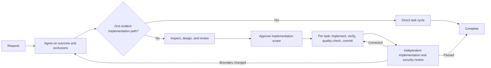

# Claude Code 开发工作流

[](https://claude.ai/code)
[](https://github.com/shinpr/claude-code-workflows)
[](https://opensource.org/licenses/MIT)
[](https://github.com/shinpr/claude-code-workflows/pulls)

[English](README.md) | **简体中文** | [日本語](README.ja.md) | [Español](README.es.md) | [한국어](README.ko.md) | [Português (Brasil)](README.pt-BR.md)

Claude Code能够深入探索代码库。但面对复杂任务时，真正困难的往往不是探索，而是让探索最终收敛。比如在设计账户恢复流程时，Claude可能发现令牌处理存在真实的不一致，并把大部分精力投入其中，结果反而没有说清用户真正需要的恢复行为。

claude-code-workflows让探索始终围绕已经约定的结果展开。它在设计前确认目标和排除项，对照代码库检查设计，在提交前验证每个任务；对于较大的变更，还会独立审查最终实现是否符合预期行为和安全要求。在这个边界内，Claude根据代码库自行决定实现细节。

如果目标和安全的实现边界已经清楚，直接使用Claude Code即可。如果变更需要先对范围达成一致、保留可追溯的设计决策、在不同上下文之间可靠交接，或进行独立验证，请使用这些工作流。

---

## 什么时候适合使用？

工作流会增加Agent调用和文档产物，因此应该只在收益足以覆盖成本时使用。当一个实际发现的次要问题可能让大型变更偏离原目标、设计看似自洽却可能漏掉所需行为，或者通过的测试并未真正观察到它声称验证的内容时，这套工作流最有价值。

实现范围获批后，Claude会完成每个任务的针对性验证、仓库质量检查、提交和最终审查，不会为常规实现决策反复询问。产品变更和重大设计变更会交回用户决定；可逆的实现选择由Claude处理。由于它以Claude Code插件形式提供，团队可以在不规定Claude具体步骤的前提下，在不同仓库中应用同一套控制机制。

---

## 快速开始

需要使用支持插件市场的Claude Code版本。

### 选择合适的路径

| 你需要什么？ | 从这里开始 | 插件 |
|---|---|---|
| 端到端交付后端、API、CLI或通用变更 | `/recipe-implement` | `dev-workflows` |
| 在实现前设计后端或通用变更 | `/recipe-design` | `dev-workflows` |
| 设计并实现React / TypeScript前端 | `/recipe-front-design` → `/recipe-front-plan` → `/recipe-front-build` | `dev-workflows-frontend` |
| 同时交付后端和React前端 | `/recipe-fullstack-implement` | `dev-workflows-fullstack` |
| 按照设计审查实现 | `/recipe-review` 或 `/recipe-front-review` | `dev-workflows` 或 `dev-workflows-frontend` |
| 在选择修复方案前调查问题 | `/recipe-diagnose` | 任意工作流插件 |
| 根据代码记录现有系统 | `/recipe-reverse-engineer` | `dev-workflows` 或 `dev-workflows-fullstack` |
| 一次性实验或原型 | 直接使用Claude Code | 无 |

### 通用设置

```bash
# 1. 启动Claude Code
claude

# 2. 添加插件市场
/plugin marketplace add shinpr/claude-code-workflows
```

### 安装一个工作流插件

安装与项目相匹配的插件。如果安装后提示运行`/reload-plugins`，请先执行它，再调用recipe。

```bash
# 后端或通用变更
/plugin install dev-workflows@claude-code-workflows
/recipe-implement "Add rate limiting to the public API"

# 前端
/plugin install dev-workflows-frontend@claude-code-workflows
/recipe-front-design "Add account recovery screens"

# 全栈
/plugin install dev-workflows-fullstack@claude-code-workflows
/recipe-fullstack-implement "Add user authentication with JWT + login form"
```

只安装一个工作流插件。`dev-workflows-fullstack`已经包含后端和前端工作流。如果你之前使用`dev-workflows`中的全栈recipe，请迁移到`dev-workflows-fullstack`。

`/recipe-front-design`会在适用的UI Spec和Design Doc完成审查并获批后停止。准备继续时，运行`/recipe-front-plan`和`/recipe-front-build`。后端或通用变更也提供同样分阶段的`/recipe-design`、`/recipe-plan`和`/recipe-build`。

### 团队设置

Claude Code支持项目级插件市场和插件。提交生成的`.claude/settings.json`，让贡献者也使用同一个工作流插件。

```bash
claude plugin marketplace add shinpr/claude-code-workflows --scope project
claude plugin install dev-workflows-fullstack@claude-code-workflows --scope project
```

请将`dev-workflows-fullstack`替换为适合当前仓库的插件。项目级和受管安装方式请参见[Claude Code插件文档](https://code.claude.com/docs/en/discover-plugins#configure-team-marketplaces)。

---

## 工作原理



路径由产品决策和设计决策的数量决定，而不是文件数量或实现工作量。

| 规模 | 变更需要什么 | 执行内容 |
|---|---|---|
| Small | 一个沿用现有模式、且限定在单一职责内的结果 | 直接执行任务 → 针对当前任务的检查和仓库检查 → 安全审查 |
| Medium | 一个跨越多个职责或需要长期设计决策的结果 | 经审查的Design Doc，以及按需添加的UI Spec / ADR → 选定的集成/E2E验证 → 经审查的Work Plan → 任务周期 → 最终审查 |
| Large | 多个需要分别做设计决策的独立产品结果 | 经审查的PRD和Design Doc，以及按需添加的UI Spec / ADR → 选定的集成/E2E验证 → 经审查的Work Plan → 任务周期 → 最终审查 |

只有确实存在相应决策或验证边界时，才会创建UI Spec、ADR以及集成或E2E测试骨架。

仅仅生成文档并不会推动工作流继续。可能影响最终设计选择的前提，必须在批准前用可验证的证据加以确认。如果仓库中的证据和权威资料仍不足以判断，验证环节会先明确还缺少什么证据。如果范围受限的能力验证是获得该证据最简且足够的方式，负责该设计的代理只执行一次，随后丢弃临时产物。Work Plan必须经过范围覆盖、依赖顺序和可执行验证方面的审查，才能授权实现。每项任务只有通过针对当前任务的检查和适用的仓库检查后才会提交。分阶段实现完成后，独立审查会分别检查设计一致性、可观测行为的覆盖和安全性。

主会话负责判断哪些发现属于当前目标，根据仓库解决实现问题，并让不受影响的工作继续进行。审查建议不会自动变成新任务。被接受的修正会返回实现阶段，并重新经过受影响的验证环节。

### 如何在新上下文中保留决策

每个阶段使用新的上下文，避免上一阶段的推理在下一阶段悄悄变成权威。内置的[Work Plan模板](skills/documentation-criteria/references/plan-template.md)要求Design Doc中每条已批准的技术需求都有对应任务，或被明确标记为缺口。它不会把文档的每个章节或每条审查建议都转成任务。缺口表示某项已批准需求还没有实现或验证任务。

```markdown
| Design Doc | DD Section | DD Item | Category | Covered By Task(s) | Gap Status | Notes |
|---|---|---|---|---|---|---|
| docs/design/example.md | API contract | Preserve the error response shape | contract-change | Phase 2 Task 1 | covered | |
| docs/design/example.md | Verification | Exercise cache invalidation | verification | | gap | Add a covering task before approval |
```

[Task模板](skills/documentation-criteria/references/task-template.md)会把具有约束力的决策和对外可验证的契约内容带入实现，并为每一项提供可用“是/否”判断的合规检查。执行完成后，在提交前对整个任务变更运行适用的仓库检查。最终审查者读取同一套已批准来源和完成的代码，而不是依赖实现过程中的对话。

### 一次真实的工作流执行

[mcp-local-rag的增量同步功能](https://github.com/shinpr/mcp-local-rag/pull/171)是一项涉及文件系统扫描、存储、CLI和MCP接口的42文件变更。独立安全审查两次将实现退回修改，发现了验证前读取文件，以及通过符号链接父目录绕过路径边界的问题。

执行开始时，现有Work Plan引用的ADR和Design Doc并不存在，因此技术决策的批准来源并不明确。用户选择把Work Plan作为权威来源，recipe将其拆分成13项计划任务。最终实现包含验证已批准行为所需的变更，同时PR记录了为何不包含watch模式和持久化任务。

### 首次运行后应该检查什么

- 约定的方法是否扩展了现有实现，并为每项新增内容提供依据？
- 能否从每项需求追踪到任务和可观察的验证方法？
- 每项已完成任务是否在提交前通过针对性检查和仓库质量检查？
- 最终审查是否将整个变更与预期行为和安全要求进行了比较？
- 审查者建议增加工作时，报告是否说明了采纳或拒绝的原因？

---

## 常用工作流

### 端到端完成后端或通用开发

```bash
/recipe-implement "Add rate limiting to the public API"
```

recipe会确定变更范围、检查当前实现，只创建决策所需的文档；需要用户决定时暂停，然后继续按照计划完成实现和最终审查。

### 先设计，后实现

```bash
# 后端或通用变更
/recipe-design "Design rate limiting for the public API"
/recipe-plan
/recipe-build

# React前端
/recipe-front-design "Build a user profile dashboard"
/recipe-front-plan
/recipe-front-build
```

设计recipe会检查现有实现、确认范围、创建必要文档并进行独立一致性审查，然后等待批准。之后可以在新的上下文中，或由其他贡献者依据已批准的产物继续规划和实现。

当需要进一步设计前端UI结构或行为时，前端路径会增加UI分析和UI Spec，并包含组件架构、React Testing Library与TypeScript检查。

例如，两个仪表盘组件可能各自正确处理加载状态，但当一个仍在加载、另一个已经失败时，整个页面的行为却没有定义。UI Spec会记录这种状态组合，并在集成前将它追踪到设计与测试工作。

### 全栈开发

```bash
/recipe-fullstack-implement "Add user authentication with JWT + React login form"
```

当变更包含多个独立产品结果时，一个PRD覆盖整个功能。前后端设计保持分离，`design-sync`检查两者边界，Work Plan采用纵向切片，以便尽早验证集成。

使用`/recipe-fullstack-build`可从现有的全栈Work Plan继续执行。全栈插件也包含适用的后端和前端recipe。

<details>
<summary>更多工作流示例</summary>

#### 按照设计审查实现

```bash
/recipe-review
```

审查工作流会将实现与Design Doc比较，并运行独立安全审查。如果修正会改变已批准的决策，它会返回相应文档，而不会悄悄修改契约。

#### 选择修复方案前先调查问题

```bash
/recipe-diagnose "API returns 500 on user login"
```

诊断工作流会绘制执行路径、验证疑似故障点，并给出不同解决方案的取舍。它不会修改代码。

#### 根据代码记录现有系统

```bash
/recipe-reverse-engineer "src/auth module"
```

该流程从代码生成PRD和Design Doc，并对照实现进行验证。功能同时涉及前后端时，请使用全栈版本。

完整示例参见[How I Made Legacy Code AI-Friendly with Auto-Generated Docs](https://dev.to/shinpr/how-i-made-legacy-code-ai-friendly-with-auto-generated-docs-4353)。

#### 根据设计来源调整已经实现的UI

```bash
/recipe-front-adjust "Align the card spacing and actions with the design source"
```

前端插件会记录如何访问外部设计来源，确认写入范围，并反复进行视觉验证，直到调整通过检查。

</details>

---

## Workflow Recipe参考

所有工作流入口都以`recipe-`开头。输入`/recipe-`并按Tab键即可查看已安装的候选项。

<details>
<summary>查看全部后端和通用recipe</summary>

| Recipe | 用途 | 适用场景 |
|---|---|---|
| `/recipe-implement` | 端到端实现功能 | 新功能、完整工作流 |
| `/recipe-design` | 创建设计文档 | 架构规划 |
| `/recipe-plan` | 根据设计生成Work Plan | 规划阶段 |
| `/recipe-build` | 执行已有Work Plan | 继续实现 |
| `/recipe-review` | 按照Design Doc验证实现 | 实现后检查 |
| `/recipe-diagnose` | 调查问题并比较解决方案 | 根因分析 |
| `/recipe-reverse-engineer` | 根据代码生成PRD和Design Doc | 现有系统文档化 |
| `/recipe-add-integration-tests` | 添加集成或E2E测试 | 为现有代码补充覆盖 |
| `/recipe-update-doc` | 更新并审查现有文档 | 需求或设计变更 |
| `/recipe-task` | 直接运行遵循规则的任务 | 不需要分阶段交接的工作 |

</details>

<details>
<summary>查看全部前端recipe</summary>

前端插件增加React专项分析、组件架构、React Testing Library、TypeScript检查，并可按需根据原型代码生成UI Spec。

| Recipe | 用途 | 适用场景 |
|---|---|---|
| `/recipe-front-design` | 创建适用的UI Spec和前端Design Doc | React组件架构 |
| `/recipe-front-plan` | 生成前端Work Plan | 组件规划 |
| `/recipe-front-build` | 执行前端Work Plan | 恢复React实现 |
| `/recipe-front-adjust` | 借助外部验证调整已实现UI | 视觉细节调整 |
| `/recipe-front-review` | 按照前端Design Doc验证实现 | 实现后检查 |
| `/recipe-diagnose` | 调查问题并比较解决方案 | 根因分析 |
| `/recipe-update-doc` | 更新并审查现有文档 | 需求或设计变更 |
| `/recipe-task` | 直接运行遵循规则的任务 | 不需要分阶段交接的工作 |

</details>

---

## 插件包含的内容

专用Agent将分析和设计与执行及最终审查分开。每个插件只包含自身工作流使用的角色；全栈插件则组合后端和前端角色。完整角色列表如下。

<details>
<summary>查看全部专用Agent角色</summary>

### 共享Agent

这些Agent由后端、前端和全栈工作流共享：

| Agent | 职责 |
|---|---|
| **requirement-analyzer** | 收集精简的范围和成本证据，供编排器判断需求与工作流 |
| **prd-creator** | 为大型功能定义产品需求 |
| **codebase-analyzer** | 在设计前检查现有代码和依赖 |
| **code-verifier** | 对照实现检查文档 |
| **work-planner** | 将设计决策转为可执行的Work Plan |
| **task-decomposer** | 将Work Plan拆分为可提交的任务 |
| **acceptance-test-generator** | 根据需求创建集成和E2E测试骨架 |
| **integration-test-reviewer** | 检查集成和E2E测试是否覆盖预期边界 |
| **code-reviewer** | 对照Design Doc检查实现 |
| **document-reviewer** | 检查文档完整性和规则合规性 |
| **design-sync** | 发现多个Design Doc之间的冲突 |
| **investigator** | 绘制执行路径并识别潜在故障点 |
| **verifier** | 质疑疑似故障点并检查路径覆盖 |
| **solver** | 比较解决方案及其取舍 |
| **security-reviewer** | 审查已完成实现中的安全问题 |
| **rule-advisor** | 选择与任务相关的编码规则 |

### 后端专用Agent

| Agent | 职责 |
|---|---|
| **technical-designer** | 设计技术方案和架构 |
| **scope-discoverer** | 从现有实现中识别功能边界 |
| **task-executor** | 通过测试优先验证实现后端任务 |
| **quality-fixer** | 运行测试、类型检查、lint等质量检查 |

### 前端专用Agent

| Agent | 职责 |
|---|---|
| **ui-spec-designer** | 根据需求和可选原型创建UI Spec |
| **ui-analyzer** | 获取设计来源、设计系统和规范，并检查现有UI |
| **technical-designer-frontend** | 设计React组件架构和状态管理 |
| **task-executor-frontend** | 实现React组件，并使用React Testing Library提供行为覆盖 |
| **quality-fixer-frontend** | 运行前端测试、TypeScript检查、lint和构建 |

</details>

<details>
<summary>查看内置开发指南</summary>

- **Coding Principles：** 代码质量标准。
- **Testing Principles：** TDD、覆盖率和测试模式。
- **Implementation Approach：** 实现决策及其取舍。
- **Documentation Standards：** 清晰、易维护的文档。
- **External Resource Context：** 记录如何访问仓库外的设计来源、设计系统、API Schema、基础设施定义等资源。
- **LLM-Friendly Context：** 让下游Agent无需猜测即可执行的提示、交接、产物和说明。

Agent会在任务需要时加载这些skill。前端插件还包含React和TypeScript专项规则。

</details>

<details>
<summary>不使用工作流，只使用指南（dev-skills）</summary>

如果你已经通过自定义提示或CI完成编排，只需要最佳实践指南，请使用`dev-skills`。如果希望Claude端到端完成规划、执行和验证，请安装合适的工作流插件。

- 最小上下文占用，不包含Agent
- 提供编码、测试、设计和文档指南，但不规定固定流程
- 根据任务自动加载相关skill

> **不要同时安装`dev-skills`和工作流插件。** 它们包含相同的skill，重复描述可能导致Claude Code在达到上下文限制后忽略skill。

```bash
/plugin install dev-skills@claude-code-workflows
```

切换插件类型：

```bash
# dev-skills -> dev-workflows
/plugin uninstall dev-skills@claude-code-workflows
/plugin install dev-workflows@claude-code-workflows

# dev-workflows -> dev-skills
/plugin uninstall dev-workflows@claude-code-workflows
/plugin install dev-skills@claude-code-workflows
```

</details>

<details>
<summary>查看可选扩展</summary>

这些插件在不改变核心工作流的情况下提供相关能力：

- [claude-code-discover](https://github.com/shinpr/claude-code-discover)：将功能想法转为有证据支持的PRD。
- [metronome](https://github.com/shinpr/metronome)：发现走捷径的迹象，并要求Claude遵循既定流程。
- [linear-prism](https://github.com/shinpr/linear-prism)：验证需求并转换为结构化Linear任务。
- [pr-review](https://github.com/shinpr/pr-review-skill)：按照仓库标准审查GitHub PR，只发布获准的问题。

```bash
/plugin install discover@claude-code-workflows
/plugin install metronome@claude-code-workflows
/plugin install linear-prism@claude-code-workflows
/plugin install pr-review@claude-code-workflows
```

</details>

---

## 常见问题

**问：如果发生错误怎么办？**

答：quality-fixer Agent会在已批准目标的范围内处理测试、类型检查、lint和构建失败，包括同一职责或契约连带需要的改动。

只有在以下情况下，工作流才会停止：

- 修复会改变产品目标、已批准契约或重大设计决策；
- 需要只有用户拥有的权限；
- 必须执行现有授权不包含、且不可逆的外部操作。

**问：有适用于OpenAI Codex CLI的版本吗？**

答：有。**[codex-workflows](https://github.com/shinpr/codex-workflows)**采用相同的工作流模型，并针对Codex CLI进行了调整。

**问：应该提交`docs/plans/`中的Work Plan和Task文件吗？**

答：不应该。recipe将`docs/plans/`视为临时工作状态。已使用的Task文件和中间修复文件会在成功完成后清理。Work Plan可能会保留用于审查或稍后继续构建，不再需要时可以删除。请在项目的`.gitignore`中加入以下内容，避免这些工作状态进入版本控制：

```
docs/plans/
```

PRD、ADR、UI Spec和Design Doc分别位于`docs/prd/`、`docs/adr/`、`docs/ui-spec/`和`docs/design/`，它们应当提交到仓库。

---

## 贡献外部插件

这个插件市场覆盖使用AI构建产品的完整生命周期：产品质量、需求发现、实现控制和验证。如果你的插件能帮助AI编程Agent交付更好的产品，欢迎告诉我们。

提交指南和验收标准请参见[CONTRIBUTING.md](CONTRIBUTING.md)。

<details>
<summary>查看仓库结构</summary>

```
claude-code-workflows/
├── .claude-plugin/
│   └── marketplace.json        # Plugin definitions and per-plugin contents
├── agents/                     # Specialized analysis, design, execution, and review roles
├── skills/
│   ├── recipe-*/               # Workflow entry points
│   ├── documentation-criteria/ # Document rules and templates
│   ├── coding-principles/
│   ├── testing-principles/
│   ├── external-resource-context/
│   ├── llm-friendly-context/
│   └── ...
├── LICENSE
└── README.md
```

</details>

---

## 设计背景

<details>
<summary>相关背景文章</summary>

- [Why LLMs Are Bad at 'First Try' and Great at Verification](https://www.norsica.jp/blog/llm-verification-over-generation)：为什么外部反馈和新的上下文，比让同一会话同时负责生成与评判更可靠。
- [When Better Models Make Old Agent Workflows Worse](https://www.norsica.jp/blog/when-better-models-make-old-agent-workflows-worse)：为什么工作流严格控制边界与证据，却不规定实现路径。
- [Reasoning Effort Is Not a Quality Setting](https://www.norsica.jp/blog/reasoning-effort-is-not-a-quality-setting)：为什么扩大探索范围后，仍然必须收敛到当前目标真正需要的工作。
- [Stop Putting Everything in AGENTS.md](https://www.norsica.jp/blog/stop-putting-everything-in-agents-md)：为什么常驻指令应保持精简，而skill、设计决策和任务指南应按需加载。

</details>

---

## 许可证

MIT License。可自由使用、修改和分发。

详情参见[LICENSE](LICENSE)。

---

由[@shinpr](https://github.com/shinpr)开发并维护。
