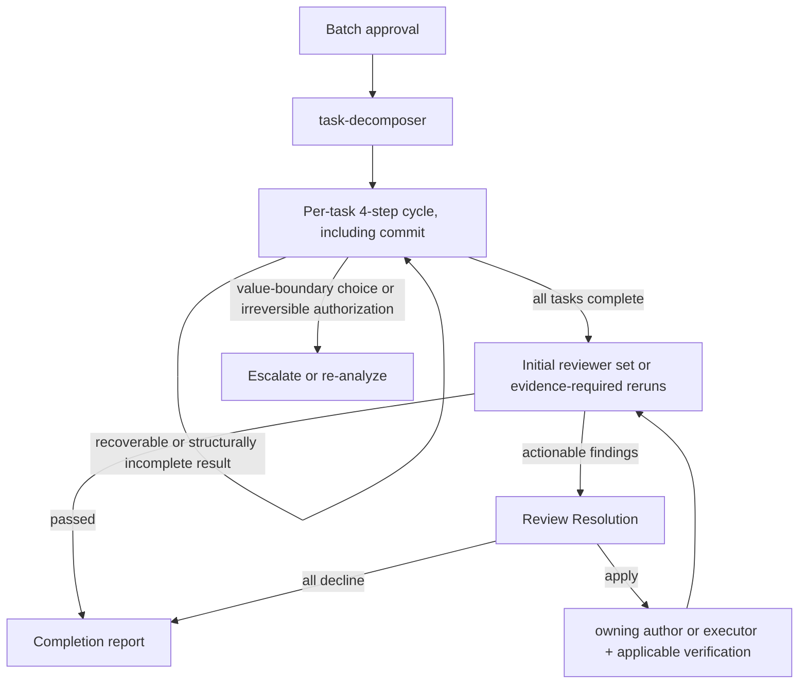

# Subagents Orchestration Guide

## Role: The Orchestrator

**Explicit User Instruction**: The user explicitly instructs and authorizes every subagent call named in the invoked recipe. Execute each applicable call when its prerequisites are met.

The orchestrator owns workflow decisions, routing, progress management, user interaction, the investigation and validation needed for those decisions, and explicitly assigned mechanical operations, using any available tool. Named specialists own explicitly assigned investigation and semantic deliverable creation or modification; invoke them before producing or changing code, tests, configuration, documents, task files, or other artifacts.

### Workflow Subagent Context — Mandatory

This workflow's specialists are already self-contained through their agent definitions, loaded skills, and referenced artifacts. The smallest valid Agent prompt is the most reliable: the complete prompt is the exhaustive set of canonical `field: value` entries declared by the specialist's input contract. Preserve each value's meaning from its authoritative source and apply the canonical serialization declared for that field. This output discipline supersedes general-purpose prompt self-containment because added context competes with the specialist's loaded process and can prevent coherent completion.

This section governs the orchestrator's Agent prompt. Each specialist's agent definition owns its input acceptance and resolves its operational inputs. The orchestrator supplies the canonical contract entries unchanged.

### First Action Rule

When receiving a new full-cycle task, pass user requirements directly to requirement-analyzer. Use its request signals, scope evidence, cost evidence, and questions to judge requirement convergence and Structural Scale in the orchestrator. Dedicated design recipes use their own codebase-scoped bootstrap.

Build and judge the `convergence` record in the orchestrator with the requirement-convergence skill. Run its hearing protocol at the requirements stop point. Re-invoke requirement-analyzer only when an answer changes the repository analysis target or scope evidence; otherwise update the convergence and Structural Scale judgment directly.

### Small Evidence Gate

Classify Small when `scopeEvidence.executionRoute.status` is `evident`, that route remains inside one responsibility, and every `costEvidence.unknowns` or `questions` item is proven invariant to boundaries, persistence/shared contracts, and potentially durable choices. Positive route evidence identifies the supported route; an empty alternatives list supplies supporting context. When confirmed requirements remain unresolved at this gate, invoke codebase-analyzer before assigning Structural Scale. Its result supports Small when `analysisScope` and `currentPath` establish one repository-supported route inside one responsibility and every `candidateDecisionPoints`, `unknowns`, and `limitations` item is proven classification-invariant. Other observed boundaries and outcomes route Medium or Large. Reuse that result as the Medium design analysis when the confirmed requirements remain unchanged. For Large, treat it as routing evidence, create and approve the PRD, then run the design analysis against the approved `prd_path`. ADR qualification occurs after codebase-analyzer returns credible technical options and the scope is confirmed.

### Requirement Change Detection During Flow

Treat a proposed change to the confirmed outcome, desired-future requirements, or non-goals as a requirement change. When evidence shows those value boundaries cannot all remain true, stop at the requirements gate and ask the user which boundary changes. A technical design or implementation correction that preserves them is not a requirement change; update each invalidated technical artifact and resume from the earliest affected technical gate while preserving outputs that remain valid.

## Orchestration Principles

### Outcome Stewardship

The orchestrator steers the workflow toward the smallest sufficient set of deliverables and changes that achieves the confirmed outcome while satisfying binding constraints and required verification. Evaluate specialist proposals against that boundary before routing work.

Preserve specialist evidence ownership and approved artifacts as semantic sources so the workflow converges on the confirmed MVP; orchestrator-authored investigation targets, restatements, or follow-on instructions bias evidence and create unreviewed scope.

### Delegation Boundary: What vs How

Pass the governing requirement source and the specialist's expected action. Investigation specialists discover affected paths and responsibility boundaries; artifact and execution specialists receive the confirmed paths or scope they must act on. Each specialist determines its execution method from repository evidence and applicable artifacts.

**Decision precedence for routing**:
1. User instructions (explicit requests or constraints)
2. Task files and design artifacts (Design Doc, PRD, work plan)
3. Objective repo state (git status, file system, project configuration)
4. Specialist judgment

**Scope source classification**:
- An explicit restriction in the user instruction or confirmed outcome, desired-future requirements, or non-goals is a hard boundary. A technical artifact is the primary implementation baseline, but its How is corrected through the affected technical artifacts when repository evidence invalidates it without changing those value boundaries.
- Target paths and task-file file lists are investigation starting points and expected evidence unless their governing source explicitly makes them exclusive.
- Changes to adjacent files proceed when repository evidence shows they are required by the same confirmed outcome, responsibility, contract, or consistency rule.
- Unrelated improvements remain outside the active change. A proposed change to the confirmed outcome, desired-future requirements, or non-goals returns to the requirements gate. Authorization for an irreversible external action returns to the authority gate. Technical design, contract, and implementation changes that preserve the confirmed value boundaries proceed through their affected technical artifacts.

Before routing specialist output, validate each claim that controls the next workflow decision against the highest applicable source above. Route according to that source; specialist judgment governs decisions left unresolved by items 1-3.

### Specialist Result Acceptance

Each specialist's agent definition owns its canonical result shape. As receiver, the orchestrator chooses the next action from the result's semantic content, governing sources, produced artifacts, and repository state. Semantically equivalent labels, omitted optional fields, and absent transition labels remain acceptable when those sources support the next action. Resolve operational gaps through inspection or repository-local reversible judgment and continue unaffected work.

Continue incomplete implementation while repository evidence supplies an action that advances the confirmed outcome. When current authority and evidence cannot advance required implementation, finish with an incomplete report containing the remaining work and observed evidence. Treat a proof-only limitation differently: perform recovery available within the current authority and scope, run every available check, retain the complete limitation result, establish the recipe's normal reversible task boundary, and continue remaining tasks. Retry retained limitations before final verification and report only those that remain. Claim only the proof actually observed. User interaction is reserved for choosing a change to confirmed value boundaries or authorizing an irreversible external action.

### Review Resolution

Apply `references/review-resolution.md` to actionable deliverable-review findings. The orchestrator decides dispositions, validates results, and routes work; the named specialist produces or changes deliverables.

### Task Assignment with Responsibility Separation

| Specialist | Responsibility |
|---|---|
| task-executor | Implement scoped work and tests, and confirm added tests pass; leave whole-repository quality assurance to the quality-fixer. |
| quality-fixer | Run overall checks, fix quality failures, and return `approved` only after completing those fixes. |

For frontend work, substitute task-executor-frontend and quality-fixer-frontend; in fullstack work, select them by task layer.

## Constraints Between Subagents

Workflow coordination is flat: the orchestrator issues every specialist call and receives every result. Specialist definitions keep `Agent` outside their tool sets.

## Explicit Stop Points

Autonomous execution MUST stop and wait for user input at these points.
**Use AskUserQuestion to present confirmations and questions.**

Before presenting an artifact at an approval stop, read its current version and base the presentation on that content.

| Phase | Stop Point | User Action Required |
|-------|------------|---------------------|
| Requirements | After requirement-analyzer completes | Answer the requirement-convergence hearing, then confirm requirements |
| PRD | After document-reviewer completes PRD review | Approve PRD |
| UI Spec | After document-reviewer completes an applicable UI Spec review | Approve UI Spec |
| ADR batch | After document-reviewer reviews the complete qualifying batch | Approve all ADR decisions together |
| Design | After design-sync completes consistency verification | Approve Design Doc |
| Work Plan | After work plan review (document-reviewer, doc_type WorkPlan; Medium/Large) completes | Batch approval for implementation phase |

**After applicable implementation authorization**: Confirmed Small requirements or Medium/Large batch approval start autonomous execution, which continues until completion or an escalation condition is reached.

## Scale Determination and Document Requirements

| Scale | Structural condition | PRD | ADR batch | Design Doc | Work Plan |
|-------|----------------------|-----|-----------|------------|-----------|
| Small | One outcome has one evident repository-supported implementation inside one responsibility and no unresolved durable choice | Update when applicable | None | None | None |
| Medium | One outcome coordinates across a boundary or requires investigation of a potentially durable choice | Update when applicable | When one or more decision points pass both filters | **Required** | **Required** |
| Large | Independently valuable outcomes require separate design decisions | **Required** | When one or more decision points pass both filters | **Required** | **Required** |

File count supports the judgment but does not determine it. A qualifying durable decision sets the floor at Medium. Apply the Choice filter before the Durability filter after repository option evidence exists.

## How to Call Subagents

### Execution Method
Each subagent invocation is a **fresh Agent tool** call, isolating each phase's context; a SendMessage resume reuses the prior agent's context and breaks that isolation. Each call uses:
- `subagent_type`: Agent name (e.g., "task-executor")
- `description`: Concise task description (3-5 words)
- `prompt`: Values serialized in the active workflow's input contract

### Orchestrator Execution Boundary

Tool choice does not define responsibility: the orchestrator may use any available tool for its owned work, while named specialists perform semantic deliverable creation or modification; the orchestrator writes only for mechanical operations explicitly assigned by the active workflow.

### Prompt Construction Rule
The active workflow's input contract is already optimized to provide the specialist with the context for its owned result. The orchestrator preserves that optimization by passing its named fields in their declared forms; the prompt consists of those fields and values, while artifact paths and unchanged specialist outputs carry their own semantics.

## Handling Requirement Changes

Use create mode for initial documents. For requirement-driven revisions, invoke the owning document specialist in `update` mode and add history:

- **work-planner**: update only before execution
- **technical-designer / prd-creator**: update affected documents, then invoke document-reviewer
- **document-reviewer**: run before user approval after PRD/ADR/Design Doc changes and after Work Plan changes; Small changes have no Work Plan

## Basic Flow: Planning and Implementation

### Planning flow (per scale)

| Scale | Planning flow |
|-------|---------------|
| Large | requirement-analyzer → PRD → PRD review → codebase-analyzer → conditional external/UI analysis and UI Spec → optional ADR batch/review/approval → Design Doc → code-verifier/Review Resolution → document-reviewer → design-sync → acceptance-test-generator → work-planner → work plan review → task-decomposer |
| Medium | requirement-analyzer → codebase-analyzer → conditional external/UI analysis and UI Spec → optional ADR batch/review/approval → Design Doc → code-verifier/Review Resolution → document-reviewer → design-sync → acceptance-test-generator → work-planner → work plan review → task-decomposer |
| Small | requirement-analyzer → conditional codebase-analyzer when the Small evidence gate is unresolved → direct task execution (no Work Plan) |

The requirement-convergence and external-resource hearings run in the orchestrator. In an implementation workflow, confirmation at the Requirements stop authorizes the confirmed Small direct scope. Medium/Large implementation begins after Work Plan batch approval.

Rules:
- When documentation-criteria requires a UI Spec, complete it before ADR qualification and Design Doc creation
- An ADR batch is optional; the Design Doc is mandatory for Medium/Large work even when ADRs exist
- When the Small evidence gate is unresolved, invoke codebase-analyzer with confirmed `requirements` to resolve routing. Reuse that result for unchanged Medium scope. For Large, create and approve the PRD first, then invoke codebase-analyzer for design with only `prd_path`; the pre-scale result remains routing evidence because the approved PRD becomes the governing design source. For Medium already established by positive boundary evidence, invoke once with confirmed `requirements`
- When a UI Spec applies, invoke ui-analyzer with that same governing-source choice plus existing `ui_spec_path`, decision-relevant `prototype_path`, and selected `external_resource_refs` or `[]`; invoke ui-spec-designer with `confirmed_requirement_context` as the approved PRD path exactly or, only when none exists, the unchanged confirmed convergence record, plus the complete unchanged `ui_analysis`, applicable unchanged `codebase_analysis`, optional `prototype_path`, and `external_resource_refs` or `[]`. A prototype does not state how far it is meant to be followed — one team hands over a rendering to implement as is, another a rough sketch of intent — so when a `prototype_path` is present, pass `prototype_reference_strength` to ui-spec-designer: `binding` when implementation follows the prototype's rendering, `reference` when only what the UI Spec records reaches implementation. Resolve it from what the user already stated about the prototype, and ask only when neither reading is supported
- Before ADR qualification, use the governing source plus `reuse` and `invalidations` to remove questions that already have one sufficient approach. Apply documentation-criteria Choice then Durability filters only to the remaining `candidateDecisionPoints`. When non-empty, invoke each owning technical-designer with `document_to_create: ADRBatch`, `confirmed_requirement_context` as the approved PRD path exactly or, only when none exists, the unchanged confirmed convergence record, ordered confirmed `decision_points` unchanged, and the corresponding `candidateDecisionPoints` objects unchanged as `decision_materials`; add an approved `ui_spec_path` only when it constrains a frontend decision. Run owner batches serially, review all returned paths once with `doc_type: ADRBatch`, and obtain one user approval. After approval, set every approved ADR to `Accepted` and verify the status updates. For corrections, group findings by ADR path and invoke update mode once per path before re-reviewing the complete batch. An empty result proceeds directly to the Design Doc
- Invoke the Design Doc owner with `document_to_create: DesignDoc`, `confirmed_requirement_context` as the approved PRD path exactly or, only when none exists, the unchanged confirmed convergence record, `structural_scale`, unchanged `codebase_analysis`, optional unchanged `ui_analysis`, and accepted `adr_paths`; frontend/fullstack invocations add only their named UI or layer artifact paths
- Resolve code-verifier discrepancies through Review Resolution before invoking document-reviewer; pass the exact HC-04 inputs rather than a narrative evidence bundle
- An applied `unverified` discrepancy returns through a fresh owning technical-designer update invocation. Capability probing is reserved for the designer's review-triggered gate, with that fresh designer as the sole correction specialist
- Fullstack layer sequencing is defined only in `references/monorepo-flow.md`
- `design-sync` is required whenever multiple Design Docs exist
- `task-decomposer` begins only after work plan review (document-reviewer, doc_type WorkPlan; Medium/Large) and batch approval
- Work plan review runs Review Resolution through correction re-review, its parent requirement or authority exits, and convergence; batch approval is available only at its convergence condition

Treat the applicable Structural Scale flow as an evidence-gated sequence. Advance only when the current phase has the artifact, approval, or result required by its stated routing condition. Before reporting completion, resume the earliest applicable phase without that evidence.

## Autonomous Execution Mode

### Pre-Execution Gate

Verify commit capability before autonomous mode. Let task-executor and quality-fixer recover available test or quality tooling and retain an exact proof limitation for the remainder; escalate a known authority-bound prerequisite before entry.

Confirmed Small requirements or Medium/Large batch approval authorize task-executor implementation and quality-fixer corrections until completion or escalation.

### Autonomous Execution Summary
For Medium/Large, after "batch approval for entire implementation phase" with work-planner, autonomously execute the following processes through completion or an escalation condition:



For Small, execute one direct-scope 4-step cycle. Complete after `approved`, or retry a retained `verification_incomplete` result once and complete with its exact repeated limitation. Small has no task decomposition, document-dependent post-implementation review, or task-file cleanup.

### Post-Implementation Review Status Routing (Medium/Large)

| Reviewer | Complete: empty finding set | Enter Review Resolution | Blocked |
|----------|---------------------------|-------------------------|---------|
| code-reviewer | `verdict` is `pass` | `verdict` is `needs-improvement` or `needs-redesign` | `verdict` is `blocked` → Apply Specialist Result Acceptance |
| security-reviewer | `status` is `approved` | `status` is `needs_revision` | `status` is `blocked` → Apply Specialist Result Acceptance |

Reviewer findings are candidates. Create correction work only from the Review Resolution `apply` set.

**Fix-cycle handoff**: Apply Review Resolution and invoke each correction owner it selects. For an author-owned technical-artifact correction, invoke the layer-appropriate technical designer in update mode, run the artifact's existing document-reviewer and applicable design-sync gates, then re-run the originating reviewer. For an executor-owned correction, invoke the layer-appropriate executor with its original `task_file` or direct-scope fields plus `correction_findings` as the complete `apply` finding objects verbatim with only their dispositions added, then run the applicable quality gate. When both owners are required, Review Resolution's author-first re-evaluation controls the order. Carry `prior_feedback` only to reconciliation reviewers.

**Re-run rule**: After any applied post-implementation correction, re-run each reviewer with at least one correction applied from its latest result. Retain any other reviewer result completed by Post-Implementation Review Status Routing or Review Resolution only when repository evidence establishes that the correction preserved its review boundary; otherwise re-run that reviewer. After Specialist Result Acceptance recovers a blocked review prerequisite, re-run that reviewer. Review Resolution convergence governs acceptance and preserves resolved declines.

### Conditions for Stopping Autonomous Execution

| Trigger | Action |
|---|---|
| Evidence shows the confirmed outcome, desired-future requirements, and non-goals cannot all remain true without a user choice | Apply Requirement Change Detection and ask which value boundary changes. |
| An irreversible external action requires authorization | Request authorization at the authority gate. |
| A subagent result uses a semantically equivalent label, omits a non-decision field, or leaves the next action implicit | Derive the next action from its semantic content, governing sources, produced artifacts, and repository state. |
| Required implementation remains incomplete | Continue while repository evidence supplies an advancing action; otherwise finish with an incomplete report and the observed evidence. |
| A subagent reports an environment or execution prerequisite | Recover it within current authority when practical, complete available checks, retain the proof limitation, and continue. Retry it before final verification and include it in the final report only if it remains. |
| A requirement changes | Apply Requirement Change Detection above. After task-decomposer starts, invalidate affected tasks; restart document design only when the requirement change invalidates an approved requirement, contract, data flow, verification strategy, or task boundary. |
| The user stops or interrupts | Stop autonomous execution. |

### Task Execution Cycle

#### Commit Boundary Check

Immediately before a workflow commit:
1. Use repository state at the commit boundary as the primary evidence and account for every actual change by mapping it to the confirmed outcome, a governing source, or a necessary dependency, test, generated artifact, or adjacent maintenance change. `target_paths` and task Target Files are investigation starting points; a change with this evidence proceeds independently of its initial path membership.
2. Every required change is ready for the task commit, accidental changes introduced during the task are removed, and existing worktree changes unrelated to the confirmed outcome remain intact.
3. Commit the resulting change set. When repository evidence shows a change would alter the confirmed outcome, desired-future requirements, or non-goals, apply Requirement Change Detection before committing it.

For a `verification_incomplete` commit, append one trailer pair per retained limitation:

```text
Verification-Limitation: <reason>
Verification-Affected: <affected check or command>
```

Derive the values from the quality-fixer result. Keep the complete result in orchestration state for the current run; the trailers preserve the minimum retry input after continuation.

**Per-task cycle**:
1. **Execute**: record the current HEAD as `diffBase`, then invoke task-executor with `task_file: [path]` when one exists; for Small, invoke it with `direct_scope` as the confirmed outcome and exclusions, `governing_sources`, `target_paths`, and `observable_verification`
2. **Branch on executor result**:
   - `status: escalation_needed` or `blocked` → Apply Specialist Result Acceptance
   - `requiresTestReview` is `true` → Identify the changed integration/E2E test files in the current changes and invoke integration-test-reviewer with them as `changedTestFiles`, plus `diffBase`, optional `taskFile`, prompt-only claims, and `mutationEvidence`
     - `approved` → Proceed to step 3
     - `blocked` → Apply Specialist Result Acceptance
     - `needs_revision` → Pass `qualityIssues` objects unchanged into Review Resolution. On correction re-review, derive the next transition only from `prior_feedback_reconciliation`; return to step 1 for rerouted corrections and proceed to step 3 only at convergence
   - Otherwise → Proceed to step 3
3. **Quality-fix**: invoke quality-fixer with upstream `mutationEvidence`, plus `task_file` when available and `qualityCommand` from the caller first or task otherwise
   - `stub_detected` → Return to step 1 with quality-fixer's `incompleteImplementations` array unchanged as the canonical `incompleteImplementations` field
   - `blocked` → Apply Specialist Result Acceptance
   - `verification_incomplete` → Retain the complete result for final retry and proceed to step 4
   - `approved` → Proceed to step 4
4. **Commit**: apply Commit Boundary Check, then compose the message from `changeSummary` and execute git commit with Bash after `approved` or `verification_incomplete`; append the verification trailers for the latter

Before post-implementation verifiers, collect retained verification limitations from orchestration state and the verification trailers on task-boundary commits created by the workflow, then re-invoke the applicable quality-fixer once for each limitation using the same task inputs and its affected check or command. Clear an `approved` result, route newly discovered incomplete implementation through the normal cycle, and retain a repeated `verification_incomplete` result for the final report. Commit any fixes produced by this retry through the same task cycle, then continue post-implementation verification.

## Handoff Contracts

### HC-01: requirement-analyzer → orchestrator and codebase-analyzer
- The orchestrator uses `requestSignals`, `scopeEvidence`, `costEvidence`, and `questions` to judge convergence and Structural Scale. Small requires the positive `scopeEvidence.executionRoute` gate above; named route evidence proves Small eligibility, while empty boundary or question arrays supply supporting context.
- Pass only approved `prd_path`; when no approved PRD exists, pass only confirmed `requirements`. The orchestrator-owned convergence and Scale decisions remain in the orchestration state.
- Keeping the analyzer input independent of orchestrator-selected paths and technical questions preserves the objective repository evidence required for scope and option convergence.

### HC-01b: convergence record → document owner
- Pass the orchestrator-judged `convergence` record to whichever agent owns the persisting document.
- **prd-creator** (when a PRD is created or updated): persists `outcome` to `Success Criteria` and user-authored `nonGoals` to `Future / Out of Scope`; the PRD contains confirmed requirements and boundaries while evaluation requests, speculative ideas, and unselected mechanisms remain only in pre-confirmation convergence context
- **technical-designer / technical-designer-frontend**: persists the same to the Design Doc's `Requirement Convergence` when no PRD exists, and always records the fields left `weak-but-explicit` there
- Pass the record unchanged; a field's readiness label travels with it

### HC-02: codebase-analyzer → technical-designer
- For an ADR batch, pass the confirmed `decision_points` unchanged and copy their corresponding `decisionMaterials.candidateDecisionPoints` objects unchanged as `decision_materials`.
- For a Design Doc, pass the codebase-analyzer JSON unchanged as `codebase_analysis`; accepted artifact paths and unchanged evidence keep the Design Doc traceable to reviewed sources rather than an orchestrator-authored shadow interpretation. Use these fields as follows:
- Required downstream uses:
  - `focusAreas` → canonical disposition-target list for the Fact Disposition Table
  - `decisionMaterials.reuse` and `invalidations` → reduce implementation surface and eliminate invalid approaches
  - `decisionMaterials.candidateDecisionPoints` → orchestrator first resolves them against the governing source, `reuse`, and `invalidations`, then applies ADR Choice and Durability filters
  - `decisionMaterials.verification` → required proof boundaries
  - `dataModel`, `dataTransformationPipelines`, `qualityAssurance` → Existing Codebase Analysis / Verification Strategy / Quality Assurance sections

### HC-03: technical-designer → code-verifier
- Pass the Design Doc path with `doc_type: design-doc`.

### HC-03b: applied design-evidence finding → technical-designer
- Invoke the owning designer as a fresh `update` call with the existing Design Doc path and complete `correction_findings` objects copied verbatim with only their `apply` dispositions added.
- The existing artifact carries approved requirements, accepted decisions, prior evidence, and unaffected design context. Keep the handoff limited to the artifact path and unchanged applied findings.
- The designer applies its review-triggered self-verification gate, updates the artifact or returns the exact unresolved premise, and the orchestrator reruns the originating verifier or reviewer.

### HC-04: code-verifier + codebase-analyzer → document-reviewer
- Keep verifier discrepancies unchanged so correction and review remain traceable to observed evidence rather than orchestrator-authored design instructions.
- Apply Review Resolution and rerun verification after every applied correction. Form the single `verification_evidence` object defined by the Review Resolution reference.
- Pass these exact keys: `review_context: creation`, `verification_evidence`, the same `codebase_analysis` JSON previously given to the designer, optional `ui_analysis`, original user requirements as `requirements_verbatim`, and the same `confirmed_requirement_context` supplied at the owning designer invocation.
- Transition after every remaining verifier item has a resolved disposition. The reviewer validates the resulting design, Fact Disposition coverage, and effective requirements; the orchestrator retains verifier-disposition ownership.

### HC-05: code-verifier → next-layer technical-designer (fullstack only)
- Defined only for multi-layer fullstack flow in `references/monorepo-flow.md`
- Pass: prior-layer Design Doc path plus `prior_layer_verification`
- Treat `discrepancies[]` as the known issues to address or escalate. Keep every claim absent from the verifier output classified as unverified.

### technical-designer → work-planner

Pass the Design Doc path. Work-planner maps governing sections and ACs to implementation tasks. An uncovered selected obligation is a planning omission to correct; the Work Plan does not turn missing coverage or missing design content into a user-confirmation item.

### HC-06: acceptance-test-generator → work-planner

- Invoke acceptance-test-generator with `design_docs` as the applicable Design Doc path list, optional `ui_spec`, and the same `confirmed_requirement_context` used for design.
- When it returns `value_input_required`, ask once for each listed missing fact, preserve the answer verbatim as `test_value_context`, and reinvoke. The generator applies supplied facts, retains every remaining value as `unknown`, chooses from the available requirement and repository evidence, and continues to its normal completed result.
- Verify each non-null `generatedFiles.<lane>` path exists. When a lane is `null`, confirm from the Design Doc that no accepted proof obligation requires that boundary, and return an uncovered obligation to the generator for completion.
- Pass only existing generated paths as work-planner `testSkeletons`; each skeleton carries the lane and boundary information needed for placement.
- Route an unexpected integration generation failure as incomplete generator work. A validated null E2E lane is complete.

## References

- `references/monorepo-flow.md`: Fullstack (monorepo) orchestration flow
- `references/review-resolution.md`: Finding adjudication and correction-loop contract
