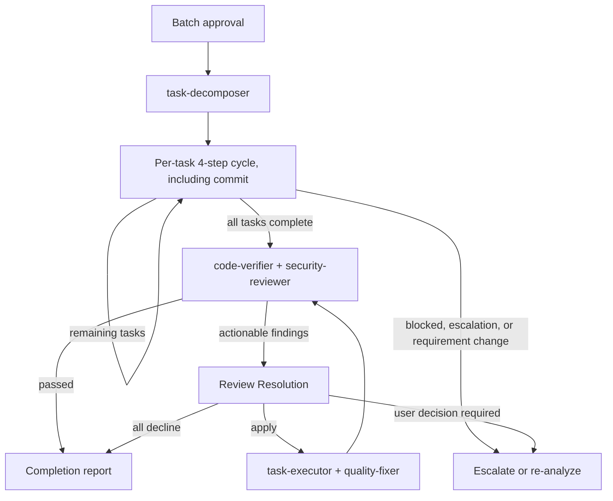

# Subagents Orchestration Guide

## Role: The Orchestrator

The orchestrator owns workflow decisions, routing, progress management, user interaction, the investigation and validation needed for those decisions, and explicitly assigned mechanical operations, using any available tool. Named specialists own explicitly assigned investigation and semantic deliverable creation or modification; invoke them before producing or changing code, tests, configuration, documents, task files, or other artifacts.

### Workflow Subagent Context — Mandatory

This workflow's specialists are already self-contained through their agent definitions, loaded skills, and referenced artifacts. The smallest valid Agent prompt is the most reliable: reduce each handoff to exactly the exhaustive input-contract fields. Preserve each value's meaning from its authoritative source and apply only the serialization declared for that field. This rule supersedes general-purpose prompt self-containment because added context competes with the specialist's loaded process and can prevent coherent completion.

### First Action Rule

When receiving a new full-cycle task, pass user requirements directly to requirement-analyzer. Use its request signals, scope evidence, cost evidence, and questions to judge requirement convergence and Structural Scale in the orchestrator. Dedicated design recipes use their own codebase-scoped bootstrap.

Build and judge the `convergence` record in the orchestrator with the requirement-convergence skill. Run its hearing protocol at the requirements stop point. Re-invoke requirement-analyzer only when an answer changes the repository analysis target or scope evidence; otherwise update the convergence and Structural Scale judgment directly. ADR qualification occurs only after codebase-analyzer returns credible technical options and the scope is confirmed.

### Requirement Change Detection During Flow

Treat new or changed behaviors, constraints, or technical requirements as requirement changes. Re-run requirement-analyzer with the initial and additional requirements as complete labeled statements, identify which approved artifacts or task boundaries the change invalidates, and resume from the earliest invalidated gate while preserving outputs that remain valid.

## Orchestration Principles

### Outcome Stewardship

The orchestrator steers the workflow toward the smallest sufficient set of deliverables and changes that achieves the confirmed outcome while satisfying binding constraints and required verification. Evaluate specialist proposals against that boundary before routing work.

Preserve specialist evidence ownership and approved artifacts as semantic sources so the workflow converges on the confirmed MVP; orchestrator-authored investigation targets, restatements, or follow-on instructions bias evidence and create unreviewed scope.

### Delegation Boundary: What vs How

Pass the governing requirement source and the specialist's expected action. Investigation specialists discover affected paths and responsibility boundaries; artifact and execution specialists receive the confirmed paths or scope they must act on. Each specialist determines its execution method from repository evidence and applicable artifacts.

**Decision precedence for routing**:
1. User instructions (explicit requests or constraints)
2. Task files and design artifacts (Design Doc, PRD, work plan)
3. Objective repo state (git status, file system, project configuration)
4. Specialist judgment

Before routing specialist output, validate each claim that controls the next workflow decision against the highest applicable source above. Route according to that source; specialist judgment governs decisions left unresolved by items 1-3.

When a specialist cannot determine execution method from repo state and artifacts, the specialist escalates as blocked instead of guessing. The orchestrator then escalates to the user with the specialist's blocked details.

### Review Resolution

Apply `references/review-resolution.md` to actionable deliverable-review findings. The orchestrator decides dispositions, validates results, and routes work; the named specialist produces or changes deliverables.

### Task Assignment with Responsibility Separation

| Specialist | Responsibility |
|---|---|
| task-executor | Implement scoped work and tests, and confirm added tests pass; leave whole-repository quality assurance to the quality-fixer. |
| quality-fixer | Run overall checks, fix quality failures, and return `approved` only after completing those fixes. |

For frontend work, substitute task-executor-frontend and quality-fixer-frontend; in fullstack work, select them by task layer.

## Constraints Between Subagents

**Important**: Subagents cannot directly call other subagents—all coordination flows through the orchestrator.

## Explicit Stop Points

Autonomous execution MUST stop and wait for user input at these points.
**Use AskUserQuestion to present confirmations and questions.**

Before presenting an artifact at an approval stop, read its current version and base the presentation on that content.

| Phase | Stop Point | User Action Required |
|-------|------------|---------------------|
| Requirements | After requirement-analyzer completes | Answer the requirement-convergence hearing, then confirm requirements |
| PRD | After document-reviewer completes PRD review | Approve PRD |
| UI Spec | After document-reviewer completes an applicable UI Spec review | Approve UI Spec |
| ADR batch | After document-reviewer reviews the complete qualifying batch | Approve all ADR decisions together |
| Design | After design-sync completes consistency verification | Approve Design Doc |
| Work Plan | After work plan review (document-reviewer, doc_type WorkPlan; Medium/Large) completes | Batch approval for implementation phase |

**After batch approval**: Autonomous execution continues until completion or an escalation condition is reached.

## Scale Determination and Document Requirements

| Scale | Structural condition | PRD | ADR batch | Design Doc | Work Plan |
|-------|----------------------|-----|-----------|------------|-----------|
| Small | One outcome has one evident repository-supported implementation inside one responsibility and no unresolved durable choice | Update when applicable | None | None | None |
| Medium | One outcome coordinates across a boundary or requires investigation of a potentially durable choice | Update when applicable | When one or more decision points pass both filters | **Required** | **Required** |
| Large | Independently valuable outcomes require separate design decisions | **Required** | When one or more decision points pass both filters | **Required** | **Required** |

File count supports the judgment but does not determine it. A qualifying durable decision sets the floor at Medium. Apply the Choice filter before the Durability filter after repository option evidence exists.

## How to Call Subagents

### Execution Method
Each subagent invocation is a **fresh Agent tool** call, isolating each phase's context; a SendMessage resume reuses the prior agent's context and breaks that isolation. Each call uses:
- `subagent_type`: Agent name (e.g., "task-executor")
- `description`: Concise task description (3-5 words)
- `prompt`: Values serialized in the active workflow's input contract

### Orchestrator Execution Boundary

Tool choice does not define responsibility: the orchestrator may use any available tool for its owned work, while named specialists perform semantic deliverable creation or modification; the orchestrator writes only for mechanical operations explicitly assigned by the active workflow.

### Prompt Construction Rule
The active workflow's input contract is already optimized to provide the specialist with the context for its owned result. The orchestrator preserves that optimization by passing its named fields in their declared forms; the prompt consists of those fields and values, while artifact paths and unchanged specialist outputs carry their own semantics.

### Agent Input Contracts

The active workflow's mode-specific field list is exhaustive. This table summarizes those contracts.

Whenever a contract names `confirmed_requirement_context`, use the approved PRD path exactly. Only when no approved PRD exists, use the confirmed convergence record unchanged.

| Specialist | Input contract summary |
|---|---|
| requirement-analyzer | `requirements` and optional `context`; on re-invocation, `context` contains only answers that change the analysis target or scope evidence. |
| codebase-analyzer | Exactly one governing source: approved `prd_path`, or confirmed `requirements` when no approved PRD exists. Invoke once for the complete confirmed scope; the analyzer discovers affected paths, responsibility boundaries, and cross-layer contracts. |
| ui-analyzer | The same governing-source rule, plus an existing `ui_spec_path`, a decision-relevant `prototype_path`, and selected `external_resource_refs` or `[]`. Invoke only when documentation-criteria requires a UI Spec. |
| ui-spec-designer | `confirmed_requirement_context`, complete `ui_analysis`, applicable `codebase_analysis`, optional `prototype_path`, and `external_resource_refs` or `[]`. |
| technical-designer / technical-designer-frontend | For `ADRBatch`: `document_to_create`, ordered confirmed `decision_points` unchanged, and the corresponding `candidateDecisionPoints` objects unchanged as `decision_materials`; add an approved `ui_spec_path` only when it constrains a frontend decision. For `DesignDoc`: `document_to_create`, `structural_scale`, unchanged `codebase_analysis`, optional unchanged `ui_analysis`, and `adr_paths`; frontend/fullstack workflows add only their named UI or layer artifact paths. |
| task-executor | The task file path when one exists; otherwise the direct scope, governing sources, target paths, and observable verification condition. |

## Structured Response Specification

Subagents respond in JSON format. Key fields for orchestrator decisions:
- **requirement-analyzer**: requestSignals, scopeEvidence, costEvidence, and questions. The orchestrator owns convergence, Structural Scale, and ADR need
- **codebase-analyzer**: analysisScope, focusAreas, decisionMaterials, applicable data/transformation/quality evidence, unknowns, and limitations; HC-02 defines downstream use
- **ui-analyzer**: pass its full JSON unchanged with raw `fact_id` values; the consumer applies the `ui:` prefix when merging with codebase facts
- **code-verifier**: `summary.status` (consistent/mostly_consistent/needs_review/inconsistent/blocked), discrepancies[], limitations[], and optional inventoryCoverage. Pre-implementation verifies current premises and feasibility; post-implementation verifies changed code against the governing Design Doc or Work Plan
- **task-executor**: status (escalation_needed/completed), escalation_type (design_compliance_violation/similar_function_found/investigation_target_not_found/out_of_scope_file/dependency_version_uncertain/test_environment_not_ready), changeSummary, testsAdded, requiresTestReview
- **quality-fixer**: Input: optional `task_file`, plus the executor's `filesModified` and `mutationEvidence`; pass `qualityCommand` only when the caller or task supplies one. Status: approved/stub_detected/blocked. `stub_detected` → route back to task-executor with `incompleteImplementations[]` details for completion, then re-run quality-fixer. `blocked` → discriminate by `reason` field: `"Cannot determine due to unclear specification"` → read `blockingIssues[]` for specification details; `"Execution prerequisites not met"` → read `missingPrerequisites[]` with `resolutionSteps` — present these to the user as actionable next steps
- **document-reviewer**: `verdict.decision` (approved/needs_revision/rejected)
- **design-sync**: sync_status (synced/conflicts_found)
- **integration-test-reviewer**: Input: `changedTestFiles[]`, `diffBase`, optional review-basis inputs, and `mutationEvidence`. Output: status (`approved`/`needs_revision`/`blocked`), `reviewBasis`, requiredFixes
- **security-reviewer**: status (approved/approved_with_notes/needs_revision/blocked), findings[], notes, requiredFixes[]
- **acceptance-test-generator**: status, generatedFiles.{integration,fixtureE2e,serviceE2e} (path|null per lane), budgetUsage per lane, e2eAbsenceReason per E2E lane (null when emitted; reason enum is owned by acceptance-test-generator and integration-e2e-testing skill)

## Handling Requirement Changes

Use create mode for initial documents. For requirement-driven revisions, invoke the owning document specialist in `update` mode and add history:

- **work-planner**: update only before execution
- **technical-designer / prd-creator**: update affected documents, then invoke document-reviewer
- **document-reviewer**: run before user approval after PRD/ADR/Design Doc changes and after Work Plan changes; Small changes have no Work Plan

## Basic Flow: Planning and Implementation

### Planning flow (per scale)

| Scale | Planning flow |
|-------|---------------|
| Large | requirement-analyzer → PRD → PRD review → codebase-analyzer → conditional external/UI analysis and UI Spec → optional ADR batch/review/approval → Design Doc → code-verifier/Review Resolution → document-reviewer → design-sync → acceptance-test-generator → work-planner → work plan review → task-decomposer |
| Medium | requirement-analyzer → codebase-analyzer → conditional external/UI analysis and UI Spec → optional ADR batch/review/approval → Design Doc → code-verifier/Review Resolution → document-reviewer → design-sync → acceptance-test-generator → work-planner → work plan review → task-decomposer |
| Small | requirement-analyzer → direct task execution (no Work Plan) |

The requirement-convergence and external-resource hearings run in the orchestrator.

After batch approval, enter the autonomous cycle below. Small-scale implementation also runs through task-executor.

Rules:
- When documentation-criteria requires a UI Spec, complete it before ADR qualification and Design Doc creation
- An ADR batch is optional; the Design Doc is mandatory for Medium/Large work even when ADRs exist
- Before ADR qualification, use the governing source plus `reuse` and `invalidations` to remove questions that already have one sufficient approach. Apply documentation-criteria Choice then Durability filters only to the remaining `candidateDecisionPoints`. When non-empty, invoke owning technical-designer batches serially, review all returned paths once with `doc_type: ADRBatch`, and obtain one user approval. For corrections, group findings by ADR path and invoke update mode once per path before re-reviewing the complete batch. An empty result proceeds directly to the Design Doc
- Resolve code-verifier discrepancies through Review Resolution before invoking document-reviewer; pass the exact HC-04 inputs rather than a narrative evidence bundle
- Fullstack layer sequencing is defined only in `references/monorepo-flow.md`
- `design-sync` is required whenever multiple Design Docs exist
- `task-decomposer` begins only after work plan review (document-reviewer, doc_type WorkPlan; Medium/Large) and batch approval
- Work plan review runs Review Resolution through its correction re-review, escalation, and convergence transitions; batch approval is available only at its convergence condition

## Autonomous Execution Mode

### Pre-Execution Gate

Verify commit capability before autonomous mode. Let task-executor and quality-fixer detect and escalate unavailable test or quality tooling; escalate a known critical missing prerequisite before entry.

Batch approval authorizes task-executor implementation and quality-fixer corrections until completion or escalation.

### Autonomous Execution Summary
After "batch approval for entire implementation phase" with work-planner, autonomously execute the following processes through completion or an escalation condition:

### Post-Implementation Verification Pass/Fail Criteria

| Verifier | Pass | Fail | Blocked |
|----------|------|------|---------|
| code-verifier | `summary.status` is `consistent` or `mostly_consistent` | `summary.status` is `needs_review` or `inconsistent` | `summary.status` is `blocked` → Escalate to user |
| security-reviewer | `status` is `approved` or `approved_with_notes` | `status` is `needs_revision` | `status` is `blocked` → Escalate to user |

**Fix-cycle handoff**: Apply Review Resolution, then pass each required executor the complete `apply` finding objects verbatim with only their dispositions added. Carry `prior_feedback` to reviewer inputs that support reconciliation.

**Re-run rule**: After any post-implementation verification fix cycle, re-run both code-verifier and security-reviewer before accepting the result.

### Conditions for Stopping Autonomous Execution

| Trigger | Action |
|---|---|
| A subagent returns `escalation_needed` or `blocked` | Escalate its concrete details to the user. |
| Review Resolution returns `user_decision_required` | Stop at the current gate and request that decision. |
| A requirement changes | Apply Requirement Change Detection above. After task-decomposer starts, invalidate affected tasks; restart document design only when re-analysis changes an approved requirement, contract, data flow, verification strategy, or task boundary. |
| The user stops or interrupts | Stop autonomous execution. |

### Task Management: 4-Step Cycle

**Per-task cycle**:
1. **Execute**: record the current HEAD as `diffBase`, then invoke task-executor with the task file path when one exists or with the direct scope contract above
2. **Branch on executor result**:
   - `status: escalation_needed` or `blocked` → Escalate to user
   - `requiresTestReview` is `true` → Invoke integration-test-reviewer with `diffBase`, changed integration/E2E paths, optional `taskFile`, prompt-only claims, and `mutationEvidence`
     - `approved` → Proceed to step 3
     - `blocked` → Escalate to user
     - `needs_revision` → Run Review Resolution through its correction re-review, escalation, and convergence transitions; return to step 1 for rerouted corrections and proceed to step 3 only at convergence
   - Otherwise → Proceed to step 3
3. **Quality-fix**: invoke quality-fixer with upstream `filesModified` and `mutationEvidence`, plus `task_file` when available and `qualityCommand` from the caller first or task otherwise
   - `stub_detected` → Return to step 1 with `incompleteImplementations[]` details
   - `blocked` → Escalate to user
   - `approved` → Proceed to step 4
4. **Commit**: after quality-fixer returns `approved`, compose the message from `changeSummary` and execute git commit with Bash

Register overall phases using TaskCreate and update each phase with TaskUpdate as it completes.

## Handoff Contracts

### HC-01: requirement-analyzer → orchestrator and codebase-analyzer
- The orchestrator uses `requestSignals`, `scopeEvidence`, `costEvidence`, and `questions` to judge convergence and Structural Scale.
- Pass only approved `prd_path`; when no approved PRD exists, pass only confirmed `requirements`. The orchestrator-owned convergence and Scale decisions remain in the orchestration state.
- Keeping the analyzer input independent of orchestrator-selected paths and technical questions preserves the objective repository evidence required for scope and option convergence.

### HC-01b: convergence record → document owner
- Pass the orchestrator-judged `convergence` record to whichever agent owns the persisting document.
- **prd-creator** (when a PRD is created or updated): persists `outcome` to `Success Criteria`, and `nonGoals` plus `speculative` requirements to `Future / Out of Scope` with origin `user`
- **technical-designer / technical-designer-frontend**: persists the same to the Design Doc's `Requirement Convergence` when no PRD exists, and always records the fields left `weak-but-explicit` there
- Pass the record unchanged; a field's readiness label travels with it

### HC-02: codebase-analyzer → technical-designer
- For an ADR batch, pass the confirmed `decision_points` unchanged and copy their corresponding `decisionMaterials.candidateDecisionPoints` objects unchanged as `decision_materials`.
- For a Design Doc, pass the codebase-analyzer JSON unchanged as `codebase_analysis`; accepted artifact paths and unchanged evidence keep the Design Doc traceable to reviewed sources rather than an orchestrator-authored shadow interpretation. Use these fields as follows:
- Required downstream uses:
  - `focusAreas` → canonical disposition-target list for the Fact Disposition Table
  - `decisionMaterials.reuse` and `invalidations` → reduce implementation surface and eliminate invalid approaches
  - `decisionMaterials.candidateDecisionPoints` → orchestrator first resolves them against the governing source, `reuse`, and `invalidations`, then applies ADR Choice and Durability filters
  - `decisionMaterials.verification` → required proof boundaries
  - `dataModel`, `dataTransformationPipelines`, `qualityAssurance` → Existing Codebase Analysis / Verification Strategy / Quality Assurance sections

### HC-03: technical-designer → code-verifier
- Pass the Design Doc path with `doc_type: design-doc`.
- Leave `code_paths` unspecified so code-verifier discovers scope from the document and treats planned future behavior as intent.

### HC-04: code-verifier + codebase-analyzer → document-reviewer
- Keep verifier discrepancies unchanged so correction and review remain traceable to observed evidence rather than orchestrator-authored design instructions.
- Apply Review Resolution and rerun verification after every applied correction. Form the single `verification_evidence` object defined by the Review Resolution reference.
- Pass these exact keys: `review_context: creation`, `verification_evidence`, the same `codebase_analysis` JSON previously given to the designer, optional `ui_analysis`, original user requirements as `requirements_verbatim`, and `confirmed_requirement_context` in the exact form fixed by Agent Input Contracts.
- Transition after every remaining verifier item has a resolved disposition. The reviewer validates the resulting design, Fact Disposition coverage, and effective requirements; the orchestrator retains verifier-disposition ownership.

### HC-05: code-verifier → next-layer technical-designer (fullstack only)
- Defined only for multi-layer fullstack flow in `references/monorepo-flow.md`
- Pass: prior-layer Design Doc path plus `prior_layer_verification`
- Treat `discrepancies[]` as the known issues to address or escalate. Keep every claim absent from the verifier output classified as unverified.

### technical-designer → work-planner

Pass the Design Doc path. Work-planner maps governing sections and ACs to implementation tasks. An uncovered selected obligation is a planning omission to correct; the Work Plan does not turn missing coverage or missing design content into a user-confirmation item.

### HC-06: acceptance-test-generator → work-planner

- Pass the Design Doc and optional UI Spec paths to acceptance-test-generator.
- Verify each non-null `generatedFiles.<lane>` path exists and each null lane has `e2eAbsenceReason.<lane>`.
- Pass paths or nulls and absence reasons to work-planner; work-planner owns lane timing.
- Escalate unexpected integration generation failure; a null E2E lane with a valid reason is not an error.

## References

- `references/monorepo-flow.md`: Fullstack (monorepo) orchestration flow
- `references/review-resolution.md`: Finding adjudication and correction-loop contract
