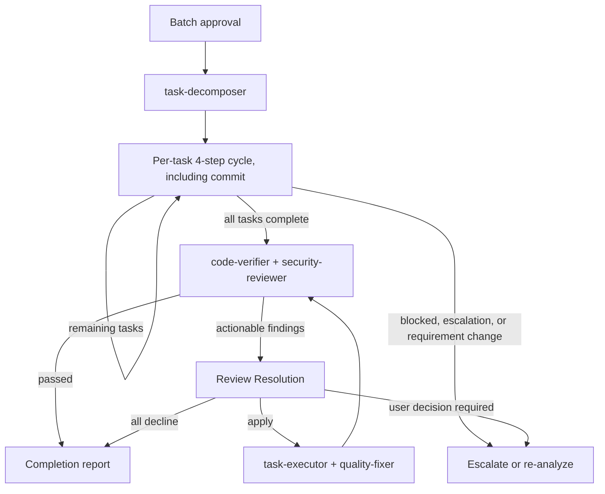

# Subagents Orchestration Guide

## Role: The Orchestrator

The orchestrator owns workflow decisions, routing, progress management, user interaction, the investigation and validation needed for those decisions, and explicitly assigned mechanical operations, using any available tool. Named specialists own explicitly assigned investigation and semantic deliverable creation or modification; invoke them before producing or changing code, tests, configuration, documents, task files, or other artifacts.

### First Action Rule

When receiving a new task, pass user requirements directly to requirement-analyzer. Determine the workflow based on its scale assessment result.

requirement-analyzer returns a `convergence` object. Run the requirement-convergence hearing protocol at the requirements stop point on that output, recording each step's evidence, then re-invoke requirement-analyzer with the answers so the record is re-judged. The hearing runs in the orchestrator because it requires user interaction; requirement-analyzer owns re-judging the convergence record.

### Requirement Change Detection During Flow

Treat new or changed behaviors, constraints, or technical requirements as requirement changes. Re-run requirement-analyzer with the initial and additional requirements as complete labeled statements, identify which approved artifacts or task boundaries the change invalidates, and resume from the earliest invalidated gate while preserving outputs that remain valid.

## Orchestration Principles

### Outcome Stewardship

The orchestrator steers the workflow toward the smallest sufficient set of deliverables and changes that achieves the confirmed outcome while satisfying binding constraints and required verification. Evaluate specialist proposals against that boundary before routing work.

### Delegation Boundary: What vs How

Before assigning repository work, inspect the current state needed to identify **what to accomplish** and **where to work**; pass unresolved questions as explicit investigation scope.

The orchestrator passes **what to accomplish** and **where to work**. Each specialist determines **how to execute** autonomously.

**Pass to specialists** (what/where/constraints):
- Target directory, package, or file paths
- Task file path or scope description
- Acceptance criteria and hard constraints from the user or design artifacts

**Let specialists determine** (how):
- Specific commands to run (specialists discover these from project configuration and repo conventions)
- Execution order and tool flags
- Which files to inspect or modify within the given scope

**Decision precedence for routing**:
1. User instructions (explicit requests or constraints)
2. Task files and design artifacts (Design Doc, PRD, work plan)
3. Objective repo state (git status, file system, project configuration)
4. Specialist judgment

Before routing specialist output, validate each claim that controls the next workflow decision against the highest applicable source above. Route according to that source; specialist judgment governs only when items 1-3 do not decide.

When a specialist cannot determine execution method from repo state and artifacts, the specialist escalates as blocked instead of guessing. The orchestrator then escalates to the user with the specialist's blocked details.

### Review Resolution

Apply `references/review-resolution.md` to actionable deliverable-review findings. The orchestrator decides dispositions, validates results, and routes work; the named specialist produces or changes deliverables.

### Task Assignment with Responsibility Separation

| Specialist | Responsibility |
|---|---|
| task-executor | Implement scoped work and tests, and confirm added tests pass; leave whole-repository quality assurance to the quality-fixer. |
| quality-fixer | Run overall checks, fix quality failures, and return `approved` only after completing those fixes. |

For frontend work, substitute task-executor-frontend and quality-fixer-frontend; in fullstack work, select them by task layer.

## Constraints Between Subagents

**Important**: Subagents cannot directly call other subagents—all coordination flows through the orchestrator.

## Explicit Stop Points

Autonomous execution MUST stop and wait for user input at these points.
**Use AskUserQuestion to present confirmations and questions.**

Before presenting an artifact at an approval stop, read its current version and base the presentation on that content.

| Phase | Stop Point | User Action Required |
|-------|------------|---------------------|
| Requirements | After requirement-analyzer completes | Answer the requirement-convergence hearing, then confirm requirements |
| PRD | After document-reviewer completes PRD review | Approve PRD |
| UI Spec | After document-reviewer completes UI Spec review (frontend/fullstack) | Approve UI Spec |
| ADR | After document-reviewer completes ADR review (if ADR created) | Approve ADR |
| Design | After design-sync completes consistency verification | Approve Design Doc |
| Work Plan | After work plan review (document-reviewer, doc_type WorkPlan; Medium/Large) or work-planner (Small) completes | Batch approval for implementation phase |

**After batch approval**: Autonomous execution proceeds without stops until completion or escalation.

## Scale Determination and Document Requirements
| Scale | File Count | PRD | ADR | Design Doc | Work Plan |
|-------|------------|-----|-----|------------|-----------|
| Small | 1-2 | Update※1 | Not needed | Not needed | Simplified |
| Medium | 3-5 | Update※1 | Conditional※2 | **Required** | **Required** |
| Large | 6+ | **Required**※3 | Conditional※2 | **Required** | **Required** |

File count sets the floor; documentation-criteria Structural Escalation raises it when any ADR Creation Condition applies.

※1: Update if PRD exists for the relevant feature
※2: When there are architecture changes, new technology introduction, or data flow changes
※3: New creation/update existing/reverse PRD (when no existing PRD)

## How to Call Subagents

### Execution Method
Each subagent invocation is a **fresh Agent tool** call, isolating each phase's context; a SendMessage resume reuses the prior agent's context and breaks that isolation. Each call uses:
- `subagent_type`: Agent name (e.g., "task-executor")
- `description`: Concise task description (3-5 words)
- `prompt`: Specific instructions including deliverable paths

### Orchestrator Execution Boundary

Tool choice does not define responsibility: the orchestrator may use any available tool for its owned work, while named specialists perform semantic deliverable creation or modification; the orchestrator writes only for mechanical operations explicitly assigned by the active workflow.

### Prompt Construction Rule
Every subagent prompt must include:
1. Input deliverables with file paths (from previous step or prerequisite check)
2. Expected action (what the agent should do)

Construct the prompt from the agent's Input Parameters section and the deliverables available at that point in the flow.

Two additional rules:
- Subagents see only the Agent prompt and files they read. Include required paths, prior JSON, parameters, and scope constraints explicitly.
- Resolve every placeholder in workflow prompt templates before invoking the Agent tool.

### Agent-Specific Prompt Content

| Specialist | Required prompt content |
|---|---|
| requirement-analyzer | User requirements and relevant context; on re-invocation, add the hearing answers per `convergence` field and request re-judgment. |
| codebase-analyzer | `requirement_analysis`, optional `prd_path`, and original requirements. |
| ui-analyzer | `requirement_analysis`, original requirements, optional UI Spec and target components, plus the external-resource context path and declared access methods. Run it in parallel with codebase-analyzer for frontend work; pass both outputs to ui-spec-designer for the UI Spec phase and technical-designer-frontend for the Design Doc phase. |
| task-executor | The task file path when one exists; otherwise the direct scope, governing sources, target paths, and observable verification condition. |

## Structured Response Specification

Subagents respond in JSON format. Key fields for orchestrator decisions:
- **requirement-analyzer**: scale, confidence, affectedLayers, adrRequired, scopeDependencies, questions, convergence (fields with readiness labels; a field below `ready` returns as a `convergence` question)
- **codebase-analyzer**: pass its full JSON unchanged; HC-02 defines the fields consumed downstream
- **ui-analyzer**: pass its full JSON unchanged with raw `fact_id` values; the consumer applies the `ui:` prefix when merging with codebase facts
- **code-verifier**: `summary.status` (consistent/mostly_consistent/needs_review/inconsistent/blocked), `summary.consistencyScore`, discrepancies[], reverseCoverage (including dataOperationsInCode, testBoundariesSectionPresent). Pre-implementation: verifies Design Doc claims against existing codebase. Post-implementation: verifies implementation consistency against the governing Design Doc or Work Plan (pass `code_paths` scoped to changed files)
- **task-executor**: status (escalation_needed/completed), escalation_type (design_compliance_violation/similar_function_found/investigation_target_not_found/out_of_scope_file/dependency_version_uncertain/binding_decision_violation/test_environment_not_ready), changeSummary, testsAdded, requiresTestReview
- **quality-fixer**: Input: optional `task_file`, plus the executor's `filesModified` and `mutationEvidence`; pass `qualityCommand` only when the caller or task supplies one. Status: approved/stub_detected/blocked. `stub_detected` → route back to task-executor with `incompleteImplementations[]` details for completion, then re-run quality-fixer. `blocked` → discriminate by `reason` field: `"Cannot determine due to unclear specification"` → read `blockingIssues[]` for specification details; `"Execution prerequisites not met"` → read `missingPrerequisites[]` with `resolutionSteps` — present these to the user as actionable next steps
- **document-reviewer**: `verdict.decision` (approved/approved_with_conditions/needs_revision/rejected)
- **design-sync**: sync_status (synced/conflicts_found)
- **integration-test-reviewer**: Input: `changedTestFiles[]`, `diffBase`, optional review-basis inputs, and `mutationEvidence`. Output: status (`approved`/`needs_revision`/`blocked`), `reviewBasis`, requiredFixes
- **security-reviewer**: status (approved/approved_with_notes/needs_revision/blocked), findings[], notes, requiredFixes[]
- **acceptance-test-generator**: status, generatedFiles.{integration,fixtureE2e,serviceE2e} (path|null per lane), budgetUsage per lane, e2eAbsenceReason per E2E lane (null when emitted; reason enum is owned by acceptance-test-generator and integration-e2e-testing skill)

## Handling Requirement Changes

Use create mode for initial documents. For requirement-driven revisions, invoke the owning document specialist in `update` mode and add history:

- **work-planner**: update only before execution
- **technical-designer / prd-creator**: update affected documents, then invoke document-reviewer
- **document-reviewer**: run before user approval after PRD/ADR/Design Doc changes and after Medium/Large Work Plan changes; Small plans require no semantic review

## Basic Flow: Planning and Implementation

### Planning flow (per scale)

| Scale | Planning flow (ends at task-decomposer for Medium/Large; ends at work-planner for Small) |
|-------|---------------|
| Large | requirement-analyzer → PRD → PRD review → external resource hearing → codebase-analyzer (+ ui-analyzer in parallel for frontend/fullstack) → optional UI Spec → optional ADR → Design Doc → code-verifier → document-reviewer → design-sync → acceptance-test-generator → work-planner → work plan review (document-reviewer, doc_type WorkPlan) → task-decomposer |
| Medium | requirement-analyzer → external resource hearing → codebase-analyzer (+ ui-analyzer in parallel for frontend/fullstack) → optional UI Spec → optional ADR → Design Doc → code-verifier → document-reviewer → design-sync → acceptance-test-generator → work-planner → work plan review (document-reviewer, doc_type WorkPlan) → task-decomposer |
| Small | requirement-analyzer → work-planner |

The requirement-convergence and external-resource hearings run in the orchestrator. Run ui-analyzer and codebase-analyzer in parallel only for frontend surfaces.

After batch approval, enter the autonomous cycle below. Small-scale implementation also runs through task-executor.

Rules:
- Frontend/fullstack flows that produce a Design Doc complete the UI Spec first; ADR-only flows skip the UI Spec
- Fullstack layer sequencing is defined only in `references/monorepo-flow.md`
- `design-sync` is required whenever multiple Design Docs exist
- `task-decomposer` begins only after work plan review (document-reviewer, doc_type WorkPlan; Medium/Large) and batch approval
- Work plan review applies Review Resolution: revise and re-review with `prior_feedback` for `apply`; proceed when all actionable findings are `decline`; escalate unresolved `user_decision_required` or unusable inputs

## Autonomous Execution Mode

### Pre-Execution Gate

Verify commit capability before autonomous mode. Let task-executor and quality-fixer detect and escalate unavailable test or quality tooling; escalate a known critical missing prerequisite before entry.

Batch approval authorizes task-executor implementation and quality-fixer corrections until completion or escalation.

### Autonomous Execution Summary
After "batch approval for entire implementation phase" with work-planner, autonomously execute the following processes without human approval:

### Post-Implementation Verification Pass/Fail Criteria

| Verifier | Pass | Fail | Blocked |
|----------|------|------|---------|
| code-verifier | `summary.status` is `consistent` or `mostly_consistent` | `summary.status` is `needs_review` or `inconsistent` | `summary.status` is `blocked` → Escalate to user |
| security-reviewer | `status` is `approved` or `approved_with_notes` | `status` is `needs_revision` | `status` is `blocked` → Escalate to user |

**Fix-cycle handoff**: Apply Review Resolution, then pass each required executor the `apply` findings, affected paths, governing evidence, and verification condition directly. Carry `prior_feedback` to reviewer inputs that support reconciliation.

**Re-run rule**: After any post-implementation verification fix cycle, re-run both code-verifier and security-reviewer before accepting the result.

### Conditions for Stopping Autonomous Execution

| Trigger | Action |
|---|---|
| A subagent returns `escalation_needed` or `blocked` | Escalate its concrete details to the user. |
| Review Resolution returns `user_decision_required` | Stop at the current gate and request that decision. |
| A requirement changes | Apply Requirement Change Detection above. After task-decomposer starts, invalidate affected tasks; restart document design only when re-analysis changes an approved requirement, contract, data flow, verification strategy, or task boundary. |
| The user stops or interrupts | Stop autonomous execution. |

### Task Management: 4-Step Cycle

**Per-task cycle**:
1. **Execute**: record the current HEAD as `diffBase`, then invoke task-executor with the task file path when one exists or with the direct scope contract above
2. **Branch on executor result**:
   - `status: escalation_needed` or `blocked` → Escalate to user
   - `requiresTestReview` is `true` → Invoke integration-test-reviewer with `diffBase`, changed integration/E2E paths, optional `taskFile`, prompt-only claims, and `mutationEvidence`
     - `approved` → Proceed to step 3
     - `blocked` → Escalate to user
     - `needs_revision` → Apply Review Resolution
       - one or more `apply` findings → Return to step 1 with those findings, then re-review with `prior_feedback`
       - every actionable finding is `decline` → Proceed to step 3
       - any unresolved `user_decision_required` finding → Escalate to user
   - Otherwise → Proceed to step 3
3. **Quality-fix**: invoke quality-fixer with upstream `filesModified` and `mutationEvidence`, plus `task_file` when available and `qualityCommand` from the caller first or task otherwise
   - `stub_detected` → Return to step 1 with `incompleteImplementations[]` details
   - `blocked` → Escalate to user
   - `approved` → Proceed to step 4
4. **Commit**: after quality-fixer returns `approved`, compose the message from `changeSummary` and execute git commit with Bash

Register overall phases using TaskCreate and update each phase with TaskUpdate as it completes.

## Handoff Contracts

### HC-01: requirement-analyzer → codebase-analyzer
- Pass: `requirement_analysis` (including `convergence`), `prd_path` (if exists), original user requirements

### HC-01b: convergence record → document owner
- Pass `convergence` from the last requirement-analyzer invocation (or, in flows without one, the orchestrator's own judged record) to whichever agent owns the persisting document
- **prd-creator** (when a PRD is created or updated): persists `outcome` to `Success Criteria`, and `nonGoals` plus `speculative` requirements to `Future / Out of Scope` with origin `user`
- **technical-designer / technical-designer-frontend**: persists the same to the Design Doc's `Requirement Convergence` when no PRD exists, and always records the fields left `weak-but-explicit` there
- Pass the record unchanged; a field's readiness label travels with it

### HC-02: codebase-analyzer → technical-designer
- Pass: full codebase-analyzer JSON as additional context
- Required downstream uses:
  - `focusAreas` → canonical disposition-target list for the Fact Disposition Table
  - `dataModel`, `dataTransformationPipelines`, `qualityAssurance` → Existing Codebase Analysis / Verification Strategy / Quality Assurance sections

### HC-03: technical-designer → code-verifier
- Pass: Design Doc path (`doc_type: design-doc`)
- Leave `code_paths` unspecified so code-verifier discovers scope from the document

### HC-04: code-verifier + codebase-analyzer → document-reviewer
- Pass: `review_context: creation`, `code_verification` JSON, the same `codebase_analysis` JSON previously given to the designer, original user requirements as `requirements_verbatim`, and confirmed scope and user decisions as `confirmed_decisions`
- Purpose: reviewer validates discrepancy integration, Fact Disposition coverage against `focusAreas`, and Design Convergence against the effective requirements

### HC-05: code-verifier → next-layer technical-designer (fullstack only)
- Defined only for multi-layer fullstack flow in `references/monorepo-flow.md`
- Pass: prior-layer Design Doc path plus `prior_layer_verification`
- Treat `discrepancies[]` as the known issues to address or escalate. Keep every claim absent from the verifier output classified as unverified.

### technical-designer → work-planner

Pass the Design Doc path. Work-planner owns the documentation-criteria template scan and Design-to-Plan Traceability; unjustified coverage gaps are errors, and justified gaps require user confirmation before plan approval.

### HC-06: acceptance-test-generator → work-planner

- Pass the Design Doc and optional UI Spec paths to acceptance-test-generator.
- Verify each non-null `generatedFiles.<lane>` path exists and each null lane has `e2eAbsenceReason.<lane>`.
- Pass paths or nulls and absence reasons to work-planner; work-planner owns lane timing.
- Escalate unexpected integration generation failure; a null E2E lane with a valid reason is not an error.

## References

- `references/monorepo-flow.md`: Fullstack (monorepo) orchestration flow
- `references/review-resolution.md`: Finding adjudication and correction-loop contract
